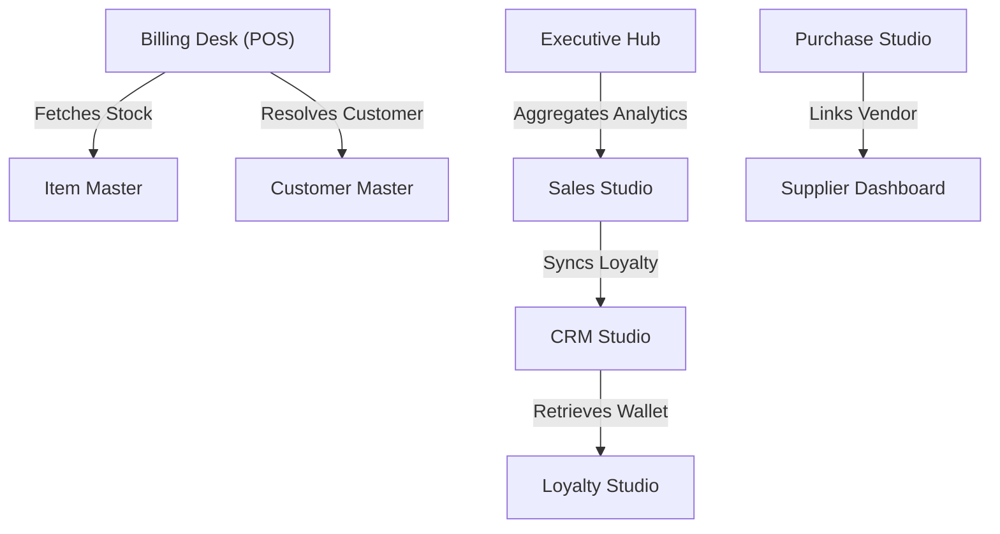

# SMRITI Architecture Dependency & Coupling Report (SDS v2.8)

> **Framework:** SDS v3.0.0 | **Total Module Couplings:** 6 | **Scan Timestamp:** 2026-08-03T21:51:52.012Z

## 1. Visual Architecture Dependency Map (Mermaid.js)

## 2. Inter-Module Coupling Matrix

| Source Module | Target Module | Dependency Type | Coupling Strength |
|---|---|:---:|:---:|
| **Billing Desk** | **Item Master** | `API_FETCH` | **HIGH** |
| **Billing Desk** | **Customer Master** | `API_FETCH` | **HIGH** |
| **Sales Studio** | **CRM Studio** | `API_FETCH` | **MEDIUM** |
| **Purchase Studio** | **Supplier Dashboard** | `SCHEMA_RELATION` | **MEDIUM** |
| **CRM Studio** | **Loyalty Studio** | `API_FETCH` | **HIGH** |
| **Executive Hub** | **Sales Studio** | `IMPORT_REFERENCE` | **LOW** |

---
*Generated by SMRITI Dependency Engine (SDS v2.8) | Timestamp: 2026-08-03T21:51:52.012Z*
