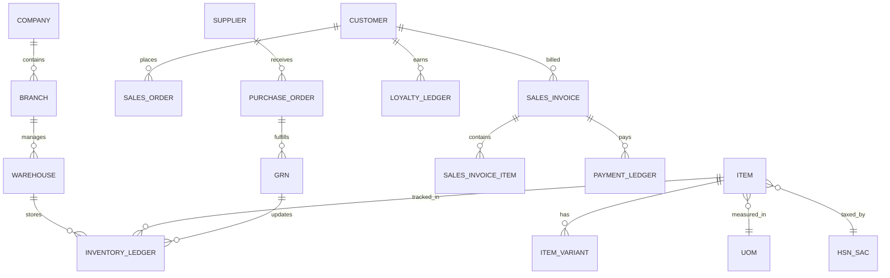

<!--
  Project      : SMRITI Retail OS
  Repository   : SMRITIRetailNX
  Organization : AITDL NETWORKS

  Founders

  * Pushpa Devi Jawahar Mallah
    * Founder & Chairperson
    * Phone: +91 9324117007
    * Email: founder@aitdl.com

  * Jawahar Ramkripal Mallah
    * Founder, Chief Executive Officer (CEO) & Chief Software Architect
    * Email: founder@aitdl.com

  * Websites: aitdl.com | erpnbook.com | smritibooks.com

  * Version    : 2.1.1
  * Created    : 2026-07-10
  * Modified   : 2026-07-11
  * Copyright  : © AITDL.com and SMRITIBooks.com. All Rights Reserved.
  * License    : Proprietary Commercial Software
-->

# SMRITI Retail OS - Enterprise ERP Deep Review (Version 2)

This document provides a comprehensive functional, technical, architectural, UI/UX, database, workflow, security, and business process audit of SMRITI Retail OS, benchmarking against enterprise retail ERP standards while maintaining SMRITI's native architecture.

## 1. Complete Gap Analysis & Missing Features Matrix

| Module | Current State | Missing Enterprise Features |
| :--- | :--- | :--- |
| **Inventory** | Basic Item Master, flat product list. | Multi-Warehouse, Multi-Store, Multi-Company, FIFO/Moving Avg Valuation, Batch/Serial Tracking, Expiry Management, Reorder Levels, Stock Aging, FSN Analysis, Physical Verification, Bin Location, Reservations, Shrinkage tracking. |
| **Retail (POS)** | Basic billing, shift management, cart. | Split Payments, Wallet/Loyalty integration, Happy Hour pricing, Price Override (with manager approval), Hold/Recall/Suspend Bill, Click & Collect, Weighing Scale integration, Customer Display integration. |
| **Distribution** | Initial PSV (Party Stock Visibility). | Distributor/Dealer hierarchy, Route/Beat/Van Sales mapping, Primary/Secondary Sales separation, Claims, Loading/Dispatch management, Indent handling. |
| **Workflows** | Direct saves without state machines. | Draft/Submitted/Approved/Rejected/Cancelled document states, RBAC Approval Workflows, Escalation matrices. |

## 2. Missing Masters Matrix

The Master Management Framework must be expanded to include the following enterprise entities:

- **Organization**: Company, Branch, Store, Warehouse, Department, Designation, Employee.
- **Item & Inventory**: Item Group, Item Variant, Brand, Category, UOM, HSN, Tax, Barcode, Batch, Serial Number.
- **Customer & CRM**: Customer, Customer Group, Loyalty, Coupon, Gift Card, Price List, Salesperson.
- **Supplier & Logistics**: Supplier, Transporter, Route, Territory, Distributor, Dealer, Franchise.
- **Finance**: Bank, Payment Mode, Currency, Expense Categories.

## 3. Missing Transactions Matrix

The system currently supports basic POS Billing and Sales/Purchase structure. It lacks complete enterprise transactional flows:

- **Sales Cycle**: Quotation → Sales Order → Delivery Note → Sales Invoice → Sales Return → Credit Note.
- **Procurement Cycle**: Purchase Order → Goods Receipt Note (GRN) → Purchase Invoice → Purchase Return → Debit Note.
- **Inventory Operations**: Stock Transfer, Stock Adjustment, Opening Stock, Goods Issue.
- **Retail Operations**: Customer Order, Layaway, Exchange, Repair/Service, Warranty/AMC.
- **Financial Operations**: Journal, Expense, Payment, Receipt, Advance.

## 4. Field Inventory (Target Enterprise State)

All forms (Masters and Transactions) require strict enterprise fields:
- **Mandatory Identifiers**: Auto-generated sequential IDs (Unique Codes).
- **Lookup/Relationships**: Foreign keys binding transactions to specific Masters (e.g., Salesperson on Invoice).
- **Financial & Tax**: Base Rate, Tax Amount, Net Amount, Discount Amount, HSN/SAC, GST Breakdown (CGST/SGST/IGST).
- **Logistics**: E-Way Bill Number, Vehicle Number, Dispatch Mode.
- **Audit & Governance**: `created_by`, `modified_by`, `created_at`, `updated_at`, `status` (Draft/Approved), Notes, Attachments.

## 5. Missing Reports Matrix

Every module requires dedicated reporting:
- **Inventory**: Stock Ledger, Stock Balance, Stock Aging, Batch-Wise Balance.
- **Sales/Retail**: Daily Sales Register, Item-wise Sales, Salesperson Performance, POS Shift Summary, Payment Mode Summary.
- **Procurement**: Purchase Register, Supplier Outstanding, GRN Register.
- **Finance**: General Ledger, Accounts Receivable/Payable Aging, GST Returns (GSTR-1, GSTR-2, GSTR-3B formats).
- **Export Formats**: All reports must support Excel, CSV, PDF, Print, and Email.

## 6. Database ER Diagram (Conceptual)

## 7. Module Dependency Diagram

- **Core/Admin** is the root (Users, Roles, Branches, Companies).
- **Masters** depend on Core (Items, Customers, Taxes).
- **Inventory** depends on Masters (Tracks Items in Warehouses).
- **Procurement & Sales** depend on Inventory & Masters.
- **Finance** depends on Procurement, Sales, and Core (Tax rules).
- **Reporting** aggregates from all operational modules.

## 8. UI/UX & Navigation Audit

- **Navigation**: Needs robust breadcrumbs, global search ("Ctrl+K"), contextual actions, and cross-module deep linking.
- **Data Density**: Enterprise grid layouts required for handling dense transactions (e.g., 50+ lines in an invoice).
- **Consistency**: All forms must adhere to SMRITI Layout Engine guidelines (Compact Mode, Dark Mode).
- **Scroll Segregation**: Independent scrolling implemented via `SmritiScrollArea`.

## 9. Performance & Security Audit

- **Performance**: High-volume grids (Stock Ledgers, POS Catalog) require virtualization/windowing. Caching layer (IndexedDB) required for offline POS capabilities. Lazy loading for non-critical dashboard charts.
- **Security**: Full Role-Based Access Control (RBAC) needed. UI elements (Approve, Delete) must be conditionally rendered based on permissions.
- **API Security**: Endpoints require strict authorization headers and payload validation.

## 10. Compliance Audit (Indian Business Context)

- **Taxation**: Support for CGST, SGST, IGST, UTGST, and CESS.
- **Reporting**: GSTR-ready data structures.
- **Invoicing**: E-Invoice schema support (IRN, QR Code mapping). E-Way Bill generation fields (Transporter ID, Distance, Vehicle No).
- **Financial**: TCS/TDS calculation points on payment entries. Reverse Charge Mechanism (RCM) flags on purchase transactions.
- **Rounding**: Configurable round-off logic for invoice totals.

## 11. Print Engine Audit

- **Formats**: Support for Thermal (58mm/80mm) for POS, A4/A5 for B2B Invoices/Purchase Orders, and specialized Barcode/Label sizes.
- **Content**: Print templates must support dynamic variables, QR Codes (for UPI/E-Invoice), and Digital Signature placeholders.

## 12. Implementation Roadmap & Priority Matrix

| Priority | Phase | Focus Area | Deliverables |
| :--- | :--- | :--- | :--- |
| **Critical** | Phase 1 | Master Data & Core Engine | Expand `MASTER_REGISTRY`, enforce global fields, implement Multi-Branch/Store logic. |
| **Critical** | Phase 2 | Inventory & Tax Compliance | Multi-Warehouse, Batch/Serial tracking, HSN/GST configurations, Stock Ledger. |
| **High** | Phase 3 | Transaction Flows (Sales/Purchase) | Complete Quote-to-Cash and Procure-to-Pay cycles. Invoice generation. |
| **High** | Phase 4 | Enterprise POS | Split payments, hold/recall, offline sync, thermal print integration. |
| **Medium** | Phase 5 | Workflows & Security | Document states (Draft/Submit), RBAC permissions, audit logging. |
| **Medium** | Phase 6 | Advanced Distribution & CRM | Van sales, Distributor hierarchy, Loyalty points, Offers engine. |
| **Low** | Phase 7 | Analytics & Extended Integrations | BI Dashboards, GSTR reports, external ERP sync tools. |

