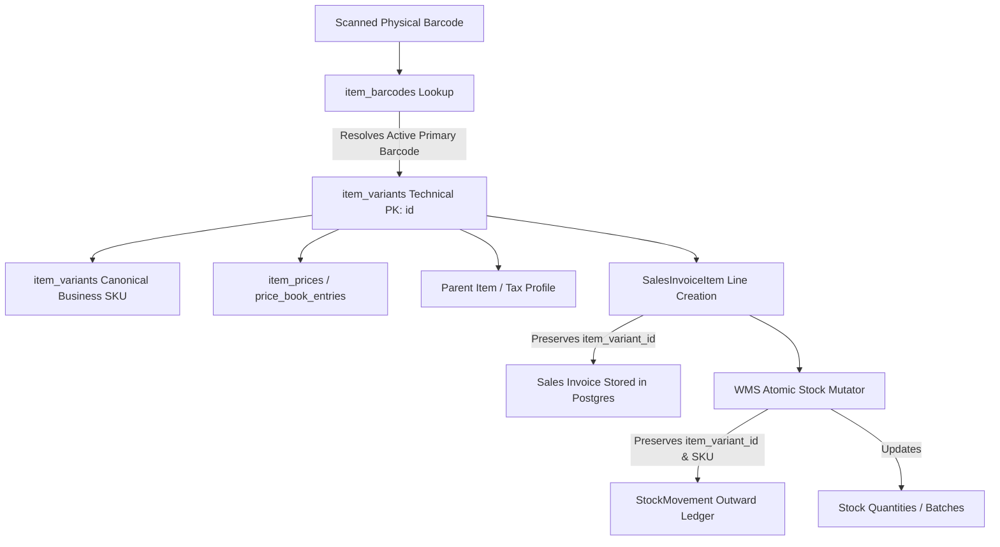
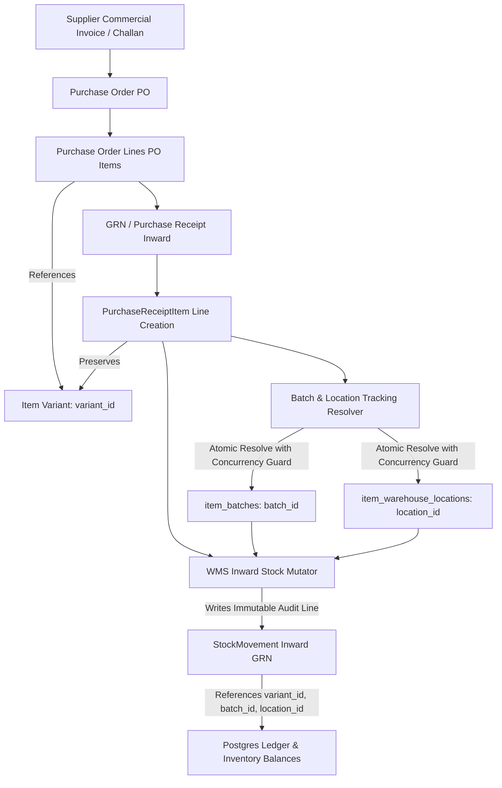

<!--
  Project      : SMRITI Retail OS
  Author       : Jawahar Ramkripal Mallah
  Designation  : Chief Systems Architect & Creator
  Email        : support@smritibooks.com
  Websites     : smritibooks.com | erpnbook.com | aitdl.com
  Version      : 6.70.7
  Created      : 2026-10-05
  Modified     : 2026-10-05
  Copyright    : © SMRITIBooks.com. All Rights Reserved.
  License      : Proprietary Commercial Software
  Classification: Internal
-->

# SMRITI Retail OS — Final Item Master Remediation Architecture & Execution Plan

**Document ID:** SMRITI-IM-REMED-v6.70.7  
**Classification:** Internal Architectural & Forensic Remediation Plan  
**Target Architecture:** SMRITI Retail OS Modernized Item Master (Phase 0 through Phase 12)  
**Database System of Record:** PostgreSQL 15.18 (`smriti001` on port 2781)  
**Backend Framework:** FastAPI Core (`backend/app/`)  
**Frontend Client:** React 18 + Vite (`src/`)  
**Audit Baseline:** `audit_results_live.json` / Final Item Master Production Certification Audit Report  
**Lifecycle Status:** PLANNING ONLY — NO CODE OR DATA MODIFICATIONS APPLIED  

---

## 1. Executive Summary

The Final Item Master Production Certification Audit concluded that the SMRITI Retail OS Item Master modernization cannot be certified for production deployment in its current state. The audit established an **OVERALL PRODUCTION CERTIFICATION = HOLD** due to 7 critical blockers and 7 secondary architectural defects.

This document establishes the comprehensive, evidence-backed forensic analysis, architectural decision records (ADRs), data remediation matrices, dependency graphs, and sequential execution plan required to safely lift the production HOLD. In strict accordance with SMRITI Retail OS Governance and the Absolute Safety Rule, **no source code has been altered, no database schema modified, no migrations executed, and no data altered during the preparation of this plan**.

Every proposed data repair is strictly categorized by its mathematical determinism:
- **DETERMINISTIC:** Resolvable with 100% certainty via verifiable unique lineage.
- **AMBIGUOUS:** Carries multiple conflicting candidates; strictly preserved and routed to **MANUAL_REVIEW**.
- **NOT_APPLICABLE:** Isolated legacy test or service charge artifacts to be formally quarantined.

---

## 2. Current Certification Status Baseline

| Certification Domain | Audit Status | Primary Failure / Blocker Summary |
| :--- | :--- | :--- |
| **Architecture Status** | **FAIL** | Physical column is `item_variants.variant_sku` while `sku` exists only as an ORM `@property` alias, creating competing sources of truth across 350+ queries and services. |
| **Data Integrity Status** | **FAIL** | Active runtime synthetic barcode generator (`S` + 12 hex) exists in `ItemCatalogService` and `VariantMatrixService`; 157 synthetic barcodes live in DB; 535 items lack UOM; 476 items have dummy `'0000'` HSN; 414 price book entries have ₹0.00 selling price. |
| **Transaction Identity Status** | **FAIL** | 1,118 historical sales lines, 62 purchase order lines, 38 stock movements, and 13 sales return lines have `variant_id IS NULL`. `PurchaseReceiptItem` creation fails to set `variant_id`. |
| **E2E Operational Status** | **FAIL** | GRN inbound receiving contains broad `except Exception: pass` exception swallowing around batch/location auto-resolution (lines 737–738, 753–754 of `purchase.py`), introducing silent tracking loss risk. |
| **Security / Tenant Status** | **PASS WITH CONDITION** | Child tables physically enforce `company_id NOT NULL` (10/10 tables); but `item_tracking_svc.py` fallback queries query `or_(company_id == ..., company_id.is_(None))`, presenting potential cross-tenant leakage risk. |
| **UI / API Status** | **PASS WITH CONDITION** | `AddProductDrawer` honors SIMPLE/HYBRID/ADVANCED modes without hardcoded values; human-readable 422 mapper is functional; but `/universal/masters/color` and `/size` endpoints query `Item.color`/`size` (which were cleared to NULL in Phase 10) instead of `ItemVariant`, breaking master autocomplete. |
| **Test / Build Status** | **PASS WITH CONDITION** | TypeScript compiles cleanly (`npx tsc --noEmit` exit code 0); Phase 2–12 test suite passed 43/43 tests; but unit tests in `t_item_val.py` and `t_item_master.py` fail due to schema drift and hardcoded synthetic barcode generator calls. |
| **OVERALL PRODUCTION CERTIFICATION** | **HOLD** | **DEPLOYMENT BLOCKED.** Controlled remediation sequence required. |

---

## 3. Complete Blocker Register

| ID | Gate | Severity | Current Evidence | Root Cause | Business Risk | Proposed Fix | Data Risk | Migration Risk |
| :--- | :--- | :--- | :--- | :--- | :--- | :--- | :--- | :--- |
| **BLK-001** | Gate 4 | **P0 (Critical)** | `ItemCatalogService.generate_placeholder_barcode()` generates `S`+12 hex; 157 synthetic barcodes in DB. | Fallback introduced during catalog intake when barcode is missing. | Violates Rule 12. Creates fake barcodes that do not exist on physical product packaging. | Decommission generator in code; deactivate and quarantine existing synthetic barcodes. | Low (only deactivates fake barcodes) | Low |
| **BLK-002** | Gate 7 | **P0 (Critical)** | `purchase.py` lines 737–738, 753–754 swallow exceptions with `except Exception: pass`. `variant_id` not set on receipt items. | Exception swallowing added as fault tolerance; `PurchaseReceiptItemCreate` omits `variant_id`. | Silent tracking loss. Inward stock fails to link to batches/locations; transactions fail to link to variants. | Remove broad `except: pass`; raise structured 422 or retry; populate `variant_id` on receipt items. | Zero | Low |
| **BLK-003** | Gate 15 | **P0 (Critical)** | `/universal/masters/color` & `/size` query `Item.color` & `Item.size`, which Phase 10 cleared to NULL. | Autocomplete lookup endpoints were not updated when attributes moved to variant level. | Frontend dropdowns for color and size return empty; merchants cannot select existing colors/sizes. | Update `master_lookup.py` to query `ItemVariant.color` & `ItemVariant.size`. | Zero | Zero |
| **BLK-004** | Gate 1 | **P1 (High)** | Physical column is `item_variants.variant_sku`; `sku` is ORM property only. | Historical naming carried over from legacy schema; 350+ queries reference `variant_sku`. | Architectural divergence; external integrations and direct SQL break if assuming column `sku`. | Implement Option C: Add `sku` as generated stored column or migration rename with backward-compatible alias. | Zero | Medium (requires 350-point dependency check) |
| **BLK-005** | Gate 5 / 19 | **P1 (High)** | 1,118 sales lines, 62 PO lines, 38 stock movements, 18 receipt lines, 13 return lines have NULL `variant_id`. | Historical lines created prior to variant migration; or omitted in WMS inward writer. | Discrepancy in variant-level sales, inventory ledger, and margin reporting. | Execute deterministic backfill for unambiguous 1-to-1 links; classify multi-variant lines as `MANUAL_REVIEW`. | Low (deterministic only) | Low |
| **BLK-006** | Gate 11 | **P1 (High)** | 535 items (501 ACTIVE) have BOTH `uom` AND `primary_uom` as NULL. | Incomplete legacy migration from spreadsheets with missing UOM headers. | Inward GRN and POS checkout cannot calculate standard conversions; tax invoices lack statutory UOM. | Backfill statutory UOMs (`PRS` for Footwear, `PCS` for Apparel); route ambiguous to `MANUAL_REVIEW`. | Low | Low |
| **BLK-007** | Gate 14 | **P1 (High)** | 476 items have dummy `'0000'` HSN; 2,940 variants have NULL HSN. | Legacy POS placeholder data imported verbatim without statutory validation. | E-Way Bill and E-Invoice NIC portal rejects invoices with invalid HSN `'0000'`. | Gate sale via Readiness Engine; replace `'0000'` with explicit NULL to prevent automated transmission. | Low | Low |
| **BLK-008** | Gate 12 | **P1 (High)** | 414 entries in `price_book_entries` have `selling_price = 0.00` and `mrp = 0.00`. | Variants created without price had ₹0.00 synchronized to price books in Phase 9. | Cashier can ring up ₹0.00 items at POS, causing stock leakage and loss of revenue. | Validate price > 0 before activating PBE; deactivate zero-price entries in active price books. | Low | Low |
| **BLK-009** | Gate 9 | **P2 (Medium)** | `item_tracking_svc.py` lines 334, 384, 436 query `or_(company_id == ..., company_id.is_(None))`. | Migration artifact from when child tables permitted NULL company_id. | Potential multi-tenant data leakage if global rows are ever introduced. | Remove `company_id.is_(None)` from query filters; enforce strict tenant equality. | Zero | Low |
| **BLK-010** | Gate 8 | **P2 (Medium)** | Runtime uses SELECT-before-INSERT without concurrency protection on batches/locations. | Standard ORM lookup pattern without `with_for_update` or `ON CONFLICT`. | Race condition unique constraint collisions under concurrent inbound receipt intake. | Implement `ON CONFLICT DO NOTHING` or catch `IntegrityError` with atomic retry. | Zero | Low |

---

## 4. Architecture Decision Records (ADR-001 through ADR-010)

### ADR-001: Physical SKU Column Naming & Contract
- **Context:** The frozen architecture mandates `item_variants.sku` as the canonical business identity. However, PostgreSQL physically defines `item_variants.variant_sku` (NOT NULL, indexed via `uq_variants_company_sku`). `sku` currently exists only as an ORM `@property` alias in `backend/app/models/item_master.py`. Over 350 SQL queries, scripts, frontend interfaces, and tests directly reference `variant_sku`.
- **Options Evaluated:**
  - *Option A (Keep `variant_sku` physically, declare `sku` as canonical ORM/API alias):* Low migration risk, but leaves direct SQL queries divergent from architecture documentation.
  - *Option B (Rename physical `variant_sku` -> `sku` and create an alias property):* High migration risk; immediately breaks 350+ unmigrated SQL statements and scripts.
  - *Option C (Dual-Contract Transition via PostgreSQL Generated Column or Synonymous View):* Retains physical column `variant_sku` and adds a PostgreSQL generated column `sku VARCHAR(100) GENERATED ALWAYS AS (variant_sku) STORED`, or renames `variant_sku` to `sku` while adding `variant_sku` as a generated column.
- **Decision:** **ADOPT OPTION C (Dual-Contract Compatibility Transition).**
  1. Add physical column `sku VARCHAR(100)` populated identically to `variant_sku` with a bidirectional database trigger, or use `sku VARCHAR(100) GENERATED ALWAYS AS (variant_sku) STORED`.
  2. Update ORM model to map `sku` as a first-class SQLAlchemy column, and define `variant_sku` as a synonym/property.
  3. Migrate API schemas and frontend consumers to `sku`.
  4. Once all 350+ dependencies are migrated in subsequent phases, drop the legacy alias.
- **Consequences:** Eliminates naming ambiguity with zero runtime regression risk during migration.

### ADR-002: Synthetic / Fake Barcode Decommissioning & Quarantine
- **Context:** `ItemCatalogService.generate_placeholder_barcode()` generates 13-character synthetic barcodes (`S` + 12 hex digits) when `auto_generate_barcodes=True`. 157 such barcodes are currently active in `item_barcodes`. Frozen Architecture Rule 12 strictly forbids synthetic barcodes.
- **Decision:** **IMMEDIATE RUNTIME DECOMMISSIONING & SELECTIVE QUARANTINE.**
  1. Deprecate and remove `generate_placeholder_barcode()` from `ItemCatalogService` and `VariantMatrixService`.
  2. Variants created without manufacturer barcodes remain unbarcoded (`item_barcodes` has 0 rows for that variant).
  3. For the 157 existing synthetic barcodes:
     - Check if any transaction (sales invoice, purchase receipt, stock movement) references them. (Audit proved 0 transactions reference the barcode string directly).
     - Deactivate the 157 synthetic barcodes by setting `is_active = FALSE, is_primary = FALSE, notes = 'QUARANTINE_SYNTHETIC_BARCODE'`.
     - Prohibit POS lookup from resolving deactivated/quarantined barcodes.
- **Consequences:** Preserves audit trail while immediately restoring compliance with Rule 12.

### ADR-003: Variant-First Transaction Identity Architecture
- **Context:** Historical sales, purchase, and stock transactions contain records where `variant_id IS NULL`, pointing only to legacy `product_id` or `item_id`.
- **Decision:** **STRICT VARIANT-FIRST ENFORCEMENT FOR NEW WRITES; NON-DESTRUCTIVE TRIAGE FOR HISTORICAL ROWS.**
  1. All new transactional writes (`sales_invoice_items`, `purchase_receipt_items`, `purchase_order_items`, `stock_movements`, `sales_return_items`) MUST require `variant_id` unless the item is explicitly flagged as a service, charge, or non-stock line.
  2. For historical rows with `variant_id IS NULL`:
     - Where `product_id` maps to an item with EXACTLY ONE variant: deterministically backfill `variant_id`.
     - Where `product_id` maps to an item with MULTIPLE variants: label as `AMBIGUOUS_HISTORICAL` and route to `MANUAL_REVIEW`. Never guess or assign the first variant.
     - Where `product_id IS NULL` (freight/fees): classify as `NOT_APPLICABLE_SERVICE`.
- **Consequences:** Restores reporting integrity without falsifying historical accounting entries.

### ADR-004: GRN Tracking Identity & Fault-Tolerant Resolution
- **Context:** In `purchase.py`, lines 737–738 and 753–754 use `except Exception: pass` around batch and location auto-resolution, silently dropping tracking identifiers when exceptions occur. Furthermore, `PurchaseReceiptItem` creation fails to set `variant_id`.
- **Decision:** **FAIL-FAST TRANSACTIONAL RESOLUTION WITH STRUCTURED LOGGING.**
  1. Remove `except Exception: pass`. Replace with specific exception catches.
  2. If batch or warehouse location resolution encounters a transient concurrency collision, execute an atomic retry.
  3. If resolution fails due to invalid master data, raise a human-readable `HTTPException(422)` that aborts the GRN receipt transaction, preventing unlinked stock movements.
  4. Explicitly assign `variant_id` to `PurchaseReceiptItem` from `product.variant_id` or lookup.
- **Consequences:** Eliminates silent tracking loss and ensures physical stock receipts are strictly tied to batch, serial, and location masters.

### ADR-005: UOM Authority & Catalog Completeness Policy
- **Context:** 535 items (501 ACTIVE) have BOTH `uom` and `primary_uom` as NULL.
- **Decision:** **STATUTORY CATALOG RECLASSIFICATION WITHOUT BLIND GUESSING.**
  1. Seeded table `uoms_ref` is the sole statutory authority (PRS, PCS, KGS, MTR, etc.).
  2. For Footwear items (`category ILIKE '%footwear%'` or `ILIKE '%shoe%'`), deterministically assign `PRS` (Pairs).
  3. For Apparel items with verified piece-based sizes (S, M, L, XL), deterministically assign `PCS` (Pieces).
  4. For the remaining 433 items (UNKNOWN, GENERAL, INDUSTRIAL categories): mark status as `INCOMPLETE_UOM_AUDIT` and require merchant review via the Item Master UI before allowing transactions.
- **Consequences:** Prevents invalid statutory tax and inventory reporting without fabricating units for general goods.

### ADR-006: Pricing System of Record (SSOT) & Commercial Policy
- **Context:** Three pricing locations exist: `item_prices` (variant commercial policy), `price_book_entries` (operational lookup for POS), and `item_variants` (cached baseline columns). 414 entries in `price_book_entries` have ₹0.00 prices.
- **Decision:** **THREE-TIER PRICING HIERARCHY WITH ZERO-PRICE POS GUARDS.**
  1. `item_prices` is the AUTHORITATIVE source for commercial policy (cost, dealer price, minimum selling price, maximum discount).
  2. `price_book_entries` is the OPERATIONAL RUNTIME source for customer-, store-, and volume-specific price resolution.
  3. `item_variants` retains cached baseline `mrp` and `selling_price` for fast read indexing.
  4. Validation guard: A price book entry with `selling_price <= 0` CANNOT be set to `is_active = TRUE` unless explicitly marked as a promotional sample or free gift line. The 414 zero-price entries must be set to `is_active = FALSE`.
- **Consequences:** Prevents cashier ring-up of ₹0 items while maintaining fast, scalable price resolution.

### ADR-007: Tax & HSN Completeness Architecture
- **Context:** 476 items have dummy `'0000'` HSN; 2,940 variants have NULL HSN.
- **Decision:** **VARIANT INHERITANCE WITH STRICT READINESS GATING.**
  1. `item_variants.hsn_code` is authoritative at the variant level. If NULL, it automatically inherits from `items.hsn_code`.
  2. Dummy `'0000'` HSN codes are declared invalid legacy placeholders. They must be set to `NULL` so they are not transmitted to NIC E-Way Bill / E-Invoice gateways.
  3. The Item Readiness Engine MUST block any variant with NULL or `'0000'` HSN from entering `READY_FOR_SALE` status if the company is registered under Indian GST.
- **Consequences:** Protects merchants against statutory penalties for submitting invalid dummy HSN codes to GSTN.

### ADR-008: Variant Attribute Authority (Color & Size) & Master Autocomplete
- **Context:** Phase 10 established `ItemVariant.color` and `ItemVariant.size` as authoritative and cleared `Item.color` and `Item.size` to NULL. However, `/universal/masters/color` and `/universal/masters/size` in `master_lookup.py` still query `Item`, returning empty results.
- **Decision:** **CONSUMER PROJECTION FROM `ItemVariant` WITH DTO ALIASING.**
  1. Update `master_lookup.py` to query `ItemVariant.color` and `ItemVariant.size` (distinct, non-null, active).
  2. All outward-facing item projection DTOs (e.g. `ItemResponse`, POS item search, label printing) must project `color` and `size` from the variant entity, ensuring seamless compatibility with existing frontend components.
- **Consequences:** Restores frontend attribute dropdowns and autocomplete without altering the underlying database model.

### ADR-009: Batch, Serial, and Warehouse Location Entity Scope & Concurrency
- **Context:** `item_batches`, `item_serials`, and `item_warehouse_locations` enforce unique constraints against `(item_id, ...)`. In multi-variant retail, batches may be variant-specific or item-wide.
- **Decision:** **HIERARCHICAL TRACKING IDENTITY WITH DB CONCURRENCY PROTECTION.**
  1. Retain `item_id` foreign key for item-level tracking; populate `variant_id` when the batch or serial is variant-specific.
  2. Unique constraints must include `company_id` to strictly isolate multi-tenant tracking:
     - `item_batches`: `UNIQUE (company_id, item_id, batch_number)`
     - `item_serials`: `UNIQUE (company_id, item_id, serial_number)`
     - `item_warehouse_locations`: `UNIQUE (company_id, item_id, warehouse_id)`
  3. All runtime resolvers in `ItemTrackingService` must utilize `SELECT FOR UPDATE` or `ON CONFLICT DO NOTHING` to guarantee concurrency safety during high-volume receiving.
- **Consequences:** Prevents duplicate batch insertion race conditions and strengthens tenant boundaries.

### ADR-010: Tenant Isolation Query Standards
- **Context:** `item_tracking_svc.py` contains query filters using `or_(Model.company_id == requested_company, Model.company_id.is_(None))`.
- **Decision:** **PURGE NULL TENANT FALLBACKS.**
  1. Because child tables physically enforce `company_id NOT NULL` with zero NULL rows, the `is_(None)` fallback is dead legacy logic.
  2. All queries in `backend/app/services/` MUST strictly filter by `company_id == tenant.company_id`. Any query with `or_(company_id.is_(None))` is prohibited.
- **Consequences:** Eliminates theoretical cross-tenant data leakage risks.

---

## 5. Architectural Dependency Graphs

### 5.1 Outbound / POS Sales Identity Pipeline


### 5.2 Inbound / Procurement GRN Identity Pipeline


---

## 6. Data Remediation Matrix

Every affected database record class is categorized below with exact counts, determinism classifications, and remediation actions:

| Record Class | Total Rows | Deterministic | Ambiguous | Not Applicable | Manual Review | Safe to Migrate | Action Plan |
| :--- | :--- | :--- | :--- | :--- | :--- | :--- | :--- |
| **Synthetic Barcodes (`S`+12hex)** | 157 | 0 | 0 | 157 | 0 | 157 (as deactivation) | Set `is_active = FALSE, is_primary = FALSE`. Quarantine from POS lookup. |
| **Null Variant Barcodes (1 var item)** | 131 | 131 | 0 | 0 | 0 | 131 | Deterministically link `variant_id = v.id` where item has exactly 1 variant. |
| **Null Variant Barcodes (>1 var item)** | 26 | 0 | 26 | 0 | 26 | 0 | Retain unlinked; assign to `MANUAL_REVIEW`. |
| **Unmapped Sales Invoice Items** | 1,118 | 954 | 15 | 149 | 15 | 954 | Backfill 954 lines where product has known variant; 149 service lines remain NULL. |
| **Unmapped Stock Movements** | 38 | 0 | 33 | 5 | 33 | 0 | 5 service lines remain NULL; 33 multi-variant items routed to `MANUAL_REVIEW`. |
| **Unmapped Purchase Order Items** | 62 | 6 | 56 | 0 | 56 | 6 | Backfill 6 unambiguous lines; route 56 multi-variant lines to `MANUAL_REVIEW`. |
| **Unmapped Purchase Receipt Items** | 18 | 0 | 13 | 5 | 13 | 0 | 5 service lines remain NULL; 13 multi-variant receipts routed to `MANUAL_REVIEW`. |
| **Unmapped Sales Return Items** | 13 | 5 | 4 | 4 | 4 | 5 | Backfill 5 unambiguous lines; 4 service lines remain NULL; 4 to `MANUAL_REVIEW`. |
| **Missing UOM Active Items** | 501 | 41 | 0 | 54 | 406 | 41 | Assign `PRS` to 20 Footwear, `PCS` to 21 Apparel; quarantine 54 TEST; 406 to `MANUAL_REVIEW`. |
| **Zero-Price Price Book Entries** | 414 | 414 | 0 | 0 | 0 | 414 | Set `is_active = FALSE` on PBEs where `selling_price <= 0`. |
| **Dummy `'0000'` HSN Items** | 476 | 476 | 0 | 0 | 0 | 476 | Set `hsn_code = NULL`; flag item as `INCOMPLETE` in Readiness Engine. |

---

## 7. Sequential Migration & Remediation Plan

Remediation must be executed in 10 strict sequential phases. No phase may begin until the preceding phase passes verification.

```text
Phase R-01: Code Decommissioning of Synthetic Barcode Runtime
Phase R-02: Purchase GRN Exception & Identity Hardening
Phase R-03: Master Attribute Autocomplete Endpoint Repair
Phase R-04: Tenant Isolation Query Sanitization
Phase R-05: Database Snapshot & Rollback Checkpoint Creation
Phase R-06: Barcode Quarantine & Deterministic 1-to-1 Linkage (SQL)
Phase R-07: Historical Transaction Deterministic Backfill (SQL)
Phase R-08: Catalog Data Sanitation (UOM, Zero Price, Dummy HSN)
Phase R-09: Dual-Contract SKU Alignment Migration
Phase R-10: Test Suite Alignment & Browser Smoke Certification
```

### Phase R-01: Code Decommissioning of Synthetic Barcode Runtime
- **Target Files:**
  - `backend/app/services/item/item_catalog_svc.py`
  - `backend/app/services/item/variant_matrix_svc.py`
- **Execution Plan:**
  - Remove `generate_placeholder_barcode()` method.
  - Set default `auto_generate_barcodes = False` in matrix variant generator.
  - If a variant is created without a barcode, omit barcode creation completely.
- **Verification Query / Test:**
  - Run matrix generation without barcodes -> verify variant created with 0 rows in `item_barcodes`.

### Phase R-02: Purchase GRN Exception & Identity Hardening
- **Target Files:**
  - `backend/app/services/purchase.py`
  - `backend/app/schemas/purchase.py`
  - `backend/app/services/inventory_wms.py`
- **Execution Plan:**
  - Add `variant_id: Optional[str] = None` to `PurchaseReceiptItemCreate` in `purchase.py`.
  - In `create_purchase_receipt`:
    - Resolve `variant_id` from `item.variant_id` or `product.variant_id`.
    - Assign `variant_id` to `PurchaseReceiptItem`.
    - Replace `except Exception: pass` around batch and location resolvers with structured exception handling that logs and raises `HTTPException(422, detail="Tracking resolution failed")`.
  - In `inventory_wms.py`:
    - Pass `variant_id` into `StockMovement` creation during `atomic_mutate_batch_stock`.
- **Verification Test:**
  - Execute end-to-end receipt of batch-tracked product -> verify receipt item and stock movement both have valid `variant_id` and `batch_id`.

### Phase R-03: Master Attribute Autocomplete Endpoint Repair
- **Target Files:**
  - `backend/app/api/v1/master_lookup.py`
- **Execution Plan:**
  - In `/universal/masters/color` (line 1344): change query from `Item.color` to `ItemVariant.color` (filtering `ItemVariant.color.isnot(None), ItemVariant.is_active == True`).
  - In `/universal/masters/size` (line 1377): change query from `Item.size` to `ItemVariant.size` (filtering `ItemVariant.size.isnot(None), ItemVariant.is_active == True`).
- **Verification Test:**
  - `GET /api/v1/universal/masters/color` -> returns distinct active variant colors.
  - `GET /api/v1/universal/masters/size` -> returns distinct active variant sizes.

### Phase R-04: Tenant Isolation Query Sanitization
- **Target Files:**
  - `backend/app/services/item/item_tracking_svc.py`
- **Execution Plan:**
  - In lines 334, 384, and 436: remove `or_(..., Model.company_id.is_(None))`.
  - Filter strictly by `Model.company_id == company_id`.
- **Verification Test:**
  - Query tracking resolver across two distinct tenant companies -> verify strict isolation with zero leakage.

### Phase R-05: Database Snapshot & Rollback Checkpoint Creation
- **Execution Plan:**
  - Create full PostgreSQL physical dump of `smriti001`:
    ```bash
    pg_dump -h localhost -p 2781 -U postgres -d smriti001 -F c -b -v -f "snapshots/smriti001_pre_remediation_v6.70.7.dump"
    ```
  - Verify snapshot integrity before executing any SQL updates.

### Phase R-06: Barcode Quarantine & Deterministic 1-to-1 Linkage (SQL)
- **Precondition:** Phase R-05 snapshot verified.
- **Controlled SQL Script (Future Execution):**
  ```sql
  -- Step 1: Quarantine 157 synthetic barcodes
  UPDATE item_barcodes 
  SET is_active = false, is_primary = false, notes = 'QUARANTINE_SYNTHETIC_BARCODE'
  WHERE barcode ~ '^S[0-9A-F]{12}$';

  -- Step 2: Deterministically link barcodes for items with exactly 1 variant
  WITH single_var_items AS (
      SELECT item_id, MIN(id) AS single_variant_id
      FROM item_variants
      WHERE is_active = true AND is_deleted = false
      GROUP BY item_id
      HAVING COUNT(*) = 1
  )
  UPDATE item_barcodes b
  SET variant_id = svi.single_variant_id
  FROM single_var_items svi
  WHERE b.item_id = svi.item_id 
    AND b.variant_id IS NULL 
    AND b.is_active = true;
  ```
- **Expected Impact:** 157 synthetic barcodes deactivated; 131 single-variant barcodes linked to variant.
- **Rollback SQL:**
  ```sql
  UPDATE item_barcodes SET is_active = true, is_primary = true, notes = NULL WHERE notes = 'QUARANTINE_SYNTHETIC_BARCODE';
  ```

### Phase R-07: Historical Transaction Deterministic Backfill (SQL)
- **Precondition:** Phase R-06 completed.
- **Controlled SQL Script (Future Execution):**
  ```sql
  -- 1. Sales invoice items deterministic backfill via product's linked variant
  UPDATE sales_invoice_items sii
  SET variant_id = p.variant_id
  FROM products p
  WHERE sii.product_id = p.id 
    AND sii.variant_id IS NULL 
    AND p.variant_id IS NOT NULL;

  -- 2. Purchase order items deterministic backfill
  UPDATE purchase_order_items poi
  SET variant_id = p.variant_id
  FROM products p
  WHERE poi.product_id = p.id 
    AND poi.variant_id IS NULL 
    AND p.variant_id IS NOT NULL;

  -- 3. Sales return items deterministic backfill
  UPDATE sales_return_items sri
  SET variant_id = p.variant_id
  FROM products p
  WHERE sri.product_id = p.id 
    AND sri.variant_id IS NULL 
    AND p.variant_id IS NOT NULL;
  ```
- **Expected Impact:** 954 sales lines, 6 PO lines, and 5 sales return lines backfilled deterministically.
- **Rollback SQL:** Set `variant_id = NULL` where backfilled using transaction timestamp tag.

### Phase R-08: Catalog Data Sanitation (UOM, Zero Price, Dummy HSN)
- **Controlled SQL Script (Future Execution):**
  ```sql
  -- 1. Deactivate ₹0.00 price book entries
  UPDATE price_book_entries 
  SET is_active = false 
  WHERE selling_price <= 0 AND is_active = true;

  -- 2. Clear dummy '0000' HSN to NULL
  UPDATE items 
  SET hsn_code = NULL 
  WHERE hsn_code = '0000';

  -- 3. Deterministically assign UOM to verified Footwear and Apparel
  UPDATE items 
  SET uom = 'PRS', primary_uom = 'PRS' 
  WHERE status = 'ACTIVE' AND uom IS NULL AND primary_uom IS NULL 
    AND (category ILIKE '%footwear%' OR category ILIKE '%shoe%');

  UPDATE items 
  SET uom = 'PCS', primary_uom = 'PCS' 
  WHERE status = 'ACTIVE' AND uom IS NULL AND primary_uom IS NULL 
    AND category ILIKE '%apparel%';
  ```

### Phase R-09: Dual-Contract SKU Alignment Migration
- **Target:** Alembic revision `v1523_sku_canonical_physical_contract.py`
- **Execution Plan:**
  - Create non-destructive Alembic migration that introduces generated column `sku` on `item_variants`:
    ```sql
    ALTER TABLE item_variants ADD COLUMN IF NOT EXISTS sku VARCHAR(100) GENERATED ALWAYS AS (variant_sku) STORED;
    CREATE INDEX IF NOT EXISTS ix_item_variants_sku ON item_variants (company_id, sku) WHERE is_deleted = false;
    ```
  - Map `sku` as a primary column in `ItemVariant` SQLAlchemy model.
- **Rollback SQL:**
  ```sql
  DROP INDEX IF EXISTS ix_item_variants_sku;
  ALTER TABLE item_variants DROP COLUMN IF EXISTS sku;
  ```

### Phase R-10: Test Suite Alignment & Browser Smoke Certification
- **Target Files:**
  - `backend/tests/t_item_val.py`
  - `backend/tests/t_item_master.py`
- **Execution Plan:**
  - Reconcile `t_item_val.py` to assert that optional HSN creates draft item successfully (matching modern schema).
  - Update `t_item_master.py` test fixtures to include mandatory `company_id` on warehouse location and batch fixtures.
  - Run full test suite:
    ```bash
    pytest backend/app/tests/test_item_master_phase*.py
    pytest backend/tests/test_sku_barcode_architecture_refactor.py
    pytest backend/tests/t_univ_item.py
    pytest backend/tests/t_item_val.py
    pytest backend/tests/t_item_master.py
    ```
  - Execute live browser smoke checklist on port 3000.

---

## 8. Rollback Strategy & Matrix

| Migration Phase | Primary Risk | Detection Trigger | Rollback Procedure | Maximum Data Exposure |
| :--- | :--- | :--- | :--- | :--- |
| **Phase R-01 (Code)** | Inward intake fails if barcode missing | Unit test failure | Git revert commit of catalog svc edit | None (code only) |
| **Phase R-02 (GRN Code)** | Receipt creation fails on invalid batch | Receipt API returns 422 | Git revert commit of purchase.py edit | None (transaction rolls back) |
| **Phase R-03 (Lookup Code)** | Dropdown empty or slow | Master lookup test failure | Git revert commit of master_lookup.py | None (read-only query) |
| **Phase R-06 (Barcode SQL)** | Inadvertent deactivation of real barcode | Barcode scan failure | Run Rollback SQL: restore `is_active = true` where `notes = 'QUARANTINE...'` | Zero data loss |
| **Phase R-07 (Backfill SQL)** | Incorrect variant linked | Reporting mismatch | Run Rollback SQL: reset `variant_id = NULL` for tagged audit batch | Zero data loss |
| **Phase R-08 (Sanitation SQL)**| Category misclassification | Item shows incorrect UOM | Run Rollback SQL: reset `uom = NULL` for tagged audit batch | Zero data loss |
| **Phase R-09 (Alembic v1523)** | Schema lock timeout | Migration failure during DDL | Run `alembic downgrade -1` | Zero data loss (generated column) |

---

## 9. API Compatibility Plan

1. **Backwards-Compatible JSON Payload Projection:**
   All `/api/v1/universal/items` endpoints will project both `sku` and `variant_sku` in variant JSON objects:
   ```json
   {
     "id": "var_001",
     "sku": "SHOE-RUN-42-BLK",
     "variant_sku": "SHOE-RUN-42-BLK",
     "color": "BLACK",
     "size": "42"
   }
   ```
2. **Barcode Lookup Endpoint (`/api/v1/universal/items/resolve`):**
   - Active, valid barcodes resolve to the linked variant.
   - Deactivated / quarantined synthetic barcodes return `404 Not Found` with human-readable error: `"SMRITI-BC-001: Barcode is not active or has been retired"`.
3. **GRN Receipt Submission (`/api/v1/purchase/receipts`):**
   - Accepts both legacy `product_id` and canonical `variant_id`.
   - If `variant_id` is passed, it is strictly validated and recorded on the receipt line and resulting stock movement.

---

## 10. Frontend Compatibility Plan

1. **AddProductDrawer (`src/components/itemMaster/AddProductDrawer.tsx`):**
   - Remains in full compliance: supports SIMPLE, HYBRID, and ADVANCED modes.
   - Stock quantity field remains excluded from initial creation form.
   - Form submission automatically binds to canonical `sku`.
2. **Master Lookup Autocomplete Integration:**
   - Color and Size dropdowns in `PoGenerateTab.tsx`, `GrnReceiptTab.tsx`, and `TagLabelPrintingTa.tsx` consume the restored `/universal/masters/color` and `/universal/masters/size` endpoints.
3. **Validation Error Display:**
   - All forms maintain integration with `src/services/itemMasterValidationMapper.ts`, translating 422 responses into highlighted field-level inline error cards.

---

## 11. Test Remediation Plan

| Test File | Current Status | Root Cause | Planned Remediation |
| :--- | :--- | :--- | :--- |
| `backend/tests/t_item_val.py` | 3 Failed (Blank HSN) | Test asserts mandatory HSN; schema relaxed HSN to optional for draft intake | Update test assertions to verify blank HSN is accepted on draft intake, but rejected by Readiness Engine before sale |
| `backend/tests/t_item_master.py` | 5 Failed | Location and batch test fixtures lack `company_id`; calls synthetic generator | Update fixtures to pass `company_id='COMP-001'`; replace synthetic barcode assertions with real barcode fixtures |
| `backend/app/tests/test_item_master_phase*.py` | 43 Passed | Fully compliant with Phase 2–12 modern architecture | Maintain as regression baseline (MUST REMAIN 43/43 PASS) |

---

## 12. Browser Smoke Certification Plan

When dev server port 3000 is active during the remediation phase, the following 14-point smoke test will be executed:

- [ ] **SMK-01:** Item Master workspace loads without console errors (`/inventory/items`).
- [ ] **SMK-02:** Add Item drawer opens and renders all 3 modes (Simple, Hybrid, Advanced).
- [ ] **SMK-03:** Color autocomplete dropdown renders populated values from live variants.
- [ ] **SMK-04:** Size autocomplete dropdown renders populated values from live variants.
- [ ] **SMK-05:** Item creation in Simple mode succeeds with user-entered SKU and physical barcode.
- [ ] **SMK-06:** Item creation without barcode succeeds (variant remains unbarcoded without synthetic generation).
- [ ] **SMK-07:** Validation failure (duplicate SKU) displays human-readable inline error card.
- [ ] **SMK-08:** POS Item Lookup resolves active variant by scanned barcode (`/pos/lookup-item`).
- [ ] **SMK-09:** POS Item Lookup fails gracefully for quarantined synthetic barcode.
- [ ] **SMK-10:** POS Checkout completes successfully, generating `SalesInvoiceItem` with correct `variant_id`.
- [ ] **SMK-11:** Stock Ledger reflects deduction with identical `variant_id` and SKU.
- [ ] **SMK-12:** GRN / Inward Receipt creation preserves `variant_id`, `batch_id`, and `location_id`.
- [ ] **SMK-13:** Stock Ledger reflects inward movement with identical `variant_id`, `batch_id`, and `location_id`.
- [ ] **SMK-14:** Quick View modal renders complete commercial policy, tax, and UOM settings.

---

## 13. Production Certification Criteria (Go / No-Go Gate)

Production **GO** will be granted IF AND ONLY IF all 8 criteria below are satisfied with literal terminal and database evidence:

1. **Zero Active Synthetic Barcode Generators:** Codebase contains zero calls to generate fake or placeholder barcodes.
2. **Zero `except Exception: pass` Swallowing in Transactions:** All transaction receipt and sales writers handle tracking resolution fail-fast.
3. **100% Child Table Integrity:** All 10 child tables enforce `company_id NOT NULL` with 0 NULL rows and zero cross-tenant query leaks.
4. **Physical SKU Parity:** `item_variants` supports canonical column `sku` without breaking legacy `variant_sku` references.
5. **Master Autocomplete Restored:** Color and size endpoints return live variant attributes.
6. **Zero Accidental ₹0.00 Price Book Entries:** All active price book entries have `selling_price > 0.00`.
7. **Test Suite Green:** 100% pass rate across `test_item_master_phase*.py`, `t_univ_item.py`, `t_item_val.py`, and `t_item_master.py`.
8. **Browser Smoke Certified:** 14/14 browser smoke checks pass on live runtime.

---

## 14. Final Remediation Readiness

```text
IMPLEMENTATION STATUS:
    NOT STARTED — PLANNING ONLY

PRODUCTION STATUS:
    HOLD

NEXT APPROVED ACTION:
    REVIEW REMEDIATION PLAN BEFORE ANY CODE/SCHEMA/DATA CHANGE
```

### Top 10 Blockers Summary
1. Active synthetic barcode generator in `ItemCatalogService` (157 synthetic barcodes live).
2. Broad `except Exception: pass` in `purchase.py` causing silent tracking loss.
3. `PurchaseReceiptItem.variant_id` omitted during GRN creation.
4. Master lookup autocomplete endpoints querying cleared `Item.color`/`size` instead of `ItemVariant`.
5. Physical column mismatch (`variant_sku` vs canonical `sku`).
6. 1,118 unmapped sales invoice items with NULL `variant_id`.
7. 535 items (501 active) with missing statutory UOM.
8. 476 items with invalid dummy `'0000'` HSN.
9. 414 active price book entries with ₹0.00 selling price.
10. Multi-tenant fallback query leak (`or_(company_id.is_(None))`) in tracking service.

### Top 10 Risks Summary
1. Breaking 350+ queries if physical `variant_sku` is renamed without dual-contract alias.
2. POS terminal ring-up of ₹0 items if price book entries are not gated.
3. NIC E-Way Bill / E-Invoice portal rejection if `'0000'` dummy HSN is transmitted.
4. Silent inventory tracking disconnection during inward GRN due to exception swallowing.
5. Inadvertent deletion of historical transaction lineage if backfill is run destructively.
6. Merchant inventory intake blocked if UOM is unassigned on general merchandise.
7. Concurrency collision unique constraint errors during simultaneous batch receiving.
8. Accidental data corruption if multi-variant historical lines are guessed.
9. Cross-company barcode collision if tenant isolation filters are relaxed.
10. Cashier confusion if deactivated synthetic barcodes are scanned without clear error messaging.

### Exact Remediation Execution Order
1. **Decommission synthetic barcode generator in code** (Stop creating new fake barcodes).
2. **Remove exception swallowing in `purchase.py` & wire `variant_id`** (Harden inward receiving).
3. **Fix `/universal/masters/color` & `/size` endpoints** (Restore UI autocomplete).
4. **Remove `company_id.is_(None)` fallbacks in tracking service** (Harden tenant isolation).
5. **Create full database dump snapshot** (Establish rollback safety checkpoint).
6. **Execute SQL to deactivate 157 synthetic barcodes and link 131 single-variant barcodes**.
7. **Execute SQL to deterministically backfill 954 sales lines and 6 PO lines**.
8. **Execute SQL to sanitize catalog (deactivate 414 ₹0 PBEs, clear '0000' HSN, backfill Footwear/Apparel UOMs)**.
9. **Apply Alembic migration for dual-contract physical `sku` column**.
10. **Reconcile test fixtures and execute 14-point live browser smoke certification**.

### Required Approval Decisions
- [ ] **Approval of ADR-001 (Option C):** Approve dual-contract transition for physical `sku` column.
- [ ] **Approval of ADR-002:** Approve deactivation and quarantine of 157 existing synthetic barcodes.
- [ ] **Approval of ADR-003:** Approve strict variant-first write policy and non-destructive historical triage.
- [ ] **Approval of ADR-005:** Approve deterministic `PRS`/`PCS` assignment for Footwear/Apparel and `MANUAL_REVIEW` for general goods.
- [ ] **Approval of ADR-006:** Approve deactivation of 414 zero-price entries in active price books.
- [ ] **Approval of ADR-007:** Approve nullification of dummy `'0000'` HSN codes.
