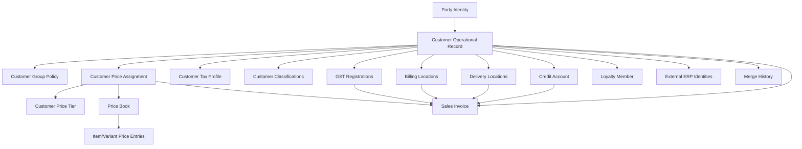
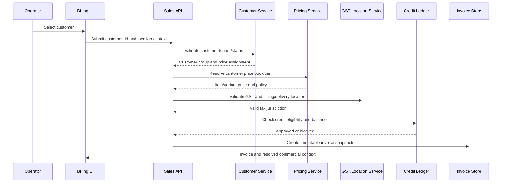

# Customer Domain: Shoper9 Learning and SMRITI Blueprint

## Purpose

This document defines what SMRITI should learn from the Shoper9 Distributor/POS customer workflows and how to preserve SMRITI's stronger GST, tenant, address, and audit architecture.

This is a design blueprint only. It does not change application code or database data.

## Decision

Yes, SMRITI should learn from Shoper9 customer workflows.

The valuable Shoper lessons are:

- A complete customer commercial contract.
- Explicit customer price-group assignment.
- Configurable classifications and profiles.
- Separate saved customer data from temporary billing context.
- Credit, payment, tax, address, and loyalty controls connected to billing.
- Customer-focused reports and import/export controls.
- Fast operator search and selection.

SMRITI should not copy Shoper's legacy database shape or put every policy into one customer-price-group table.

## Source Evidence

Shoper topics:

- [`shoper9pos/catalogue/CC_Customer_Catalogue.htm`](../shoper9pos/catalogue/CC_Customer_Catalogue.htm)
- [`shoper9pos/catalogue/CC_Adding_Customer.htm`](../shoper9pos/catalogue/CC_Adding_Customer.htm)
- [`shoper9pos/catalogue/CC_Retail_Details_in_Customer_Catalogue.htm`](../shoper9pos/catalogue/CC_Retail_Details_in_Customer_Catalogue.htm)
- [`shoper9pos/catalogue/CC_Additional_Details_in_Customer_Catalogue.htm`](../shoper9pos/catalogue/CC_Additional_Details_in_Customer_Catalogue.htm)
- [`shoper9pos/catalogue/CPG_Customer_Price_Group.htm`](../shoper9pos/catalogue/CPG_Customer_Price_Group.htm)
- [`shoper9pos/catalogue/CPG_Adding_Customer_Price_Group.htm`](../shoper9pos/catalogue/CPG_Adding_Customer_Price_Group.htm)
- [`shoper9pos/Sales/Customer_Classification_Configuration_POS.htm`](../shoper9pos/Sales/Customer_Classification_Configuration_POS.htm)
- [`shoper9/Reports/Customer_Offtake_Bill-wise_Report.htm`](../shoper9/Reports/Customer_Offtake_Bill-wise_Report.htm)
- [`shoper9/housekeep/Importing_Customer_Information.htm`](../shoper9/housekeep/Importing_Customer_Information.htm)

SMRITI evidence:

- [`backend/app/models/crm.py`](../backend/app/models/crm.py)
- [`backend/app/models/pricing.py`](../backend/app/models/pricing.py)
- [`backend/app/models/party.py`](../backend/app/models/party.py)
- [`backend/app/models/sales.py`](../backend/app/models/sales.py)
- [`backend/app/services/sales.py`](../backend/app/services/sales.py)
- [`backend/app/api/v1/crm.py`](../backend/app/api/v1/crm.py)
- [`backend/app/api/v1/crm_reports.py`](../backend/app/api/v1/crm_reports.py)
- [`src/components/customer/CustMasterWs.tsx`](../src/components/customer/CustMasterWs.tsx)
- [`src/components/customer/CustMailingDlg.tsx`](../src/components/customer/CustMailingDlg.tsx)
- [`src/components/billing/BillingTerm.tsx`](../src/components/billing/BillingTerm.tsx)

## Shoper Customer Model

Shoper's customer catalogue contains:

```text
Customer identity
Customer price group
Mailing/address list
Five classifications
Five profile fields
Retail/personal details
Dependants/subordinates
Loyalty details
Payment details
Credit terms and limits
Price/tax factors
Statutory tax details
Retail/Distributor integration details
```

A Shoper Customer Price Group combines commercial controls:

```text
Price factor applicability
Cash invoice permission
Credit invoice permission
Miscellaneous issue permission
Payment terms
Credit days
Credit limit
Destination tax type
```

Shoper also documents temporary classification values entered during POS billing. These can apply to the current bill without becoming part of the saved customer master.

## SMRITI Current Strengths

SMRITI already exceeds Shoper in important areas:

- Multi-state GST registrations.
- Separate billing and delivery locations.
- Alphanumeric delivery store codes.
- GST state-prefix validation.
- Customer/location ownership validation.
- Immutable invoice tax and location snapshots.
- Tenant-scoped customer identity and duplicate protection.
- External ERP identity mappings.
- Customer merge foundations.
- Dedicated price books and price-book entries.
- Backend loyalty foundations.

These strengths must remain authoritative.

## Current SMRITI Risks

### 1. Rich UI versus persisted contract

The customer workspace displays many Shoper-style fields, but the canonical backend customer payload does not persist all of them. Risk areas include:

- Customer price group.
- Payment category and payment terms.
- Per-customer credit overrides.
- Price and tax factors.
- Cash, credit, miscellaneous issue, and receipt permissions.
- Dependants and personal/profile fields.
- Loyalty membership details.
- Transport and banking metadata.

The UI must not show a value as saved unless it is persisted and returned by the backend.

### 2. Customer price assignment is not authoritative

The canonical customer model has `customer_group_id`, while pricing has `CustomerPriceTier` and `PriceBook`. Customer-to-tier assignment is not consistently a persisted relationship. Price resolution can accept an explicit tier code instead of deriving it from the selected customer.

This can produce default pricing when the customer should receive a corporate or distributor price.

### 3. Credit ledger ownership is split

The frontend contains credit-engine behavior, while backend invoices store paid and balance amounts. A durable receipt/allocation ledger must be the single source for customer credit balances.

### 4. Duplicate customer architectures

SMRITI has both:

```text
customers
parties + customer_profiles
```

One must become the identity authority. The other must become an explicit compatibility projection or bridge.

### 5. Customer reports need canonical fields

Customer report SQL currently references fields that are not present on the canonical customer model and may degrade through broad exception handling. Reports must fail visibly and use the canonical schema.

## Target Architecture



## Ownership Rules

### Customer identity

Short term: keep `customers` authoritative for operational sales and CRM APIs.

Long term: bridge `customers` to `parties`, then migrate identity ownership deliberately. Do not allow both models to independently own pricing, credit, or tax policy.

### Customer group policy

Use for commercial permissions and credit defaults:

```text
allow_cash_invoice
allow_credit_invoice
allow_misc_issue
allow_misc_receipt
credit_limit
credit_days
grace_days
credit_hold
auto_block_sales
allowed_payment_methods
max_discount_percent
tax_inclusive
```

### Customer price assignment

Create one authoritative assignment per customer and validity period:

```text
customer_id
price_tier_id
price_book_id
valid_from
valid_to
priority
assignment_source
approved_by
```

A customer may have historical assignments, but only one active effective assignment should win for a transaction.

### GST and locations

Keep SMRITI's existing separation:

```text
Customer
  +-- GST registrations by state
  +-- Billing locations
  +-- Delivery locations/store codes
```

Do not merge billing and delivery into a single address field.

### Classification and profile values

Use configurable definitions instead of fixed columns:

```text
customer_classification_definitions
customer_classification_values
```

For billing-only values, persist a transaction snapshot with:

```text
source = SAVED_MASTER | TEMPORARY_BILLING
```

## End-to-End Billing Flow



## Required Invariants

1. Customer code is unique within the tenant for active customers.
2. Inactive or deleted customers cannot be selected for new billing.
3. A customer has at most one active primary GST registration.
4. A customer has at most one active default billing location.
5. A customer has at most one active default delivery location.
6. Every selected location belongs to the selected customer.
7. GSTIN state prefix matches the registration state.
8. Credit invoices require an eligible customer and approved credit policy.
9. Price resolution derives from `customer_id`, not a frontend-local price-group string.
10. Invoice stores immutable customer, price, GST, location, payment, and credit snapshots.
11. Customer receipts and allocations are persisted exactly once.
12. Payment allocation cannot exceed receipt amount or invoice balance.
13. Returns and cancellations reverse outstanding and loyalty movements exactly once.
14. Customer merges preserve invoice history and source-to-target audit mapping.
15. All customer, price, credit, GST, and location queries are tenant-scoped.

## API Blueprint

```text
GET    /crm/customers
POST   /crm/customers
GET    /crm/customers/{id}
PATCH  /crm/customers/{id}
POST   /crm/customers/check-duplicate
POST   /crm/customers/{target}/merge/{source}

GET    /crm/customers/{id}/classifications
PUT    /crm/customers/{id}/classifications

GET    /crm/customers/{id}/price-assignment
PUT    /crm/customers/{id}/price-assignment
GET    /crm/customers/{id}/price-history

GET    /crm/customers/{id}/credit-account
POST   /crm/customers/{id}/credit-receipts
POST   /crm/customers/{id}/credit-adjustments
GET    /crm/customers/{id}/ledger
GET    /crm/customers/{id}/aging

GET    /crm-reports/customer-offtake
GET    /crm-reports/customer-aging
GET    /crm-reports/customer-ledger
GET    /crm-reports/customer-mailer
POST   /crm/import/customers/validate
POST   /crm/import/customers/commit
GET    /crm/export/customers
```

## UI Blueprint

```text
Customer 360
├── Identity
│   ├── Code and legal name
│   ├── Mobile and email
│   ├── Duplicate warning
│   └── External ERP identities
├── Commercial Policy
│   ├── Customer group
│   ├── Credit permission and limit
│   ├── Payment terms
│   └── Allowed transaction types
├── Price Assignment
│   ├── Price tier
│   ├── Price book
│   ├── Effective dates
│   └── Assignment history
├── Tax and Compliance
│   ├── GST registrations
│   ├── Primary registration
│   └── State validation
├── Addresses
│   ├── Billing locations
│   ├── Delivery locations
│   ├── Default flags
│   └── Store codes
├── Classifications and Loyalty
│   ├── Saved classifications
│   ├── Temporary billing context
│   └── Loyalty membership/ledger
├── Credit Ledger
│   ├── Outstanding
│   ├── Receipts
│   ├── Allocations
│   ├── Aging
│   └── Holds and approvals
└── Reports and Audit
    ├── Offtake
    ├── Customer ledger
    ├── Price history
    ├── Import/export history
    └── Merge/identity audit
```

## Phased Plan

### Phase 0: Ownership and correctness

- Choose `customers` as short-term operational authority.
- Define the bridge to `parties`.
- Fix CRM report field mismatches and remove silent fallback errors.
- Remove broken `Customer.price_group_id` assumptions.
- Add tests proving customer price assignment reaches billing.

### Phase 1: Persist the visible customer contract

- Persist commercial fields currently shown in the UI.
- Decide group-only policy versus customer-level overrides.
- Replace local-only price group strings with backend IDs.
- Persist classification/profile values intentionally.
- Preserve canonical GST and address ownership.

### Phase 2: Connect customer to pricing

- Add `customer_price_assignments`.
- Resolve price from `customer_id`.
- Define precedence: price book, tier, volume break, promotion, authorized override.
- Snapshot resolved price policy on orders and invoices.

### Phase 3: Build durable credit accounting

- Add customer credit accounts, receipts, allocations, adjustments, and holds.
- Reconcile invoice balance, customer outstanding, and ledger totals.
- Enforce FIFO allocation and reversal rules.
- Add idempotency and concurrency protection.

### Phase 4: Reports and data exchange

- Implement Shoper-style customer offtake reports.
- Add customer ledger and aging reports.
- Add validated customer import/export with dry run, rejection log, and idempotency.
- Add price assignment history and audit views.

## Final Assessment

SMRITI should learn from Shoper9 customer workflows, especially:

- Commercially meaningful price groups.
- Configurable classifications.
- Customer-focused reports.
- Credit and payment controls.
- Fast search and billing linkage.
- Explicit import/export behavior.

SMRITI should retain its stronger design for:

- Multi-state GST.
- Separate billing/delivery locations.
- Tenant isolation.
- Immutable invoice snapshots.
- External identity mapping.
- Customer merge and historical preservation.

The target is not a Shoper clone:

```text
Shoper customer workflow discipline
+ SMRITI GST/location architecture
+ authoritative customer pricing assignment
+ durable credit ledger
+ tenant-scoped auditability
= production-grade customer domain
```
