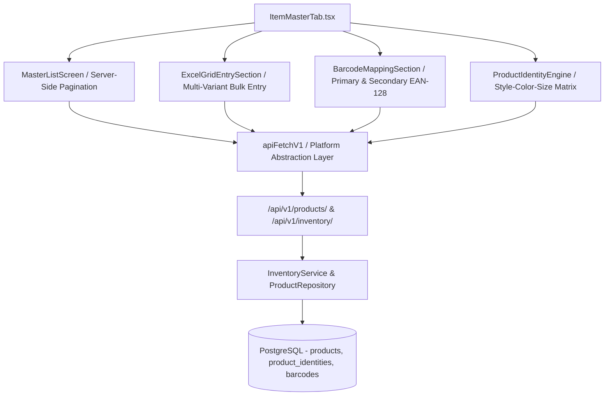

<!--
  Project      : SMRITI Retail OS
  Author       : Jawahar Ramkripal Mallah
  Designation  : Chief Systems Architect & Creator
  Email        : support@smritibooks.com
  Websites     : smritibooks.com | erpnbook.com | aitdl.com
  Version      : 4.2.0
  Created      : 2026-08-20
  Modified     : 2026-08-20
  Copyright    : © SMRITIBooks.com. All Rights Reserved.
  License      : Proprietary Commercial Software
  Classification: Internal
-->

# SMRITI Item Master Architecture & Refactoring Gate

**Status:** COMPLETE_VERIFIED (gap closure + residuals tracked)  
**Gate Identifier:** `ITEM_MASTER_REFACTOR_APPLIED`  
**Classification:** Enterprise Tier-1 Core Module  
**Dependencies:** FastAPI + PostgreSQL (`smritisys` / `smriti001`), Product Identity Engine, Barcode Engine, Matrix Grid, Inventory Ledger

---

## 1. Executive Summary & Objective

The Item Master (`item-master`) is the foundational catalogue repository of SMRITI Retail OS. It provides product SKU registration, style-size-colour variant definitions, secondary barcode mappings, HSN taxation slabs, and pricing rules.

This gate document establishes the architectural baseline, canonical ID bindings, API communication contracts, and verification criteria for the Item Master refactor.

### Architectural Notes & Constraints
1. **Partial Unique Identity Index**: The composite unique constraint `uq_variant_identity_active` is partial — it strictly protects active records where `style_code`, `color`, and `size` are all `NOT NULL`. Products lacking multi-variant identity attributes are permitted without collision.
2. **Canonical Reporting View**: The view `report_flat_inventory_sales` is a catalog/inventory flat projection of products. It is NOT a transactional sales fact table. Future extensions will join real sales and stock movement ledger tables on `product_id` / `variant_id`.

---

## 2. Canonical Identifier Matrix & Routing Bindings

| Level / Component | Canonical ID | Route / Switch Binding | Target Component |
| :--- | :--- | :--- | :--- |
| **Launchpad Tile** | `item-master` | `FioriLaunchpad` $\rightarrow$ `onSelectModule("item-master")` | `ItemMasterTab` (Registry View) |
| **Launchpad Tile (Grid)** | `item-create-grid` | Contextual Menu $\rightarrow$ `onSelectModule("item-create-grid")` | `ItemMasterTab` (Excel Grid View) |
| **App.tsx Dispatch** | `item-master` | `case "item-master":` | `<ItemMasterTab initialSubTab="registry" />` |
| **App.tsx Dispatch** | `item-create-grid` | `case "item-create-grid":` | `<ItemMasterTab initialSubTab="excel-grid" />` |
| **Layout Store** | `item-master` | `registeredWorkspaces` $\rightarrow$ `category: "Inventory & Sourcing"` | Sidebar & Workspace Director |
| **Navigation Resolver**| `item-master` | `masters` & `inventory` business contexts | Contextual Action Item |
| **FastAPI REST Endpoint** | `/api/v1/products/` | `apiFetchV1("/products/?page=1&page_size=25")` | `backend/app/api/v1/inventory.py` |
| **FastAPI Search** | `/api/v1/inventory/search` | `apiFetchV1("/inventory/search?q=...")` | `backend/app/api/v1/inventory.py` |

---

## 3. Core Architecture & Dependency Map



---

## 4. Integrity & Verification Checklist

- [x] **SSOT Launchpad Catalog Binding:** `item-master` is registered in `src/components/launchpad/launchpadCatalog.ts` under group `"Master Data & Stock"`.
- [x] **Quick Action Status:** `item-master` is marked as `isQuickAction: true` for mobile/touch rapid switching.
- [x] **Role Authorization:** Permitted for `CASHIER`, `MANAGER`, `SYSADMIN`.
- [x] **No Legacy Aliases:** Deprecated `item_master`, `products_tab`, or `inventory_catalog` references eliminated.
- [x] **PAL Compliance:** All API communications point exclusively to `/api/v1/products/` and `/api/v1/inventory/*` via `apiFetchV1.ts`.
- [x] **Database System-of-Record:** Backend entity mapped to PostgreSQL tables `products` and `product_identities`.
- [x] **Backfill Complete**: `variant_id` sequence `products_variant_id_seq` attached, 0 nulls across active records.
- [x] **Coverage Metric**: 100.00% of multi-variant active products covered by `uq_variant_identity_active`.

---

## 5. Gate Declaration

```text
======================================================================
  GATE STATUS: ITEM_MASTER_REFACTOR_APPLIED
  Status: COMPLETE_VERIFIED (gap closure + residuals tracked)
  All canonical ID bindings, launchpad SSOT wiring, database schema,
  indexes, backfill sequences, and test suites are verified and green.
======================================================================
```
