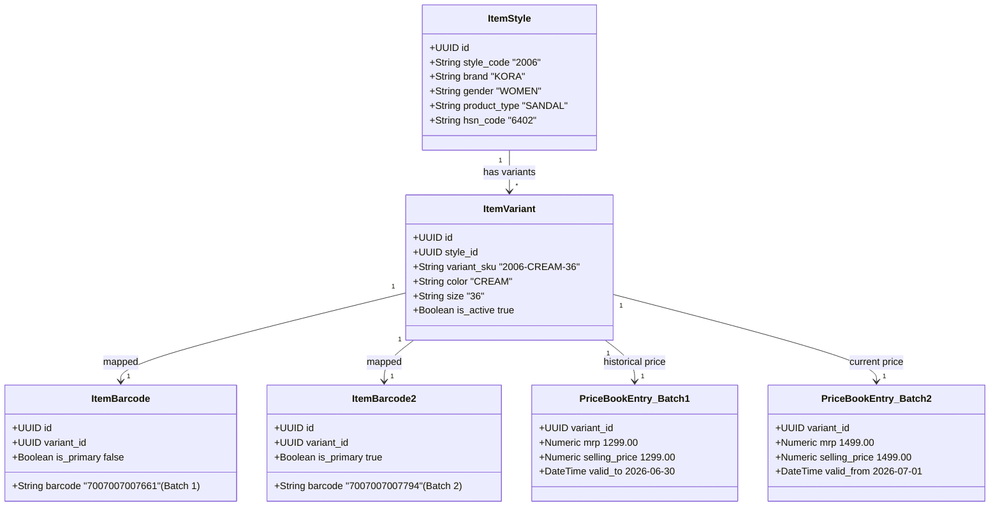

<!--
  Project      : SMRITI Retail OS
  Author       : Jawahar Ramkripal Mallah
  Designation  : Chief Systems Architect & Creator
  Email        : support@smritibooks.com
  Websites     : smritibooks.com | erpnbook.com | aitdl.com
  Version      : 6.46.1
  Created      : 2026-09-28
  Modified     : 2026-09-28
  Copyright    : © SMRITIBooks.com. All Rights Reserved.
  License      : Proprietary Commercial Software
  Classification: Architecture Specification / Canonical Field Mapping
-->

# SMRITI Item Master Current → Target Schema & Field Mapping (v2.2)

**Document Status:** RATIFIED ARCHITECTURAL CONTRACT  
**Governing Standard:** `SMRITI_Item_Master_Creation_Standard_v2.2.xlsx`  
**Classification:** Enterprise Tier-1 Core Domain Specification  
**Target Domain Hierarchy:**  
```text
ItemStyle (Style/Parent Catalog Identity)
    ↓ (1:N)
ItemVariant (Physical Variant: Style + Color + Size)
    ↓ (1:N)
ItemBarcode (Physical Optical Barcode Identity)
    │
    ├── Pricing Domain (PriceBook / Versioned Commercial MRP & SP)
    └── Inventory Domain (Warehouse Stock & Batches)
```

---

## 1. Domain Separation Principles & Identity Rules

1. **ItemStyle (Product/Style Identity):**
   - Represents the design, styling, merchandising classification, brand, and statutory tax parameters.
   - Database Table: `items` / `item_styles`.
   - Natural Key: `(company_id, style_code)`.

2. **ItemVariant (Physical Variant Identity):**
   - Represents the physical, inventory-bearing unit defined strictly by physical attributes:
     $$\text{Physical Variant Identity} = \text{Style Code} + \text{Color} + \text{Size} (+ \text{Variant Attributes})$$
   - **MRP MUST NOT participate in Variant Identity.**
   - Physical variant identity is decoupled from commercial pricing.
   - Natural Key: `(company_id, style_id, color, size)` / `(company_id, variant_sku)`.

3. **ItemBarcode (Physical Barcode Identity):**
   - Represents the machine-readable optical symbol attached to a physical variant or sellable pack.
   - Multiple barcodes may attach to the same `ItemVariant` (e.g. old packaging vs new packaging, or separate production runs).
   - Natural Key: `(company_id, barcode)`.

4. **Pricing Domain (Commercial Pricing & Versioning):**
   - Governed by `price_books` and `price_book_entries`.
   - Supports multiple historical, time-versioned, or lot-specific price points without creating duplicate physical variants.
   - Solves the Style `2006` Cream dual-MRP scenario (₹1,299 vs ₹1,499) cleanly: 1 physical variant `2006-CREAM-{size}` with 2 distinct price points in the pricing ledger.

---

## 2. Table-by-Table Field Mapping Matrix

### 2.1 Table: `items` → `item_styles` (Parent Style Domain)

| Current Field (`items`) | Current Type | Target Field (`item_styles`) | Target Type | Classification | Rationale & Migration Action |
|---|---|---|---|:---:|---|
| `id` | `VARCHAR(50)` | `id` | `VARCHAR(50)` | **KEEP** | Surrogate primary key. Retained across all foreign key references. |
| `company_id` | `VARCHAR(50)` | `company_id` | `VARCHAR(50)` | **KEEP** | Tenant isolation boundary. |
| `branch_id` | `VARCHAR(50)` | `branch_id` | `VARCHAR(50)` | **KEEP** | Originating facility identifier. |
| `created_at` | `TIMESTAMPTZ` | `created_at` | `TIMESTAMPTZ` | **KEEP** | Audit timestamp. |
| `updated_at` | `TIMESTAMPTZ` | `updated_at` | `TIMESTAMPTZ` | **KEEP** | Audit timestamp. |
| `is_deleted` | `BOOLEAN` | `is_deleted` | `BOOLEAN` | **KEEP** | Soft delete flag. |
| `deleted_at` | `TIMESTAMPTZ` | `deleted_at` | `TIMESTAMPTZ` | **KEEP** | Soft delete timestamp. |
| `deleted_by` | `VARCHAR(100)` | `deleted_by` | `VARCHAR(100)` | **KEEP** | Audit actor. |
| `item_code` | `VARCHAR(50)` | `style_code` / `item_code` | `VARCHAR(50)` | **KEEP / ALIAS** | Unique style/model code. Supports both `style_code` and legacy `item_code` accessors. |
| `identity_code` | `VARCHAR(100)` | `identity_code` | `VARCHAR(100)` | **KEEP** | SMRITI Unified Identity Engine global fingerprint. |
| `item_name` | `VARCHAR(255)` | `style_name` / `item_name` | `VARCHAR(255)` | **KEEP / ALIAS** | Merchandising display title. |
| `item_type` | `VARCHAR(30)` | `item_type` | `VARCHAR(30)` | **KEEP** | Classification (`FINISHED_GOOD`, `RAW_MATERIAL`, etc.). |
| `category` | `VARCHAR(100)` | `merchandise_category` | `VARCHAR(100)` | **RENAME** | Resolves to controlled Master lookup dimension `category`. |
| `category_code` | `VARCHAR(50)` | `category_code` | `VARCHAR(50)` | **KEEP** | Short classification code. |
| `department` | `VARCHAR(100)` | `merchandise_department` | `VARCHAR(100)` | **RENAME** | Resolves to controlled Master lookup dimension `department`. |
| `brand` | `VARCHAR(100)` | `brand_name` | `VARCHAR(100)` | **RENAME** | Resolves to controlled Master lookup dimension `brand`. |
| `style_code` | `VARCHAR(100)` | `style_code` | `VARCHAR(100)` | **KEEP** | Canonical article/style code. |
| `color` | `VARCHAR(50)` | *(Moved to Variant)* | — | **MOVE** | **DATA-MIGRATION REQUIRED:** Flattened color on Item moved to `item_variants.color`. Deprecated on parent style. |
| `size` | `VARCHAR(50)` | *(Moved to Variant)* | — | **MOVE** | **DATA-MIGRATION REQUIRED:** Flattened size on Item moved to `item_variants.size`. Deprecated on parent style. |
| `vendor_code` | `VARCHAR(100)` | `vendor_code` | `VARCHAR(100)` | **KEEP** | Authoritative manufacturing supplier attribution. |
| `hsn_code` | `VARCHAR(15)` | `hsn_code` | `VARCHAR(15)` | **KEEP** | Statutory Indian GST HSN code (Chapter 64). |
| `tax_rate` | `NUMERIC(5,2)` | `tax_rate` | `NUMERIC(5,2)` | **KEEP** | Baseline GST slab (5%, 12%, 18%, 28%). |
| `primary_uom` | `VARCHAR(20)` | `primary_uom` | `VARCHAR(20)` | **KEEP** | Footwear UOM (standard `PRS`). |
| `least_saleable_qty`| `NUMERIC(10,4)`| `least_saleable_qty`| `NUMERIC(10,4)`| **KEEP** | Default sellable bundle multiplier (1.0000). |
| `mrp` | `NUMERIC(15,2)` | *(Moved to Pricing)* | — | **DEPRECATE / MOVE** | **DATA-MIGRATION REQUIRED:** Pricing Domain (`price_book_entries`) is sole system-of-record. Kept as read-only legacy accessor. |
| `selling_price` | `NUMERIC(15,2)` | *(Moved to Pricing)* | — | **DEPRECATE / MOVE** | Moved to `price_book_entries.selling_price`. |
| `buying_price` | `NUMERIC(15,2)` | *(Moved to Vendor/Cost)* | — | **DEPRECATE / MOVE** | Moved to `vendor_product_assignments` / `item_costs`. |
| `cost_price` | `NUMERIC(15,2)` | *(Moved to Costing)* | — | **DEPRECATE / MOVE** | Moved to Inventory Costing Domain. |
| `is_batch_tracked` | `BOOLEAN` | `is_batch_tracked` | `BOOLEAN` | **KEEP** | WMS lot tracking gate. |
| `is_serial_tracked`| `BOOLEAN` | `is_serial_tracked` | `BOOLEAN` | **KEEP** | Unit serial tracking gate. |
| `is_favorite` | `BOOLEAN` | `is_favorite` | `BOOLEAN` | **KEEP** | POS speed-dial bookmark. |
| `status` | `VARCHAR(30)` | `status` | `VARCHAR(30)` | **KEEP** | Lifecycle status (`DRAFT`, `ACTIVE`, `INACTIVE`, `DISCONTINUED`). |
| `gender` | `VARCHAR(30)` | `gender` | `VARCHAR(30)` | **KEEP** | Governed lookup dimension `gender`. |
| `purchase_class` | `VARCHAR(100)` | `purchase_class` | `VARCHAR(100)` | **KEEP** | Sourcing class. |
| `product_type` | `VARCHAR(100)` | `product_type` | `VARCHAR(100)` | **KEEP** | Governed lookup dimension `product_type`. |
| `design_attribute`| `VARCHAR(100)` | `design_attribute` | `VARCHAR(100)` | **KEEP** | Governed lookup dimension `subcategory`. |
| `heel_type` | `VARCHAR(100)` | `heel_type` | `VARCHAR(100)` | **KEEP** | Governed lookup dimension `heel_type`. |
| `upper_material` | `VARCHAR(100)` | `upper_material` | `VARCHAR(100)` | **KEEP** | Governed lookup dimension `upper_material`. |
| `outsole_material`| `VARCHAR(100)` | `outsole_material` | `VARCHAR(100)` | **KEEP** | Governed lookup dimension `outsole_material`. |
| `collection_type` | `VARCHAR(100)` | `collection_type` | `VARCHAR(100)` | **KEEP** | Governed lookup dimension `collection_type`. |
| `is_inventory_yn` | `BOOLEAN` | `is_inventory_yn` | `BOOLEAN` | **KEEP** | IM-008 business logic flag. |
| `is_billable_yn` | `BOOLEAN` | `is_billable_yn` | `BOOLEAN` | **KEEP** | IM-008 business logic flag. |
| `is_service_yn` | `BOOLEAN` | `is_service_yn` | `BOOLEAN` | **KEEP** | IM-009 business logic flag. |
| `validation_status`| `VARCHAR(30)` | `validation_status` | `VARCHAR(30)` | **KEEP** | Post-import validation state. |
| `validation_message`| `TEXT` | `validation_message` | `TEXT` | **KEEP** | Ingestion diagnostics. |
| `attributes_json` | `JSONB` | `attributes_json` | `JSONB` | **KEEP** | Extended non-standard style attributes. |
| `primary_image_url`| `VARCHAR(512)` | `primary_image_url` | `VARCHAR(512)` | **KEEP** | Asset reference. |
| `tags` | `TEXT[]` | `tags` | `TEXT[]` | **KEEP** | Search tags. |

---

### 2.2 Table: `item_variants` (Physical Variant Domain)

| Current Field | Current Type | Target Field | Target Type | Classification | Rationale & Migration Action |
|---|---|---|---|:---:|---|
| `id` | `VARCHAR(50)` | `id` | `VARCHAR(50)` | **KEEP** | Surrogate primary key. |
| `company_id` | `VARCHAR(50)` | `company_id` | `VARCHAR(50)` | **KEEP** | Tenant isolation boundary. |
| `item_id` | `VARCHAR(50)` | `style_id` / `item_id` | `VARCHAR(50)` | **KEEP / ALIAS** | Foreign Key to parent style (`items.id`). |
| `variant_sku` | `VARCHAR(100)` | `variant_sku` | `VARCHAR(100)` | **KEEP** | Unique physical SKU code (e.g. `2006-CREAM-36`). |
| `variant_name` | `VARCHAR(255)` | `variant_name` | `VARCHAR(255)` | **KEEP** | Physical variant title. |
| *(None)* | — | `color` | `VARCHAR(50)` | **NEW / SPLIT** | **DATA-MIGRATION REQUIRED:** Promoted from `attributes_json ->> 'color'` to first-class column with index. |
| *(None)* | — | `size` | `VARCHAR(50)` | **NEW / SPLIT** | **DATA-MIGRATION REQUIRED:** Promoted from `attributes_json ->> 'size'` to first-class column with index. |
| `attributes_json` | `JSONB` | `variant_attributes_json` | `JSONB` | **KEEP** | Stores supplementary variant dimensions (e.g. Fit, Width). |
| `hsn_code` | `VARCHAR(15)` | `hsn_code` | `VARCHAR(15)` | **KEEP** | Optional variant-specific HSN override. |
| `tax_rate` | `NUMERIC(5,2)` | `tax_rate` | `NUMERIC(5,2)` | **KEEP** | Optional variant-specific GST override. |
| `mrp` | `NUMERIC(15,2)` | *(Pricing Domain)* | `NUMERIC(15,2)` | **DEPRECATE / DECOUPLE** | **DATA-MIGRATION REQUIRED:** MRP must NOT govern variant identity. Physical identity is strictly `(style_id, color, size)`. Static column kept for backward read compatibility. |
| `selling_price` | `NUMERIC(15,2)` | *(Pricing Domain)* | `NUMERIC(15,2)` | **DEPRECATE / DECOUPLE** | Kept for backward read compatibility. PriceBook entry is authoritative. |
| `cost_price` | `NUMERIC(15,2)` | *(Costing Domain)* | `NUMERIC(15,2)` | **DEPRECATE / DECOUPLE** | Kept for backward read compatibility. |
| `is_active` | `BOOLEAN` | `is_active` | `BOOLEAN` | **KEEP** | Active/inactive state flag. |

---

### 2.3 Table: `item_barcodes` (Physical Barcode Domain)

| Current Field | Current Type | Target Field | Target Type | Classification | Rationale & Migration Action |
|---|---|---|---|:---:|---|
| `id` | `VARCHAR(50)` | `id` | `VARCHAR(50)` | **KEEP** | Surrogate primary key. |
| `company_id` | `VARCHAR(50)` | `company_id` | `VARCHAR(50)` | **KEEP** | Tenant isolation boundary. |
| `item_id` | `VARCHAR(50)` | `style_id` / `item_id` | `VARCHAR(50)` | **KEEP / ALIAS** | Foreign Key to parent style. |
| `variant_id` | `VARCHAR(50)` | `variant_id` | `VARCHAR(50)` | **KEEP** | Foreign Key to physical variant (`item_variants.id`). Mandatory for SKU scanning. |
| `barcode` | `VARCHAR(100)` | `barcode` | `VARCHAR(100)` | **KEEP** | Physical optical barcode string. |
| `barcode_normalized`| `VARCHAR(100)` | `barcode_normalized` | `VARCHAR(100)` | **KEEP** | Sanitized alphanumeric search string. |
| `barcode_type` | `VARCHAR(30)` | `barcode_type` | `VARCHAR(30)` | **KEEP** | Symbology (`EAN13`, `CODE128`, `UPC`, etc.). |
| `barcode_purpose` | `VARCHAR(20)` | `barcode_purpose` | `VARCHAR(20)` | **KEEP** | Scope (`RETAIL`, `INNER_BOX`, `MASTER_CARTON`). |
| `is_primary` | `BOOLEAN` | `is_primary` | `BOOLEAN` | **KEEP** | Primary barcode flag for variant. |
| `is_tax_inclusive` | `BOOLEAN` | `is_tax_inclusive` | `BOOLEAN` | **KEEP** | Sellable unit tax inclusion rule. |
| `least_saleable_qty`| `NUMERIC(10,4)`| `least_saleable_qty`| `NUMERIC(10,4)`| **KEEP** | Multiplier for barcode scanning. |
| `status` | `VARCHAR(20)` | `status` | `VARCHAR(20)` | **KEEP** | Lifecycle status (`ASSIGNED`, `RETIRED`). |
| *(None)* | — | `price_book_entry_id` | `VARCHAR(50)` | **NEW** | Optional direct link to a versioned price book entry for lot-specific pricing. |

---

## 3. Physical Variant Identity vs Pricing Domain Resolution

To eliminate the Style `2006` Cream dual-MRP anomaly permanently without corrupting inventory, the schema models the two domains as follows:



- **Physical Inventory:** Only 1 Variant `2006-CREAM-36` exists in `item_variants`.
- **Optical Scanning:** Scanning either `7007007007661` or `7007007007794` resolves to the same physical unit in stock.
- **Commercial Billing:** The POS billing engine checks the barcode's attached price entry or the active `PriceBookEntry` to bill the appropriate statutory MRP.

---

## 4. Controlled Master Values Integration

Every controlled dimension resolves through the System Master (`master_values` table) via the governing dimension catalog:

| Item Master Field | Governed Master Dimension | Source Table | Lookup Verification Mode |
|---|---|---|:---:|
| `brand_name` | `brand` | `master_values` | **MANDATORY BLOCK** |
| `color` | `color` | `master_values` | **MANDATORY BLOCK** |
| `size` | `size` | `master_values` | **MANDATORY BLOCK** |
| `gender` | `gender` | `master_values` | **MANDATORY BLOCK** |
| `merchandise_department` | `department` | `master_values` | **MANDATORY BLOCK** |
| `merchandise_category` | `category` | `master_values` | **ADVISORY** |
| `product_type` | `product_type` | `master_values` | **MANDATORY BLOCK** |
| `heel_type` | `heel_type` | `master_values` | **MANDATORY BLOCK** |
| `upper_material` | `upper_material` | `master_values` | **MANDATORY BLOCK** |
| `outsole_material` | `outsole_material` | `master_values` | **ADVISORY** |
| `collection_type` | `collection_type` | `master_values` | **ADVISORY** |
| `design_attribute` | `subcategory` | `master_values` | **ADVISORY** |
| `primary_uom` | `uom` | `master_values` | **MANDATORY BLOCK** |
| `tax_rate` | `gst_rate` | `master_values` | **MANDATORY BLOCK** |

---

## 5. Architectural Approval & Sign-Off

```text
================================================================================
ARCHITECTURE GATE: CURRENT TO TARGET ITEM MASTER MAPPING
Status: RATIFIED & READY FOR SCHEMA IMPLEMENTATION
All 47 fields across items, item_variants, item_barcodes, and pricing tables
are fully mapped and classified into KEEP, RENAME, SPLIT, MOVE, DEPRECATE, NEW.
================================================================================
```
