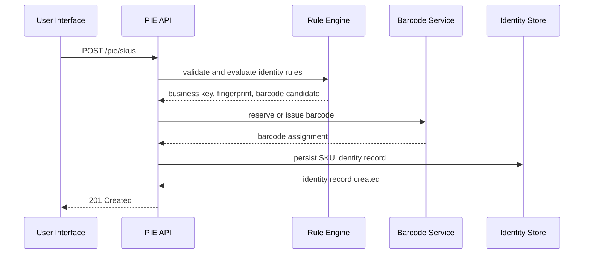
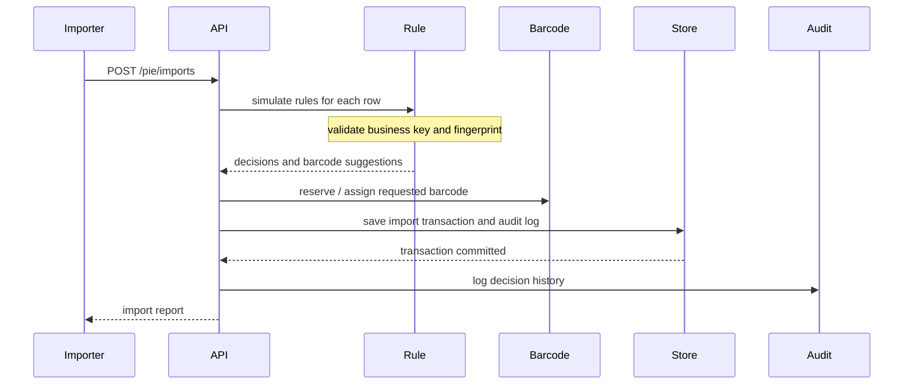
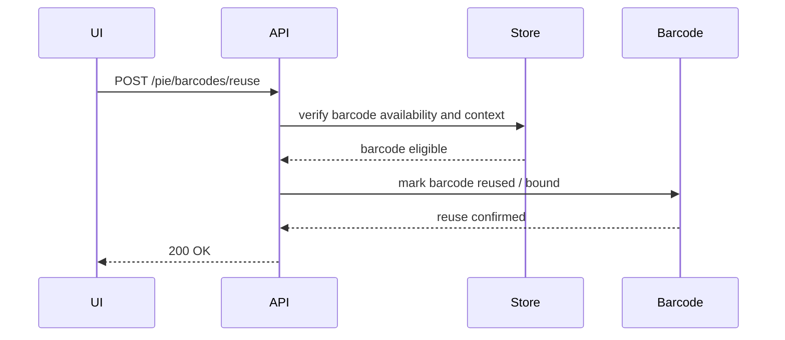
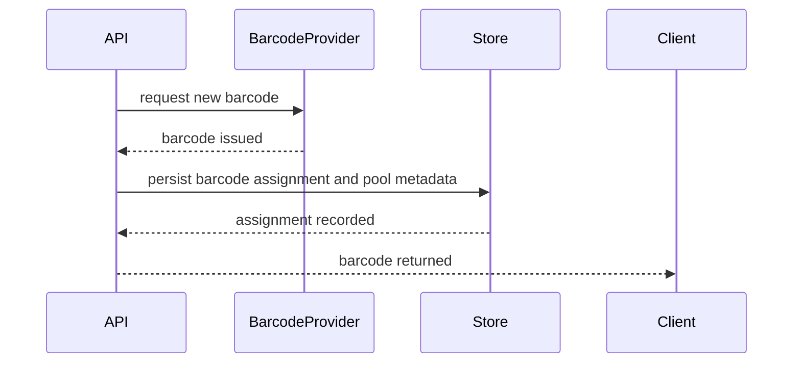
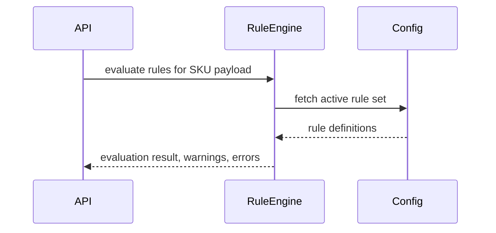
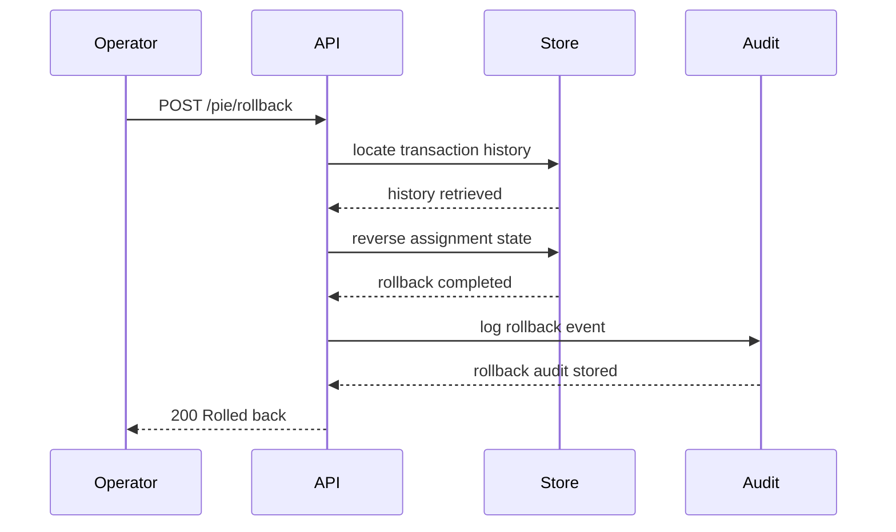

<!--
  Title: Product Identity Engine Sequence Diagrams
  Version: 1.0
  Status: Draft
  Owner: Enterprise Architecture
  Reviewers: Product, Architecture, Engineering
  Last Updated: 2026-07-18
  Dependencies: PRODUCT_IDENTITY_ENGINE.md, PRODUCT_IDENTITY_ENGINE_API_SPEC.md
  Related Documents: PRODUCT_IDENTITY_ENGINE_STATE_MACHINE.md, PRODUCT_IDENTITY_ENGINE_ERRORS.md
  Change History:
    - v1.0 2026-07-18 Created.
-->

# Product Identity Engine Sequence Diagrams

## Purpose

This document describes the key runtime flows for SMRITI Product Identity Engine (PIE), including SKU creation, import, barcode reuse, barcode generation, rule evaluation, and rollback.

## Sequence Diagrams

### 1. Create SKU

### 2. Import SKU

### 3. Reuse Barcode

### 4. Generate Barcode

### 5. Rule Evaluation

### 6. Rollback

