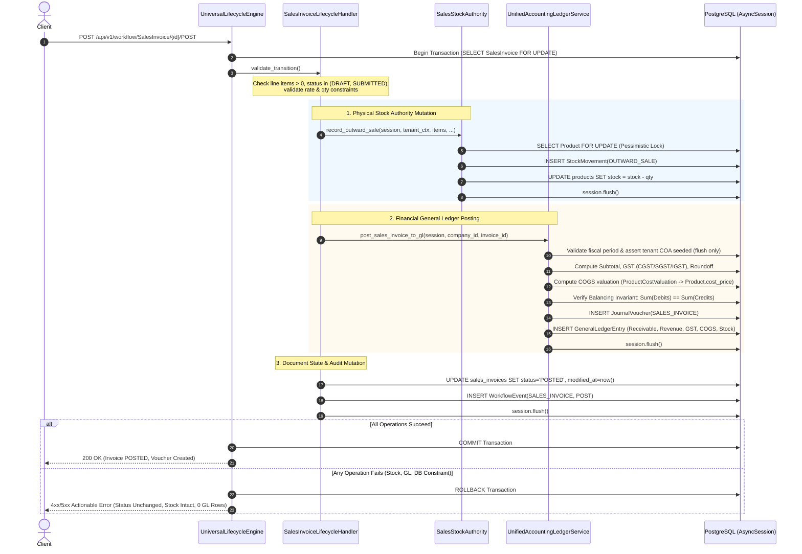

<!--
  Project      : SMRITI Retail OS
  Author       : Jawahar Ramkripal Mallah
  Designation  : Chief Systems Architect & Creator
  Email        : support@smritibooks.com
  Websites     : smritibooks.com | erpnbook.com | aitdl.com
  Version      : 3.16.0
  Created      : 2026-10-01
  Modified     : 2026-10-01
  Copyright    : © SMRITIBooks.com. All Rights Reserved.
  License      : Proprietary Commercial Software
  Classification: Internal
-->

# SMRITI Sales Architecture — Phase P2 Accounting Business Decision Freeze

**Document ID:** SMRITI-SALES-P2-ACCOUNTING-DECISION-FREEZE-v1.0  
**Status:** FROZEN — ARCHITECTURE GOVERNANCE RECORD  
**Date:** 2026-10-01  
**Author:** Jawahar Ramkripal Mallah, Chief Systems Architect & Creator  
**Classification:** Internal System Architecture & Accounting Governance  

---

## 1. Decision Freeze Formal Declaration

By formal executive directive, the architectural and business decisions governing **Phase P2 (General Ledger & Financial Accounting Integration)** of the SMRITI Sales Subsystem are hereby **FROZEN**.

This document serves as the binding, immutable source of truth for all subsequent engineering implementations of Phase P2. Engineering teams and automated coding agents are strictly prohibited from altering the decisions recorded herein, silently resolving policy questions through ad-hoc assumptions, or initiating implementation without satisfying all prerequisite gates.

```text
================================================================================
GOVERNANCE FREEZE REGISTRY:
  - BD-01: INVOICE POST GL FAILURE POLICY    --> FROZEN: OPTION A (Synchronous Fail-Fast)
  - BD-02: INVENTORY / COGS RECOGNITION      --> FROZEN: OPTION A (Perpetual Real-Time COGS)
  - BD-03: PAYMENT ACCOUNTING CONVERGENCE    --> FROZEN: OPTION A (Synchronous Payment Receipt GL)
  - BD-04: POS OFFLINE ACCOUNTING & SYNC     --> FROZEN: OPTION B (Outbox Buffering + Fail-Safe)

PHASE STATUS:
  P2 ACCOUNTING DECISIONS = FROZEN
  P2 IMPLEMENTATION       = NOT STARTED
================================================================================
```

---

## 2. Decision BD-01: Invoice POST GL Failure Policy

### Decision: OPTION A — Synchronous Fail-Fast + Atomic Rollback

### Mandatory Policy Rules:
1. **Zero Silent Error Suppression:** All bare `try...except Exception: pass` or logging-only error handling in document lifecycle handlers (specifically `SalesInvoiceLifecycleHandler` and `SalesReturnLifecycleHandler`) are strictly forbidden.
2. **Indivisible Transaction Boundary:** If General Ledger voucher generation, validation, or account lookup fails for any reason during the `POST` transition, the entire transaction MUST abort immediately via database rollback.
3. **Rollback Invariants:** Upon GL posting failure:
   - The `SalesInvoice` MUST NOT become `POSTED`; its status remains strictly in its pre-transition state (`DRAFT` or `SUBMITTED`).
   - The physical stock mutation MUST roll back completely.
   - The `StockMovement` row (`OUTWARD_SALE`) MUST roll back and not persist.
   - Cached inventory balance in `Product.stock` MUST roll back to its exact pre-transaction value.
   - Any generated `JournalVoucher` and `GeneralLedgerEntry` rows MUST roll back (0 orphan entries).
   - The `WorkflowEvent` record MUST roll back.
4. **Actionable Caller Feedback:** The API endpoint must return a structured, human-readable error response (e.g., HTTP 422 or 500) indicating the exact accounting barrier (e.g., unseeded chart of accounts, closed fiscal period, or unbalanced voucher), enabling operational correction.

---

## 3. Decision BD-02: Inventory & Cost of Goods Sold (COGS) Recognition

### Decision: OPTION A — Perpetual Real-Time COGS

### Mandatory Policy Rules:
1. **Perpetual Double-Entry Mandate:** On every Sales Invoice `POST`, the system must record the cost of merchandise sold simultaneously with sales revenue:
   - **Debit:** Cost of Goods Sold (Account `5010` — Expense)
   - **Credit:** Stock in Hand / Inventory Asset (Account `1040` — Asset)
2. **Authoritative Costing Source Discovery & Mapping:**
   In accordance with the directive to utilize existing authoritative costing mechanisms rather than inventing ad-hoc FIFO/moving average logic:
   - **Primary Costing Entity:** `ProductCostValuation` (`product_cost_valuations` table, defined in [`backend/app/models/profitability.py`](file:///f:/SMRITRretailNX/backend/app/models/profitability.py#L20)).
   - **Line-Item Cost Snapshot Entity:** `TransactionCostSnapshot` (`transaction_cost_snapshots` table, defined in [`backend/app/models/profitability.py`](file:///f:/SMRITRretailNX/backend/app/models/profitability.py#L37)).
   - **Master Cost Fallback:** `Product.cost_price` (`products` table, defined in [`backend/app/models/inventory.py`](file:///f:/SMRITRretailNX/backend/app/models/inventory.py#L44)).
3. **Valuation Resolution Hierarchy:**
   For each item line in a sales invoice:
   $$\text{Unit Cost} = \begin{cases} 
   \texttt{ProductCostValuation.weighted\_average\_cost} & \text{if } > 0 \\
   \texttt{ProductCostValuation.purchase\_cost} & \text{if } > 0 \\
   \texttt{ProductCostValuation.last\_purchase\_cost} & \text{if } > 0 \\
   \texttt{Product.cost\_price} & \text{if } > 0 \\
   0.00 & \text{fallback (flagged as zero-cost)}
   \end{cases}$$
4. **Engineering Blocker Registry (Identified Costing Gap):**
   - *Current State:* While `ProductCostValuation` is updated on Goods Receipt (GRN) via `purchase.py`, historical or test catalog products may lack a `ProductCostValuation` row or carry `cost_price = 0.00`.
   - *Implementation Blocker:* Posting a 0.00 INR COGS entry creates zero-value ledger lines. The P2 implementation plan must include an authoritative fallback resolver that permits zero-cost retail promotions while raising warnings or requiring managerial override for standard merchandise lacking cost valuation.

---

## 4. Decision BD-03: Payment Accounting Convergence

### Decision: OPTION A — Synchronous Payment Receipt GL

### Mandatory Policy Rules:
1. **Three-Way Transactional Parity:** Each successful payment tender collection on a sales invoice must atomically create:
   $$\texttt{PaymentTransaction} \iff \texttt{PaymentAllocation} \iff \texttt{JournalVoucher(PAYMENT\_RECEIPT)}$$
2. **Double-Entry Distribution by Tender Type:**
   - **Cash Tenders (`CASH`):**
     * **Debit:** Cash in Hand (Account `1010` — Asset) = `payment_amount`
     * **Credit:** Accounts Receivable / Sundry Debtors (Account `1030` — Asset) = `payment_amount` (Party: `customer_id`)
   - **Digital / Bank Tenders (`UPI`, `CARD`, `NETBANKING`, `BANK`):**
     * **Debit:** Bank Accounts (Account `1020` — Asset) = `payment_amount`
     * **Credit:** Accounts Receivable / Sundry Debtors (Account `1030` — Asset) = `payment_amount` (Party: `customer_id`)
3. **Idempotency Guarantee:** Exactly one payment transaction record produces exactly one `JournalVoucher` header with statutory doc type `PAYMENT_RECEIPT` linked via `reference_doc_id = payment_transaction.id`.
4. **Lifecycle Handler Convergence:** The bare status mutation in `SalesInvoiceLifecycleHandler(action="PAY")` is abolished; it must delegate directly to `PaymentsEngine.process_payment`, ensuring complete accounting linkage.

---

## 5. Decision BD-04: POS Offline Accounting & Synchronization

### Decision: OPTION B — Outbox Buffering + Fail-Safe Reconciliation

### Mandatory Policy Rules:
1. **Continuity of Offline Retail Operations:** Offline POS billing terminals must be permitted to complete checkouts locally during network disconnections using the local offline queue.
2. **Synchronization Pipeline:** When network connectivity is restored, transactions synchronize to the central cluster in the following deterministic sequence:
   $$\text{Local Terminal Outbox} \longrightarrow \text{Central Ingestion} \longrightarrow \text{Server-Side Validation} \longrightarrow \text{Stock Mutation} \longrightarrow \text{GL Voucher Generation} \longrightarrow \text{Terminal ACK}$$
3. **Idempotency Invariant for Offline Batches:** Every offline transaction payload MUST carry a globally unique, immutable `idempotency_key` and `client_session_uuid`.
4. **Strict Duplicate Prevention:** Re-synchronization, network timeouts, or repeated sync requests MUST NEVER result in:
   - Duplicate `SalesInvoice` records.
   - Duplicate `StockMovement` entries or double inventory deduction.
   - Duplicate `PaymentTransaction` records.
   - Duplicate `JournalVoucher` or double-counted financial balances.
5. **Implementation Scope:** Documented as an architectural requirement; actual code changes deferred to the POS Synchronization phase.

---

## 6. Authoritative Accounting Event Matrix

The frozen double-entry accounting matrix for all commercial sales events is defined as follows:

| Business Event | Source Document | Debit Accounts | Credit Accounts | Physical Stock Effect | GL Voucher Type | Statutory Reversal Method |
|---|---|---|---|---|---|---|
| **Invoice POST (Revenue & Tax)** | `SalesInvoice` | Accounts Receivable (`1030`) | Sales Revenue (`4010`)<br>Output CGST (`2021`)<br>Output SGST (`2022`)<br>Output IGST (`2023`)<br>Roundoff (`5030`) | `OUTWARD_SALE` (via `SalesStockAuthority`) | `SALES_INVOICE` | Compensating Reversal Voucher (`SALES_CANCEL`) |
| **Invoice POST (Perpetual COGS)** | `SalesInvoice` | Cost of Goods Sold (`5010`) | Stock in Hand / Inventory (`1040`) | Synchronized with Outward Sale | Combined or Linked JV | Compensating Reversal Voucher |
| **Invoice CANCEL** | `SalesInvoice` | Sales Revenue (`4010`)<br>Output GST (`2021-23`)<br>Roundoff (`5030`)<br>Inventory (`1040`) | Accounts Receivable (`1030`)<br>Cost of Goods Sold (`5010`) | `RETURN_INWARD` (Restock) | `SALES_CANCEL` | Historical vouchers remain immutable; new compensating voucher posted |
| **Customer PAYMENT (Cash)** | `PaymentTransaction` | Cash in Hand (`1010`) | Accounts Receivable (`1030`) (Party: `customer_id`) | None | `PAYMENT_RECEIPT` | Payment Void / Reversal Voucher |
| **Customer PAYMENT (Bank/Digital)**| `PaymentTransaction` | Bank Accounts (`1020`) | Accounts Receivable (`1030`) (Party: `customer_id`) | None | `PAYMENT_RECEIPT` | Payment Void / Reversal Voucher |
| **Sales RETURN (Credit Note)** | `SalesReturn` | Sales Revenue / Return (`4010`)<br>Output GST (`2021-23`)<br>Roundoff (`5030`)<br>Inventory (`1040`) | Accounts Receivable (`1030`)<br>COGS (`5010`) | `RETURN_INWARD` (Restock) | `SALES_RETURN` | Credit Note Cancellation Voucher |

---

## 7. Atomic Transaction Boundary & Rollback Protocol

The complete lifecycle execution boundary for `SalesInvoice.POST` is formalized below:



---

## 8. Offline Idempotency Principle

1. **Deterministic Identity:** Every offline POS checkout must generate a client-side deterministic identity formatted as:
   $$\texttt{idempotency\_key} = \text{SHA256}(\texttt{tenant\_id} + \texttt{terminal\_id} + \texttt{pos\_invoice\_number} + \texttt{timestamp})$$
2. **Server-Side Upsert / Deduplication Guard:**
   Upon server-side ingestion:
   - If `idempotency_key` already exists with status `POSTED`, return the existing record and its associated `journal_voucher_id` without executing further database mutations.
   - If processing is in flight, leverage PostgreSQL row locks (`SELECT ... FOR UPDATE`) to serialize execution.
3. **Journal Voucher Uniqueness:**
   Enforce database-level uniqueness across `(company_id, reference_doc_type, reference_doc_id)` for all non-deleted vouchers.

---

## 9. Unified Authority Model

To prevent subsystem fragmentation and rogue writers, authority is consolidated under three sovereign pillars:

```text
┌────────────────────────────────────────────────────────────────────────┐
│                   UNIVERSAL LIFECYCLE ENGINE                           │
│  Sole Authority: State machine transitions, status validation,         │
│  pessimistic document locks, and transactional boundaries.             │
└──────────────────────────────────┬─────────────────────────────────────┘
                                   │
                  ┌────────────────┴────────────────┐
                  ▼                                 ▼
┌──────────────────────────────────┐  ┌──────────────────────────────────┐
│      SALES STOCK AUTHORITY       │  │  UNIFIED ACCOUNTING LEDGER SVC   │
│  Sole Authority: Physical stock  │  │  Sole Authority: Double-entry    │
│  mutations, StockMovement rows,  │  │  accounting, JournalVouchers,    │
│  and product.stock balance.      │  │  GeneralLedgerEntries, and COA.  │
└──────────────────────────────────┘  └──────────────────────────────────┘
```

### Absolute Constraints:
- No module may alter `Product.stock` or insert `StockMovement` rows directly; all mutations must invoke `SalesStockAuthority`.
- No module may insert `JournalVoucher` or `GeneralLedgerEntry` rows directly; all financial mutations must invoke `UnifiedAccountingLedgerService`.
- No rogue services (such as legacy methods in `stock_acct_svc.py`) may bypass tenant filtering or execute internal commits.

---

## 10. Engineering Preconditions for Implementation

Before code changes for Phase P2 may begin, the following preconditions must be verified:

1. **P1 Physical Stock Authority Frozen & Green:** All 195 baseline tests across all 9 test suites must continue to pass without regressions.
2. **COA Seed Refactoring Planned:** `seed_default_chart_of_accounts` in `backend/app/services/unified_ledger.py` must be scheduled for refactoring to replace `await session.commit()` with `await session.flush()`.
3. **Tenant Lookup Verification:** All SQL queries in `StockAccountingBoundaryService` and related services must be verified to mandate `company_id` scoping.
4. **Statutory Immutability Compliance:** Soft-delete flags (`is_deleted = True`) on posted invoices must be prohibited in favor of compensating reversal entries.

---

## 11. Deferred Questions & Blocker Registry

| Item ID | Classification | Topic | Description | Status |
|---|---|---|---|---|
| **DQ-01** | Valuation Policy | Zero-Cost Items | How should the system handle sales of merchandise with `cost_price = 0.00`? | **DEFERRED TO P2-STEP 5:** Allow with audit warning; do not block transaction. |
| **DQ-02** | Database Migration | Partial Unique Index on JVs | Adding partial unique index `(company_id, reference_doc_type, reference_doc_id)` requires Alembic migration. | **SCHEDULED:** To be bundled with Phase P2 migration suite. |
| **DQ-03** | Point of Sale | Offline Buffer Ingestion | Implementation of the offline client sync engine and retry daemon. | **DEFERRED:** Retained in backlog for POS Phase 3. |

---

## 12. Implementation Sequence (Phase P2 Roadmap)

Once authorized to proceed with implementation, engineering will execute in 5 sequential stages:

```text
STAGE 1: Remove Error Suppression in Handlers
  ├── Eliminate `try...except Exception: pass` in SalesInvoiceLifecycleHandler
  ├── Eliminate `try...except Exception as e: logger.warning` in SalesReturnLifecycleHandler
  └── Ensure exceptions propagate to UniversalLifecycleEngine to trigger rollback.

STAGE 2: Purge Internal Commits from Accounting Service
  ├── Refactor `seed_default_chart_of_accounts` in unified_ledger.py to use `session.flush()`
  └── Refactor `stock_acct_svc.py` to use `session.flush()` exclusively.

STAGE 3: Multi-Tenant Safety Hardening
  ├── Add `Account.company_id == company_id` to `StockAccountingBoundaryService.record_journal_voucher`
  └── Enforce strict tenant filtering across all account lookup queries.

STAGE 4: Harmonize Payment Accounting Convergence
  ├── Wire `PaymentsEngine.process_payment` to `post_payment_transaction_to_gl`
  └── Refactor `SalesInvoiceLifecycleHandler(action="PAY")` to delegate to PaymentsEngine.

STAGE 5: Implement Perpetual COGS Accounting
  ├── Resolve item cost from ProductCostValuation / Product.cost_price
  ├── Record TransactionCostSnapshot rows
  └── Inject Debit 5010 (COGS) and Credit 1040 (Inventory) lines into invoice JournalVoucher.
```

---

## 13. Test Gates & Quality Thresholds

No phase transitions will be accepted unless the following test gates pass with literal console evidence:

1. **Gate 1 — Atomic Rollback Test:**
   Simulate a GL failure (e.g., closed fiscal period) during invoice `POST`. Assert that:
   - HTTP response is 4xx/5xx (not 200).
   - Invoice status remains `DRAFT`.
   - `StockMovement` table has 0 new rows.
   - `Product.stock` balance is unchanged.
   - 0 `JournalVoucher` or `GeneralLedgerEntry` rows exist.
2. **Gate 2 — Perpetual COGS Validation Test:**
   Post an invoice for a product with cost = ₹500 and price = ₹1,000. Assert that:
   - Debit 1030 (AR) = ₹1,180 (including 18% GST).
   - Credit 4010 (Revenue) = ₹1,000.
   - Credit 2021/2022 (GST) = ₹180.
   - Debit 5010 (COGS) = ₹500.
   - Credit 1040 (Inventory) = ₹500.
   - Voucher is perfectly balanced: $\Sigma \text{Debits} = \Sigma \text{Credits} = ₹1,680$.
3. **Gate 3 — Payment Synchronization Test:**
   Post a ₹1,180 payment against the invoice. Assert that:
   - `PaymentTransaction` is created.
   - `JournalVoucher(PAYMENT_RECEIPT)` is created with Debit Bank/Cash ₹1,180 and Credit AR ₹1,180.
   - `SalesInvoice.balance_amount` = 0.00 and status = `PAID`.
4. **Gate 4 — Full Regression Test Suite:**
   All 195 baseline tests across all 9 suites must remain 100% green.

---

## 14. Rollback Strategy

If Phase P2 implementation introduces unresolvable regressions or runtime lockups:
1. **Source Code Reversion:** Revert handler files (`sales_invoice.py`, `sales_return.py`) and service files (`unified_ledger.py`, `payments_engine.py`) to the frozen Git baseline.
2. **Database Integrity:** Zero manual schema rollbacks required if core atomic fix is applied without DDL migrations. If DDL was applied, execute `alembic downgrade -1`.
3. **Sanity Verification:** Execute the 195-test suite to verify that system stability is fully restored.

---

## Final Governance Status

```text
================================================================================
FINAL ARCHITECTURE VERDICT:

P2 ACCOUNTING DECISIONS = FROZEN
P2 IMPLEMENTATION       = NOT STARTED
================================================================================
```

*This decision freeze is official, final, and recorded. No production code changes have been executed.*
