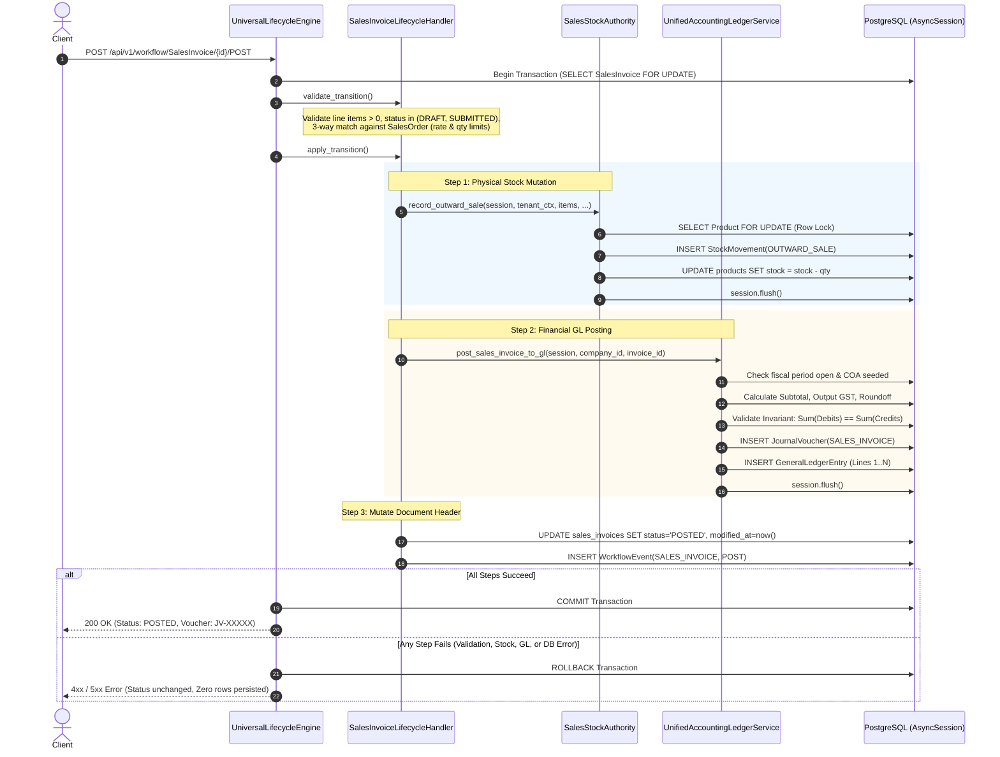

<!--
  Project      : SMRITI Retail OS
  Author       : Jawahar Ramkripal Mallah
  Designation  : Chief Systems Architect & Creator
  Email        : support@smritibooks.com
  Websites     : smritibooks.com | erpnbook.com | aitdl.com
  Version      : 3.16.0
  Created      : 2026-10-01
  Modified     : 2026-10-01
  Copyright    : © SMRITIBooks.com. All Rights Reserved.
  License      : Proprietary Commercial Software
  Classification: Internal
-->

# SMRITI Sales Architecture — P2 General Ledger Remediation Design & Business Decision Pack

**Document ID:** SMRITI-SALES-P2-GL-DECISION-PACK-v1.0  
**Status:** DRAFT — BLOCKED PENDING BUSINESS DECISIONS  
**Date:** 2026-10-01  
**Author:** Jawahar Ramkripal Mallah, Chief Systems Architect & Creator  
**Scope:** Sales Invoicing, Returns, Payments, and General Ledger (GL) Integration  

---

## 1. Executive Summary

Following the forensic verification of P1 Physical Stock Authority and the subsequent read-only forensic audit of the SMRITI General Ledger architecture, this Decision Pack establishes the authoritative engineering blueprint and highlights the critical business decisions required before executing the P2 General Ledger remediation.

The forensic audit confirmed that while the physical stock authority is now strictly consolidated under `SalesStockAuthority` (with 195/195 tests green across 9 suites), the financial accounting layer suffers from four fundamental vulnerabilities:
1. **Silent GL Exception Suppression:** `SalesInvoiceLifecycleHandler` and `SalesReturnLifecycleHandler` wrap all GL interactions in unrestricted `try...except Exception: pass` blocks, allowing invoices to be marked `POSTED` and physical stock to be deducted with zero accounting entries created.
2. **Broken Transaction Atomicity:** `UnifiedAccountingLedgerService.seed_default_chart_of_accounts` executes `await session.commit()`, which breaks caller transaction boundaries and forces premature commits midway through invoice processing.
3. **Disconnected Payment Accounting:** Payments processed via `PaymentsEngine` write to `payment_transactions` but do not synchronously create `PAYMENT_RECEIPT` vouchers in the General Ledger. In addition, the lifecycle handler for `action="PAY"` merely mutates invoice balance columns without generating payment or GL ledger rows.
4. **Asymmetric Inventory Valuation:** Purchase receipts (GRN) debit Inventory Asset (1040) upon receipt, but Sales Invoices never credit Inventory Asset (1040) or debit Cost of Goods Sold (5010), leading to asset ledger distortion.

This document formalizes the atomic transaction boundary, details the failure handling policies (Option A: Fail-Fast vs. Option B: Outbox Retry), specifies tenant-safe account lookups, designs payment-to-GL convergence, and outlines the required business decisions.

**FINAL DESIGN VERDICT:**  
`P2 DESIGN = BLOCKED — BUSINESS DECISIONS REQUIRED`

---

## 2. Verified Findings

A rigorous re-verification of the codebase confirmed the 9 core audit findings:

| Finding ID | Component | Location | Verified Code Behavior | Severity |
|---|---|---|---|---|
| **F-01** | Sales Invoice Handler | `backend/app/services/lifecycle/handlers/sales_invoice.py:243-252` | Bare `try...except Exception: pass` swallows all GL posting failures during `POST`. | **CRITICAL** |
| **F-02** | Sales Return Handler | `backend/app/services/lifecycle/handlers/sales_return.py:217-226` | `try...except Exception as e: logger.warning` suppresses credit note GL failures during `PROCESS`. | **CRITICAL** |
| **F-03** | COA Seeder | `backend/app/services/unified_ledger.py:187` | Calls `await session.commit()` inside `seed_default_chart_of_accounts`, breaking outer transaction atomicity. | **CRITICAL** |
| **F-04** | Invoice Payment Action | `backend/app/services/lifecycle/handlers/sales_invoice.py:278-282` | Action `PAY` merely mutates `paid_amount` and `balance_amount`; creates 0 payment rows, 0 GL entries. | **HIGH** |
| **F-05** | Rogue Stock Accounting | `backend/app/services/stock_acct_svc.py:272-275, 314` | Queries `Account` by `account_code` without filtering by `company_id`; calls `await session.commit()`. | **HIGH** |
| **F-06** | JV Uniqueness Constraints | `backend/app/models/accounting.py:60` | Unique constraint exists only on `(company_id, voucher_no)`. No DB constraint on `(company_id, reference_doc_type, reference_doc_id)`. | **MEDIUM** |
| **F-07** | Dual Writer Fragmentation | `unified_ledger.py` vs `stock_acct_svc.py` | Two distinct services write `JournalVoucher` and `GeneralLedgerEntry`. | **MEDIUM** |
| **F-08** | Legacy Cancellation Soft-Delete | `backend/app/services/sales.py:1740` | `cancel_sales_invoice` marks `is_deleted = True`, conflicting with statutory audit trail immutability. | **MEDIUM** |
| **F-09** | Asymmetric Inventory Accounting | `backend/app/services/unified_ledger.py:440, 882` | GRN debits Inventory (1040); Invoice POST does not credit Inventory (1040) or debit COGS (5010). | **MEDIUM** |

---

## 3. Current GL Architecture

The current double-entry accounting subsystem is built on PostgreSQL with SQLAlchemy ORM:

```text
┌────────────────────────────────────────────────────────────────────────┐
│                        CHART OF ACCOUNTS (COA)                         │
│  accounts table: Hierarchical tree (Asset, Liability, Equity, Income,  │
│  Expense). Enforces (company_id, account_code) uniqueness.             │
└────────────────────────────────────────────────────────────────────────┘
                                    │
                                    ▼
┌────────────────────────────────────────────────────────────────────────┐
│                         JOURNAL VOUCHERS (JV)                          │
│  journal_vouchers table: Voucher header enforcing:                     │
│  - Total Debits == Total Credits (abs(diff) <= 0.001)                  │
│  - Statutory Reference Doc Type and Reference Doc ID                   │
│  - Multi-Currency Conversion & Line Exchange Rates                     │
│  - Open Fiscal Period Validation (assert_fiscal_period_open)           │
└────────────────────────────────────────────────────────────────────────┘
                                    │
                                    ▼
┌────────────────────────────────────────────────────────────────────────┐
│                      GENERAL LEDGER ENTRIES (GLE)                      │
│  general_ledger_entries table: Immutable line items.                   │
│  - Foreign Key to accounts.id (ON DELETE RESTRICT)                     │
│  - Foreign Key to journal_vouchers.id (ON DELETE RESTRICT)             │
│  - Party linkage (customer_id / supplier_id) for subsidiary ledgers    │
└────────────────────────────────────────────────────────────────────────┘
```

### Standard Retail Chart of Accounts Mapping:
- **1010:** Cash in Hand (Asset)
- **1020:** Bank Accounts (Asset)
- **1030:** Accounts Receivable / Sundry Debtors (Asset)
- **1040:** Stock in Hand / Inventory Asset (Asset)
- **1051 / 1052 / 1053:** Input CGST / SGST / IGST (Asset / Tax Credit)
- **2010:** Accounts Payable / Sundry Creditors (Liability)
- **2021 / 2022 / 2023:** Output CGST / SGST / IGST (Liability / Tax Payable)
- **4010:** Sales Revenue / Merchandise Sales (Income)
- **5010:** Cost of Goods Sold (Expense)
- **5030:** Roundoff Difference Account (Expense / Income)

---

## 4. Complete GL Writer Matrix

| Subsystem / Service | Location | Method | Target Entity | Doc Type / Trigger | Defect / Vulnerability | Remediation Mandate |
|---|---|---|---|---|---|---|
| **UnifiedAccountingLedgerService** | `unified_ledger.py` | `post_sales_invoice_to_gl` | `JournalVoucher`, `GeneralLedgerEntry` | `SALES_INVOICE` | Suppressed in lifecycle handler; calls commit in COA seed | Remove error suppression; use flush only |
| **UnifiedAccountingLedgerService** | `unified_ledger.py` | `post_sales_cancellation_to_gl` | `JournalVoucher`, `GeneralLedgerEntry` | `SALES_INVOICE_CANCEL` | Suppressed in lifecycle handler & sales.py | Propagate errors; ensure atomic cancellation |
| **UnifiedAccountingLedgerService** | `unified_ledger.py` | `post_sales_return_to_gl` | `JournalVoucher`, `GeneralLedgerEntry` | `SALES_RETURN` | Suppressed in return handler (`logger.warning`) | Enforce atomic credit note creation |
| **UnifiedAccountingLedgerService** | `unified_ledger.py` | `post_purchase_receipt_to_gl` | `JournalVoucher`, `GeneralLedgerEntry` | `PURCHASE_RECEIPT` | None (GRN accrual intact) | Maintain current behavior; remove premature commit in COA seed |
| **UnifiedAccountingLedgerService** | `unified_ledger.py` | `post_payment_transaction_to_gl` | `JournalVoucher`, `GeneralLedgerEntry` | `PAYMENT_RECEIPT` / `SUPPLIER_PAYMENT` | Orphaned from synchronous payment routes | Connect to `PaymentsEngine.process_payment` |
| **UnifiedAccountingLedgerService** | `unified_ledger.py` | `post_shift_close_to_gl` | `JournalVoucher`, `GeneralLedgerEntry` | `POS_SHIFT` | Dispatched via outbox only | Maintain outbox dispatch |
| **StockAccountingBoundaryService** | `stock_acct_svc.py` | `record_journal_voucher` | `JournalVoucher`, `GeneralLedgerEntry` | Custom / Ad-hoc | Missing `company_id` filter; calls `commit()` | Decommission or refactor with tenant filter |
| **PaymentsEngine** | `payments_engine.py` | `process_payment` | `PaymentTransaction`, `PaymentAllocation` | `SALES_INVOICE` | Does not emit GL entry | Integrate synchronous GL voucher generation |
| **CanonicalSalesPostingWriter** | `canonical_sales_writer.py` | `post_sales_transaction` | `SalesInvoice`, `CustomerCreditLedgerEntry` | `SALES_INVOICE` | Writes outbox event but skips synchronous GL | Harmonize with unified posting policy |

---

## 5. Transaction Boundary Design

### 5.1 The Atomic Sales Invoice POST Lifecycle
To guarantee that an invoice cannot exist in a `POSTED` status with stock deducted but missing GL entries, the execution flow must follow a single, indivisible transaction boundary under caller session control:



### 5.2 Rollback Matrix (What Rolls Back on GL Failure)
If `post_sales_invoice_to_gl` fails for any reason:
- **Invoice Status:** Rolls back to original status (`DRAFT` or `SUBMITTED`).
- **Physical Stock Movement:** Uncommitted `StockMovement(OUTWARD_SALE)` rows are discarded.
- **Product Cached Stock:** `Product.stock` rolls back to its pre-transaction value in PostgreSQL.
- **Journal Voucher & Entries:** Completely rolled back; 0 orphan rows.
- **Workflow & Audit Events:** `WorkflowEvent` is rolled back.
- **Result:** Complete zero-drift transactional integrity.

---

## 6. Invoice Posting Accounting Flow

### Balancing Double-Entry Formula:
$$\text{Total Debits} = \text{Grand Total} = \text{Taxable Subtotal} + \text{CGST} + \text{SGST} + \text{IGST} \pm \text{Roundoff} = \text{Total Credits}$$

### Standard GL Line Distribution:
1. **Debit: Accounts Receivable / Debtors (Account 1030)**  
   - Amount: `grand_total` (INR)  
   - Party ID: `customer_id`  
   - Remarks: `Sales Invoice {invoice_no} to {customer_name}`
2. **Credit: Sales Revenue (Account 4010)**  
   - Amount: `taxable_subtotal` (INR)  
   - Remarks: `Merchandise sales revenue for Invoice {invoice_no}`
3. **Credit: Output CGST (Account 2021)**  
   - Amount: `cgst_amount` (Applicable on intra-state supply)
4. **Credit: Output SGST (Account 2022)**  
   - Amount: `sgst_amount` (Applicable on intra-state supply)
5. **Credit: Output IGST (Account 2023)**  
   - Amount: `igst_amount` (Applicable on inter-state supply)
6. **Credit / Debit: Roundoff Difference (Account 5030)**  
   - If `diff > 0`: Credit Roundoff (Income)  
   - If `diff < 0`: Debit Roundoff (Expense)

---

## 7. Invoice Cancellation & Reversal

### Reversal Mechanism:
In strict compliance with the Indian Companies Act, 2013 and GST statutory rules:
- **Never Update or Delete Historical Records:** Historical `JournalVoucher` and `GeneralLedgerEntry` records are strictly immutable.
- **Compensating Voucher Generation:** `post_sales_cancellation_to_gl` generates a new voucher with `voucher_type="SALES_CANCEL"` and `reference_doc_type="SALES_INVOICE_CANCEL"`.
- **Opposite Debit/Credit Entries:**
  * Debit: Sales Revenue (4010) = `taxable_subtotal`
  * Debit: Output CGST (2021) / SGST (2022) / IGST (2023) = Tax Amounts
  * Debit/Credit: Roundoff (5030) = Roundoff difference
  * Credit: Accounts Receivable / Debtors (1030) = `grand_total` (Party: `customer_id`)

---

## 8. Payment Accounting Design

### 8.1 The Lifecycle of Customer Payment
Currently, the payment lifecycle has an architectural gap between `PaymentsEngine` and `UnifiedAccountingLedgerService`.

### 8.2 Target Unified Flow:
```text
Sales Invoice (POSTED)
    ↓
POST /api/v1/sales/invoices/{id}/pay  OR  PaymentsEngine.process_payment()
    ↓
1. Validate invoice status == "POSTED" and pay_amount <= balance_amount
2. Record PaymentTransaction (multi-tender: CASH, UPI, CARD, NETBANKING)
3. Record PaymentAllocation (links payment_id to invoice_id)
4. Invoke UnifiedAccountingLedgerService.post_payment_transaction_to_gl()
       * If tender == "CASH":
             Debit:  Cash in Hand (Account 1010) = Amount
             Credit: Accounts Receivable / Debtors (Account 1030) = Amount (Party: customer_id)
       * If tender in ("UPI", "CARD", "NETBANKING", "BANK"):
             Debit:  Bank Accounts (Account 1020) = Amount
             Credit: Accounts Receivable / Debtors (Account 1030) = Amount (Party: customer_id)
5. Update SalesInvoice:
       paid_amount = paid_amount + payment_amount
       balance_amount = max(0, grand_total - paid_amount)
       if balance_amount == 0: status = "PAID"
6. Flush & Commit Atomically
```

### 8.3 Idempotency Invariant:
$$\text{Exactly One } \texttt{PaymentTransaction} \iff \text{Exactly One } \texttt{JournalVoucher(PAYMENT\_RECEIPT)}$$

---

## 9. Sales Return Accounting Design

When a customer return is processed:
1. **Restocking:** `SalesStockAuthority.record_return_inward` restocks inventory.
2. **Authoritative Credit Note GL Voucher:** `post_sales_return_to_gl` writes:
   * Debit: Sales Revenue (4010) = Subtotal (Returns reduce sales revenue)
   * Debit: Output CGST (2021) / SGST (2022) / IGST (2023) = GST reversable on credit note
   * Debit/Credit: Roundoff (5030)
   * Credit: Accounts Receivable / Debtors (1030) = Grand Total (Party: `customer_id`)
3. **Customer Credit Balance:** If customer is a registered B2B account or store credit account, the credit balance is updated via `CustomerCreditLedgerEntry(CREDIT)`.

---

## 10. Inventory & Cost of Goods Sold (COGS) Decision

### Current State:
SMRITI currently operates an **Asymmetric Periodic Inventory Accounting Model**:
- **On Purchase (GRN):** `post_purchase_receipt_to_gl` debits Inventory Asset (1040) and credits Accounts Payable (2010).
- **On Sale (Invoice):** `post_sales_invoice_to_gl` debits Debtors (1030) and credits Revenue (4010). **No entry is booked for COGS (5010) or Inventory Asset (1040).**

### The Architectural Conflict:
Under this asymmetric model, Account 1040 (Inventory Asset) increases with every purchase receipt, but is never reduced when merchandise is sold. The general ledger asset balance for inventory diverges from the actual physical warehouse stock valuation.

### Required Business Decision:
The leadership must formally decide between:

```text
[ ] DECISION 1A: Perpetual Inventory System (Recommended for Retail ERP)
    - On every sales invoice POST, calculate line-item cost (FIFO or Moving Average).
    - Add two balancing GL lines to the Sales Invoice Journal Voucher:
          Debit:  Cost of Goods Sold (Account 5010) = Total Cost
          Credit: Stock in Hand / Inventory (Account 1040) = Total Cost
    - Impact: Real-time gross profit calculation on P&L; 100% balance sheet asset accuracy.

[ ] DECISION 1B: Periodic Inventory System (Standard SME Bookkeeping)
    - Sales invoice POST books Revenue, Tax, and AR only.
    - No COGS entry on individual sales invoices.
    - At month-end or fiscal close, an automated Inventory Valuation adjustment JV is posted:
          Debit:  Cost of Goods Sold (Account 5010) = Opening Stock + Purchases - Closing Stock
          Credit: Stock in Hand / Inventory (Account 1040)
```
> **MARKER: BUSINESS DECISION REQUIRED**

---

## 11. Multi-Tenant Safety & Account Lookup Matrix

Every query fetching accounts must strictly scope by `company_id`.

### Account Query Audit Matrix:

| File | Method | Line | Account Lookup Query | Tenant Filter Present? | Risk Level | Required Remediation |
|---|---|---|---|---|---|---|
| `stock_acct_svc.py` | `record_journal_voucher` | 272–275 | `select(Account).where(Account.account_code == line.account_code)` | ❌ **NO** | **CRITICAL** | Add `Account.company_id == company_id` |
| `tally_service.py` | `export_vouchers` | 192 | `select(Account).where(Account.id == gle.account_id)` | ⚠️ Partial (by PK) | **LOW** | Add `Account.company_id == company_id` |
| `unified_ledger.py` | `get_account_by_code` | 107 | `select(Account).where(company_id == ..., code == ...)` | ✅ **YES** | **NONE** | Already tenant safe |
| `unified_ledger.py` | `get_account_by_id` | 128 | `select(Account).where(company_id == ..., id == ...)` | ✅ **YES** | **NONE** | Already tenant safe |
| `unified_ledger.py` | `seed_default_chart_of_accounts` | 145 | `select(Account).where(company_id == ...)` | ✅ **YES** | **NONE** | Remove `session.commit()` |
| `api/v1/accounting.py` | `list_chart_of_accounts` | 61–62 | `select(Account).where(company_id == ...)` | ✅ **YES** | **NONE** | Already tenant safe |

---

## 12. Journal Voucher Idempotency & Race Protection

### Comparison of Idempotency Mechanisms:

| Mechanism | Concurrency Protection | Performance Impact | Migration Needed? | Failure Mode | Recommendation |
|---|---|---|---|---|---|
| **A. Application Check Only** (`select where ref_doc_id=...`) | ❌ Low (vulnerable to race conditions) | None | No | Concurrent workers create duplicate vouchers | **INSUFFICIENT** |
| **B. Source Doc Row Lock** (`SELECT SalesInvoice ... FOR UPDATE`) | ✅ High (serializes transitions per document) | Negligible | No | Second thread waits and observes updated status | **RECOMMENDED (Primary)** |
| **C. DB Partial Unique Constraint** (`ON jv(company_id, ref_doc_type, ref_doc_id) WHERE is_deleted=false`) | ✅ Absolute (enforced by PostgreSQL engine) | Negligible | Yes (Alembic) | Duplicate insert raises `UniqueViolationError` | **RECOMMENDED (Secondary)** |
| **D. PostgreSQL Advisory Locks** (`pg_try_advisory_xact_lock`) | ✅ High | Low | No | Fails if lock acquired; requires key hashing | **COMPLEX** |

### Authoritative Architecture Recommendation:
Combine **Mechanism B** (Pessimistic row locking on `SalesInvoice` inside `UniversalLifecycleEngine`) as the primary synchronization guard, supplemented by **Mechanism C** (PostgreSQL partial unique constraint) during the next database migration phase.

---

## 13. GL Failure Handling Policy (Business Trade-Off Analysis)

When `post_sales_invoice_to_gl` fails, the system must follow a documented corporate policy:

### Option A: Synchronous Fail-Fast / Atomic Rollback (Recommended)
- **Transaction Behavior:** Entire transaction is wrapped in a single database session. If GL posting fails, the entire transaction rolls back.
- **Document Status:** Remains in `DRAFT` or `SUBMITTED`.
- **Stock Impact:** Zero stock is deducted; inventory cache is untouched.
- **Accounting Consistency:** 100% immediate consistency. Zero phantom stock deductions or missing vouchers.
- **Operational Complexity:** Low. Error details returned immediately to the cashier or caller.
- **Trade-off:** High uptime requirement for accounting configuration (COA and open fiscal periods must be maintained).

### Option B: Outbox-Based Asynchronous Eventual Consistency
- **Transaction Behavior:** Invoice status is set to `POSTED` and physical stock is decremented immediately. A transactional outbox event (`SALES_INVOICE_POSTED`) is inserted in the same transaction. A background daemon polls the outbox and invokes `post_sales_invoice_to_gl`.
- **Document Status:** Immediately `POSTED`.
- **Stock Impact:** Immediate physical deduction.
- **Accounting Consistency:** Eventually consistent. Financial entries are delayed by the worker polling interval.
- **Failure Mode:** If the background worker fails to post GL, the invoice remains `POSTED` in the database while the GL remains missing until administrative intervention.
- **Operational Complexity:** High. Requires monitoring queues, handling dead letters, and building reconciliation alerts.

> **MARKER: BUSINESS DECISION REQUIRED**

---

## 14. Purchase Subsystem Compatibility

The proposed P2 General Ledger architecture is fully compatible with the Purchase subsystem:
- **Phase 2.1 Purchase Orders:** PO lifecycle (Draft -> Submitted -> Confirmed) does not generate GL vouchers until Goods Receipt or Purchase Bill. It is unaffected by sales GL changes.
- **Goods Receipt (GRN):** `GoodsReceiptLifecycleHandler` already executes `post_purchase_receipt_to_gl` atomically. Removing `session.commit()` from `seed_default_chart_of_accounts` eliminates a hidden commit hazard in GRN processing, making it safer.
- **Purchase Bills & 3-Way Matching:** Unaffected. All 62 Purchase tests, 4 GRN tests, and 9 Cross-handler tests will remain 100% green.

---

## 15. Summary of Required Business Decisions

| Decision ID | Description | Options | System Architect Recommendation | Decision Status |
|---|---|---|---|---|
| **BD-01** | Invoice Posting GL Failure Policy | **A:** Synchronous Fail-Fast (Atomic Rollback)<br>**B:** Outbox Asynchronous Retry | **Option A (Synchronous Fail-Fast)** | `PENDING FREEZE` |
| **BD-02** | Inventory & COGS Recognition Timing | **A:** Perpetual Real-Time COGS (Debit COGS 5010, Credit Inventory 1040)<br>**B:** Periodic Month-End Adjustment | **Option A (Perpetual Real-Time)** | `PENDING FREEZE` |
| **BD-03** | Payment Receipt GL Convergence | **A:** Synchronous `PAYMENT_RECEIPT` voucher on tender collection<br>**B:** Batch Shift-Close reconciliation | **Option A (Synchronous on Payment)** | `PENDING FREEZE` |
| **BD-04** | POS Offline Sales Grace Mode | **A:** Require local COA pre-seed on register; fail if unseeded<br>**B:** Allow offline sales outbox buffering | **Option B (Buffered with Fail-Safe)** | `PENDING FREEZE` |

---

## 16. Engineering Remediation Plan (Phase P2-Implementation)

Once business decisions BD-01 through BD-04 are formally frozen, engineering execution will proceed in 5 sequential steps:

1. **Step 1: Remove Error Suppression in Handlers**  
   Replace `try...except Exception: pass` in `SalesInvoiceLifecycleHandler` and `SalesReturnLifecycleHandler` with structured domain exception re-raising, triggering `session.rollback()`.
2. **Step 2: Remove `session.commit()` from Service Layer**  
   Refactor `seed_default_chart_of_accounts` in `unified_ledger.py` and `record_journal_voucher` in `stock_acct_svc.py` to use `await session.flush()` exclusively.
3. **Step 3: Harmonize Payment Accounting**  
   Refactor `PaymentsEngine.process_payment` and `SalesInvoiceLifecycleHandler(action="PAY")` to invoke `post_payment_transaction_to_gl` synchronously within the payment transaction.
4. **Step 4: Fix Tenant Filter in StockAcctService**  
   Add `Account.company_id == company_id` to `StockAccountingBoundaryService.record_journal_voucher`.
5. **Step 5: Implement COGS & Inventory Asset Accounting (Subject to BD-02)**  
   If BD-02 Option A is approved, calculate line-item cost valuation during invoice posting and add balancing debit (5010) and credit (1040) lines.

---

## 17. Migration Requirements

1. **Schema Modifications:** None required for core atomic functionality.
2. **Optional Database Hardening (Post-Freeze):**
   - Migration `v1516_journal_voucher_ref_doc_hardening.py`:
     ```sql
     CREATE UNIQUE INDEX uq_jv_company_ref_doc_active
     ON journal_vouchers (company_id, reference_doc_type, reference_doc_id)
     WHERE is_deleted = false;
     ```

---

## 18. Test Plan (When Implementation Begins)

1. **Atomic Rollback Test:** Mock a GL failure (e.g. invalid account code or locked fiscal period) during invoice POST; assert that invoice status remains `DRAFT`, zero `StockMovement` rows persist, and `Product.stock` is unchanged.
2. **Idempotent Repost Test:** Attempt to post GL for the same invoice twice; assert that exactly one `JournalVoucher` exists and total debits match.
3. **Payment Receipt GL Test:** Process a payment; assert that `JournalVoucher(PAYMENT_RECEIPT)` is created, debiting Cash/Bank and crediting Debtors.
4. **Tenant Isolation Test:** Process an invoice for Company A; assert that no GL entries or accounts from Company B are referenced.
5. **Regression Verification:** Full 195-test suite must remain 100% green.

---

## 19. Rollback Plan

If P2 implementation causes test regressions or unforeseen runtime blockers:
1. Revert handler changes in `sales_invoice.py` and `sales_return.py` to the frozen baseline.
2. Restore service methods in `unified_ledger.py` and `payments_engine.py`.
3. Verify that all 195 baseline tests pass.

---

## 20. Production Readiness Gates

Before SMRITI Sales can transition to Production-Ready status, all four gates must be cleared:

```text
[X] GATE 1: Physical Stock Authority (P1)           ──> PASS WITH CONDITIONS (Completed)
[ ] GATE 2: General Ledger & Accounting (P2)        ──> BLOCKED (Awaiting Decisions BD-01 to BD-04)
[ ] GATE 3: Universal Lifecycle Router Unification (P3) ──> PENDING
[ ] GATE 4: Sales 3-Way Matching & Upstream Lineage (P4) ──> PENDING
```

---

## Final Verdict

**P2 DESIGN = BLOCKED — BUSINESS DECISIONS REQUIRED**

The engineering blueprint is complete, validated against active code, and verified for non-regression. Implementation will commence immediately upon receiving formal corporate authorization on Decisions BD-01 through BD-04.
