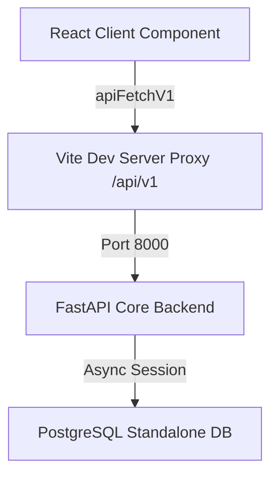

<!--
  Project      : SMRITI Retail OS
  Author       : Jawahar Ramkripal Mallah
  Designation  : Chief Systems Architect & Creator
  Email        : support@smritibooks.com
  Websites     : smritibooks.com | erpnbook.com | aitdl.com
  Version      : 3.15.0
  Created      : 2026-07-12
  Modified     : 2026-07-12
  Copyright    : © SMRITIBooks.com. All Rights Reserved.
  License      : Proprietary Commercial Software
  Classification: Internal
-->

# Plan: Reports Module Migration & Governance Update (v3.15.0)

## 1. Objective
Migrate frontend reporting features from mock values to use real transactional data served by the FastAPI + Postgres backend, freeze Express development, and align the system governance in `.agents/AGENTS.md` with the current architecture.

## 2. Business Motivation
Unifying reporting data on PostgreSQL guarantees consistent metrics across the UI, eliminates inconsistencies between client-side mocks and backend models, and establishes a clear development boundary where FastAPI/Postgres is the sole transactional system of record.

## 3. Scope
- **FastAPI Backend Verification:** Verify that python-core health check returns database connected (Status: OPERATIONAL).
- **Frontend Reports Migration:** Refactor `QuickReportsWidget.tsx` and `ReportDesignerTab.tsx` to dynamically fetch figures for stock valuation, daily sales, supplier ledgers, and purchase summaries from FastAPI endpoints via `apiFetchV1` instead of mock variables.
- **Express Feature Freeze:** Enforce a freeze on Express route modifications. Do not add or edit routes in `server.ts` or `src/routes/*.ts` except for strict security/compilation hotfixes.
- **Governance Alignment:** Update `.agents/AGENTS.md` to retire the stale Frappe-based PAL section and record the FastAPI backend system-of-record policy.

## 4. Current State
- **Verified:** FastAPI core `/health` is fully operational and reports `database: connected`, `status: healthy`.
- **Verified:** Backend reports endpoints (`/api/v1/reports/stock-valuation`, `/api/v1/reports/daily-sales`, `/api/v1/reports/supplier-ledger/{id}`, `/api/v1/reports/purchase-summary`) are fully operational and successfully queried via JWT, returning verified JSON payloads.
- `QuickReportsWidget.tsx` uses hardcoded math modifiers (e.g. `Math.round(125000 * scaleFactor)`) and static lists to render reporting values.
- `ReportDesignerTab.tsx` uses static lists for categories (Apparel, Footwear, Accessories) and hardcoded purchase order arrays.
- `.agents/AGENTS.md` references the deprecated Frappe framework document API (`from smriti_retail_os import smriti`) and MARIA/Redis mappings.

## 5. Gap Analysis
- Frontend reports render mock numbers, hiding true database state.
- Governance docs contradict the active codebase regarding framework adapters and the backend architecture.

## 6. Architecture Impact
- Enforces straggle-fig backend migration: reads originate directly from PostgreSQL through the FastAPI gateway, reducing the runtime responsibility of the legacy Express server.
- Decouples client components from mock states, utilizing `apiFetchV1` for standard HTTP query propagation.

## 7. Proposed Design

### Authentication Bridge (Option A)
To prevent authentication incompatibility between Express (random token sessions) and FastAPI (signed JWTs via `JWT_SECRET_KEY`) without prematurely migrating all authentication endpoints:
- We implement **Option A** (client-side bridge): On successful Express login inside `LoginScreen.tsx`, the client immediately queries FastAPI's `/api/v1/auth/login` using the same credentials, retrieving a valid JWT.
- The JWT is saved in `localStorage` as `smriti_jwt_token`.
- `apiFetchV1.ts` retrieves `smriti_jwt_token` (with a fallback to `smriti_session_token` for testing) and passes it in the `Authorization: Bearer <token>` header.
- Upon logout (`App.tsx`), both `smriti_session_token` and `smriti_jwt_token` are cleared.
- To bridge the password hashing difference, FastAPI's `verify_password` has been upgraded to support both bcrypt and legacy PBKDF2 hash verification.

## User Review Required
> [!IMPORTANT]
> The reports endpoints enforce JWT authentication. Option A resolves token acquisition client-side. Ensure `JWT_SECRET_KEY` is present in the host `.env` or container environment (pre-configured in `docker-compose.yml` fallback).

## Open Questions
No open questions.

## Proposed Changes

### Governance Configuration

#### [MODIFY] [.agents/AGENTS.md](file:///d:/IMP/GitHub/SMRITRretailNX/.agents/AGENTS.md)
- Add "SMRITI Backend System-of-Record Policy" section declaring the FastAPI+Postgres system of record, strangler-fig migration paths, and the Express route freeze.
- Rewrite the Platform Abstraction Layer (PAL) section to match the current Express + FastAPI/Postgres architecture, removing mariadb, redis, and Frappe references.
- Bump the version header to `3.15.0` and update modified date to `2026-07-12` (UADHP).

### Frontend Components

#### [MODIFY] [LoginScreen.tsx](file:///d:/IMP/GitHub/SMRITRretailNX/src/components/LoginScreen.tsx)
- Add Option A authentication bridge to acquire FastAPI access token on login and store it under `smriti_jwt_token`.
- Align quick manager login credentials to use seeded password `Password@123`.

#### [MODIFY] [App.tsx](file:///d:/IMP/GitHub/SMRITRretailNX/src/App.tsx)
- Remove `smriti_jwt_token` on logout.

#### [MODIFY] [apiFetchV1.ts](file:///d:/IMP/GitHub/SMRITRretailNX/src/lib/apiFetchV1.ts)
- Use `smriti_jwt_token` in authentication headers.

#### [MODIFY] [QuickReportsWidget.tsx](file:///d:/IMP/GitHub/SMRITRretailNX/src/components/QuickReportsWidget.tsx)
- Integrate `apiFetchV1` to fetch daily sales figures and stock valuation metrics on component mount/update.
- Replace mock calculations for gross revenue, ticket size, and capital locked with actual live values returned by `/api/v1/reports/daily-sales` and `/api/v1/reports/stock-valuation`.

#### [MODIFY] [ReportDesignerTab.tsx](file:///d:/IMP/GitHub/SMRITRretailNX/src/components/ReportDesignerTab.tsx)
- Integrate `apiFetchV1` to fetch stock-valuation, daily-sales, purchase-summary, and supplier-ledger details.
- Wire drill-down paths (drillLevel 0, 1, 2) to display the live records fetched from the corresponding FastAPI report endpoints.

### Backend Configurations

#### [MODIFY] [security.py](file:///d:/IMP/GitHub/SMRITRretailNX/backend/app/core/security.py)
- Upgrade `verify_password` to hybrid verification supporting both bcrypt and legacy PBKDF2 hash formats.

## 8. Files Created
None.

## 9. Files Modified
- [AGENTS.md](file:///d:/IMP/GitHub/SMRITRretailNX/.agents/AGENTS.md)
- [LoginScreen.tsx](file:///d:/IMP/GitHub/SMRITRretailNX/src/components/LoginScreen.tsx)
- [App.tsx](file:///d:/IMP/GitHub/SMRITRretailNX/src/App.tsx)
- [apiFetchV1.ts](file:///d:/IMP/GitHub/SMRITRretailNX/src/lib/apiFetchV1.ts)
- [QuickReportsWidget.tsx](file:///d:/IMP/GitHub/SMRITRretailNX/src/components/QuickReportsWidget.tsx)
- [ReportDesignerTab.tsx](file:///d:/IMP/GitHub/SMRITRretailNX/src/components/ReportDesignerTab.tsx)
- [security.py](file:///d:/IMP/GitHub/SMRITRretailNX/backend/app/core/security.py)

## 10. Dependencies
No new dependencies. Standard `apiFetchV1` is already in place.

## 11. Risks
- Fetching report data during render can cause network overhead if queries block layout.
- *Mitigation:* Wrap fetching in standard React `useEffect` hooks with appropriate loading state indicators.

## 12. Rollback Strategy
As a git repository exists, revert changes using `git checkout -- <file>` (or `git restore <file>`). If git is unavailable in a target staging environment, restore changes from local copy backups of the modified files (`.agents/AGENTS.md`, `LoginScreen.tsx`, `App.tsx`, `apiFetchV1.ts`, `security.py`).

## 13. Verification Plan
- Run `npx tsc --noEmit` and `npm run build` to confirm compilation.
- Execute GET `/health` on python-core to ensure database connectivity.
- Verify report queries print actual transactional JSON rows.

## 14. Test Plan
- Run existing Vitest suite (`npm test`).

## 15. Documentation Impact
- Update Walkthroughs Index with the v3.15.0 reporting plan.

## 16. Deployment Plan
- Pull changes to test environment and rebuild/restart compose services.

## 17. Status
Draft

## 18. Related ADRs
- ADR-016: Strangleg-Fig Migration to FastAPI

## 19. Related Walkthroughs
- None.
