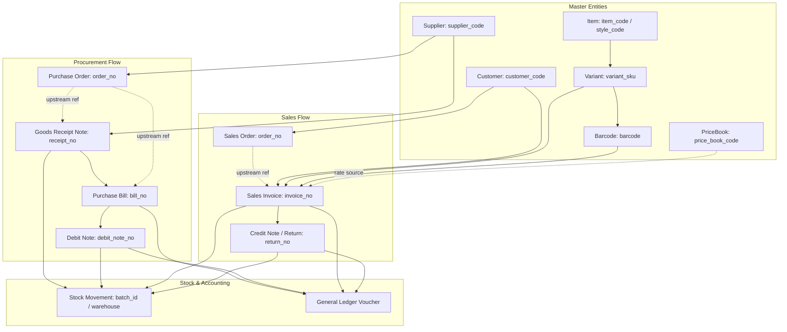

<!--
  Project      : SMRITI Retail OS
  Author       : Jawahar Ramkripal Mallah
  Designation  : Chief Systems Architect & Creator
  Email        : support@smritibooks.com
  Websites     : smritibooks.com | erpnbook.com | aitdl.com
  Version      : 1.0.0
  Created      : 2026-10-06
  Modified     : 2026-10-06
  Copyright    : © SMRITIBooks.com. All Rights Reserved.
  License      : Proprietary Commercial Software
  Classification: Architecture Audit & Specification — SMRITI Transaction DataBridge
-->

# Architecture Audit & Design Specification: SMRITI Transaction DataBridge (v1.0.0)

## Executive Summary
This document provides an exhaustive, evidence-based architectural audit and design specification for extending the **SMRITI DataBridge** platform capability beyond Catalog Master Data to support the governed import, preview, validation, conflict detection, and export of **complete business transactions** across retail operations.

**Guiding Architectural Invariants:**
1. **Zero Domain Logic Duplication**: DataBridge MUST NOT become a second Sales Engine, Purchase Engine, Inventory Engine, GST Engine, or Accounting Engine. It serves strictly as an **ingress orchestration and harmonization boundary**, delegating all persistence and mutations to existing canonical services.
2. **Stable Business Reference Binding**: Transactions must reference dependencies through persistent, human-readable commercial identifiers (`customer_code`, `supplier_code`, `item_code`, `variant_sku`, `barcode`, `document_no`), never fragile surrogate primary keys (`id`).
3. **Safe Missing Master Auto-Creation**: Transactions may create missing master entities (`Customer`, `Supplier`, `Item`, `ItemVariant`, `ItemBarcode`, `PriceBookEntry`) ONLY when the import payload supplies sufficient, validated metadata to satisfy canonical domain creation invariants. If data is incomplete, the import is strictly blocked.
4. **Multi-Tenant & Capability Guarding**: Zero bypass of `TenantContext`, company database routing, RBAC, or `require_databridge_entitlement`.
5. **Audit & Idempotency Guarantee**: All transaction ingresses must enforce SHA-256 idempotency cache replay and immutable WORM audit logs (`ComplianceImmutableAuditLog`).

---

## 1. Current DataBridge Implementation Baseline

### 1.1 Backend Modules & Contracts Verified
- **API Router**: [`backend/app/api/v1/databridge.py`](file:///F:/SMRITRretailNX/backend/app/api/v1/databridge.py)
  - Enforces 7-stage security chain: `AUTH` -> `TenantContext` -> `require_databridge_entitlement` -> `require_permission` -> `get_company_db` -> business operation -> WORM audit.
  - Endpoints: `GET /status`, `POST /contract/ping`, `POST /preview`, `POST /commit`, plus entity-specific convenience routes (`/item/*`, `/variant/*`, `/barcode/*`, `/pricebook/*`).
- **Foundation Service Boundary**: [`backend/app/services/databridge/service.py`](file:///F:/SMRITRretailNX/backend/app/services/databridge/service.py)
  - `DataBridgeService`: Enforces company isolation boundary (`verify_tenant_boundary`), capability entitlement check (`verify_capability_entitlement`), synchronous row ceiling (`MAX_SYNC_ROWS = 5000`), preview token generation and caching (`_PREVIEW_REGISTRY`), and SHA-256 idempotency (`_IDEMPOTENCY_CACHE`).
  - Strict anti-tamper check: verifies incoming payload hash against preview token hash upon commit. Rejects un-issued or stale tokens with `DataBridgeStalePreviewError` (HTTP 409).
- **Domain Models & Contracts**: [`backend/app/services/databridge/models.py`](file:///F:/SMRITRretailNX/backend/app/services/databridge/models.py)
  - Authoritative classification taxonomy: `CREATE`, `UPDATE`, `NO_CHANGE`, `EXISTING_CONFLICT`, `VALIDATION_ERROR`, `DEPENDENCY_ERROR`.
  - Active entity types: `ITEM`, `VARIANT`, `BARCODE`, `PRICEBOOK`, `CATALOG_DOCUMENT`.
  - Structured result models: `DataBridgeResultItem`, `DataBridgeDiff`, `DataBridgeConflict`, `DataBridgeSummary`, `DataBridgePreviewResponse`, `DataBridgeCommitResponse`.
- **Domain Adapters**: [`backend/app/services/databridge/adapters/`](file:///F:/SMRITRretailNX/backend/app/services/databridge/adapters/)
  - `BaseDataBridgeAdapter`: Abstract contract defining `normalize()`, `validate()`, `match()`, `diff()`, `classify()`, `preview()`, `commit()`.
  - `DataBridgeItemAdapter`: Implements Item resolution, IM-001 controlled field validation, and style creation.
  - `DataBridgeVariantAdapter`: Implements variant resolution (`variant_sku` or `parent + color + size`) and price validation.
  - `DataBridgeBarcodeAdapter`: Implements 4 mandatory barcode lifecycle rules and strict immutability.
  - `DataBridgePriceBookAdapter`: Implements price schedule evaluation and selling price <= MRP enforcement.

### 1.2 Frontend Architecture Verified
- **Canonical Workspace**: [`src/components/databridge/DataBridgeWorkspace.tsx`](file:///F:/SMRITRretailNX/src/components/databridge/DataBridgeWorkspace.tsx)
  - 8-step import wizard: `Choose Data` -> `Select Entity` -> `Map Fields` -> `Validate` -> `Preview` -> `Review Issues` -> `Commit` -> `Result`.
  - Interactive Diff Viewer modal (`DiffViewModal.tsx`), Conflict Review drawer (`IssueReviewModal.tsx`), Templates modal (`DataBridgeTemplatesModal.tsx`), and chronological Import History view (`DataBridgeHistoryView.tsx`).
  - **False-Success Hardening**: Real commit failures halt progress, remain in `PREVIEW`, and present an explicit failure banner (`commitError`) with zero false success.
- **Client Service**: [`src/components/databridge/databridgeService.ts`](file:///F:/SMRITRretailNX/src/components/databridge/databridgeService.ts)
  - Communicates via `apiFetchV1` to `/api/v1/databridge/*`.
- **Header Mapping Engine**: [`src/lib/headerMapping/HeaderAliasRegistry.ts`](file:///F:/SMRITRretailNX/src/lib/headerMapping/HeaderAliasRegistry.ts)
  - Currently contains `SMRITI_ITEM_MASTER_FIELDS`. Needs expansion for transaction header/line mapping contexts.
- **Global Grid Profiles**: [`src/services/gridInput/gridProfiles.ts`](file:///F:/SMRITRretailNX/src/services/gridInput/gridProfiles.ts)
  - Defines existing profiles: `BILLING`, `PURCHASE`, `STOCK_MOVEMENT`, `BARCODE_PRINTING`, `ITEM_MASTER`.

---

## 2. Frozen Catalog Baseline (v1.2.0 QA Evidence)

The existing Catalog DataBridge scope is frozen and fully certified `PRODUCTION READY`:

| Catalog Entity | Import | Export | Preview | Validation | Conflict Detection | Commit | Audit | Idempotency |
|---|---|---|---|---|---|---|---|---|
| **Items** | YES | YES | YES | YES (IM-001) | YES | YES | YES (WORM) | YES (SHA-256) |
| **Variants** | YES | YES | YES | YES | YES | YES | YES (WORM) | YES (SHA-256) |
| **Barcodes** | YES | YES | YES | YES | YES | YES | YES (WORM) | YES (SHA-256) |
| **Price Book** | YES | YES | YES | YES | YES | YES | YES (WORM) | YES (SHA-256) |
| **Complete Catalog** | YES | YES | YES | YES | YES | YES | YES (WORM) | YES (SHA-256) |

**Certified Baseline Invariants:**
- HTTP 409 classified specifically as `EXPECTED SECURITY REJECTION` (STALE PREVIEW TOKEN).
- Security tests in `backend/tests/test_databridge_phase1.py` execute authentic `require_databridge_entitlement` failing closed with HTTP 403 (`SMRITI-CAP-001`) with zero mock overrides.
- 25/25 Pytest tests, 11/11 Vitest tests, and 18/18 visual screenshots green.

---

## 3. Transaction Capability Matrix

Based on rigorous inspection of active backend models, API routes, and domain services, here is the capability matrix for all 15 business entities:

| # | Entity | Import | Export | Preview | Commit | Existing Canonical Service | Existing Model | Existing API Route | Existing Validation Engine |
|---|---|---|---|---|---|---|---|---|---|
| 01 | **Customer** | Proposed | Existing | Proposed | Proposed | `CrmService` (`crm.py`) | `Customer` (`crm.py`) | `/api/v1/crm/customers` | GSTIN validator, unique phone/code |
| 02 | **Supplier** | Proposed | Existing | Proposed | Proposed | `PurchaseService` (`purchase.py`) | `Supplier` (`purchase.py`) | `/api/v1/purchase/suppliers` | GSTIN, code uniqueness |
| 03 | **Item** | Existing | Existing | Existing | Existing | `ItemCatalogService`, `ItemMasterService` | `Item` (`item_master.py`) | `/api/v1/databridge/item` | `IM001ControlledFieldValidator` |
| 04 | **Variant** | Existing | Existing | Existing | Existing | `VariantMatrixService` | `ItemVariant` (`item_master.py`) | `/api/v1/databridge/variant` | `CatalogDimensionValidator` |
| 05 | **Barcode** | Existing | Existing | Existing | Existing | `BarcodeResolverService` | `ItemBarcode` (`item_master.py`) | `/api/v1/databridge/barcode` | 4-Rule Barcode Lifecycle Engine |
| 06 | **Price Book** | Existing | Existing | Existing | Existing | `PricingEngine` (`pricing_engine.py`) | `PriceBookEntry` (`pricing.py`) | `/api/v1/databridge/pricebook` | Selling price <= MRP rule |
| 07 | **Sales Invoice** | Proposed | Existing | Proposed | Proposed | `CanonicalSalesPostingWriter`, `SalesService` | `SalesInvoice`, `SalesInvoiceItem` (`sales.py`) | `/api/v1/sales/invoices` | `gst_engine`, statutory invariant |
| 08 | **Sales Return / Credit Note** | Proposed | Existing | Proposed | Proposed | `SalesService.create_sales_return` | `SalesReturn`, `SalesReturnItem` (`sales.py`) | `/api/v1/sales/returns` | `SalesReturnPolicyResolver`, original bill window |
| 09 | **Purchase Invoice (Bill)** | Proposed | Existing | Proposed | Proposed | `PurchaseService.create_purchase_bill` | `PurchaseBill`, `PurchaseBillItem` (`purchase.py`) | `/api/v1/purchase/bills` | 3-way match, supplier tax breakdown |
| 10 | **Purchase Return (Debit Note)** | Proposed | Existing | Proposed | Proposed | `PurchaseService.create_debit_note` | `IdentityEngine` + GL Ledger (`purchase.py`) | `/api/v1/purchase/debit-notes` | Receipt validation, outstanding deduction |
| 11 | **Sales Order (SO)** | Proposed | Existing | Proposed | Proposed | `SalesService.create_sales_order` | `SalesOrder`, `SalesOrderItem` (`sales.py`) | `/api/v1/sales/orders` | Customer existence, line totals |
| 12 | **Purchase Order (PO)** | Proposed | Existing | Proposed | Proposed | `PurchaseService.create_purchase_order` | `PurchaseOrder`, `PurchaseOrderItem` (`purchase.py`) | `/api/v1/purchase/orders` | Supplier existence, line costs |
| 13 | **Goods Receipt Note (GRN)** | Proposed | Existing | Proposed | Proposed | `PurchaseService.create_purchase_receipt` | `PurchaseReceipt`, `PurchaseReceiptItem` (`purchase.py`) | `/api/v1/purchase/receipts` | PO linkage, warehouse verification |
| 14 | **Payment / Receipt** | Conditional | Existing | Conditional | Conditional | `PaymentsEngine` (`payments_engine.py`) | `PaymentTransaction`, `PaymentAllocation` (`payment_ledger.py`) | `/api/v1/payments/process` | Multi-tender allocation, balance guards |
| 15 | **Stock Transfer** | Conditional | Existing | Conditional | Conditional | `InventoryWmsService` (`inventory_wms.py`) | `StockTransfer`, `StockTransferItem` (`inventory.py`) | `/api/v1/inventory/transfers` | Source != Dest warehouse, stock availability |

### Classification of Conditional Entities (Accounting & Stock Risk Analysis):
- **Payment / Receipt**:
  - *Risk Classification*: **HIGH ACCOUNTING RISK**.
  - *Determination*: Importing raw payment records without an accompanying or existing commercial invoice creates unallocated cash imbalances and distorted customer/supplier ledger balances.
  - *Policy*: Payments should NOT be imported as disconnected standalone records. Instead, payments may be imported **in-situ as tender settlements within a Sales Invoice payload** (`tenders` block), or allocated explicitly against an existing, settled invoice. Standalone bank statement sync is deferred to Bank Reconciliation.
- **Stock Transfer**:
  - *Risk Classification*: **MEDIUM STOCK AUDIT RISK**.
  - *Determination*: Inter-warehouse or inter-branch stock movements directly shift physical balance sheet assets between tax registrations.
  - *Policy*: Stock Transfer import must require dual warehouse validation (`source_warehouse_id != dest_warehouse_id`), valid transit status (`DISPATCHED` vs `RECEIVED`), and stock availability verification. Supported as a separate operational profile under `InventoryWmsService`.

---

## 4. Canonical Domain Services & Transaction Boundaries

DataBridge will orchestrate the following existing canonical services without duplicating domain rules:

```
+-----------------------------------------------------------------------------------------+
|                                  SMRITI DataBridge Ingress                               |
|              (Normalization -> Header Mapping -> Preview Token -> Diff -> WORM Audit)    |
+-----------------------------------------------------------------------------------------+
                                             |
                   +-------------------------+-------------------------+
                   |                                                   |
       [Master Auto-Creation]                                [Transaction Posting]
                   |                                                   |
       +-----------+-----------+                     +-----------------+-----------------+
       |                       |                     |                 |                 |
  CrmService             PurchaseService    CanonicalSalesPostingWriter  PurchaseService  InventoryWmsService
(create_customer)      (create_supplier)     (post_sales_transaction)    (create_receipt) (create_transfer)
       |                       |                     |                 |                 |
  ItemCatalogService     PricingEngine         SalesService      UnifiedAccountingLedger
(create_item/variant)  (create_price_entry)  (create_sales_return)   (post_gl_entries)
```

### Detailed Service Mapping:

#### 1. Sales Invoice
- **Canonical Service**: `CanonicalSalesPostingWriter` ([`backend/app/services/canonical_sales_writer.py`](file:///F:/SMRITRretailNX/backend/app/services/canonical_sales_writer.py))
- **Create Operation**: `post_sales_transaction(session, req, idempotency_key, commit=False)`
- **Update Operation**: Not allowed. Sales invoices are immutable once posted; corrections require Credit Notes or cancellations.
- **Validation**: Line count > 0, customer verification, GST rates match HSN classification, tender sum matches grand total.
- **Stock Effect**: Deducts physical batch stock and records `StockMovement` (Direction: `OUT`, Type: `SALE`).
- **Accounting Effect**: Posts double-entry journal entries: Dr. Cash/Bank/Debtors, Cr. Sales Revenue, Cr. Output GST (CGST/SGST/IGST).
- **GST Effect**: Determines GSTR-1 classification (B2B Table 4A, B2C Large Table 5, B2C Small Table 7).
- **Document Relationships**: Allocates from Sales Order (`SalesOrderInvoiceAllocation`), references Customer PO (`po_reference`).
- **Audit**: `ComplianceImmutableAuditLog` + `IntegrationOutboxEvent`.
- **Transaction Boundary**: Single atomic `AsyncSession` covering Invoice + Lines + StockMovements + Tenders + Audit.

#### 2. Sales Return / Credit Note
- **Canonical Service**: `SalesService` ([`backend/app/services/sales.py`](file:///F:/SMRITRretailNX/backend/app/services/sales.py))
- **Create Operation**: `create_sales_return(sr_in, idempotency_key)`
- **Update Operation**: Immutable once approved.
- **Validation**: Enforces return window (`return_window_days`), checks previous return quantities against original invoice, verifies supervisor threshold.
- **Stock Effect**: Restores returned items into warehouse stock and records `StockMovement` (Direction: `IN`, Type: `RETURN`).
- **Accounting Effect**: Dr. Sales Return / Debit to Revenue, Dr. Output GST reversal, Cr. Customer Debtors / Refund Tender.
- **GST Effect**: GSTR-1 Table 9B (Credit/Debit Notes Registered) or Table 9B (Unregistered).
- **Document Relationships**: Strictly requires `original_invoice_id` / `original_invoice_no` (unless policy permits authorized blind return).
- **Audit**: Transaction integrity guard + compliance audit.
- **Transaction Boundary**: Pessimistic `SELECT FOR UPDATE` on original invoice row.

#### 3. Purchase Order (PO)
- **Canonical Service**: `PurchaseService` ([`backend/app/services/purchase.py`](file:///F:/SMRITRretailNX/backend/app/services/purchase.py))
- **Create Operation**: `create_purchase_order(req)`
- **Update Operation**: `amend_purchase_order(order_id, amend_req)` (creates versioned amendment revision).
- **Validation**: Supplier active in company, positive rates, valid delivery date.
- **Stock Effect**: None (commitment only; optionally updates expected inward quantity).
- **Accounting Effect**: None (unrecognized commitment).
- **GST Effect**: None.
- **Document Relationships**: Serves as upstream parent to Goods Receipt Note (GRN) and Purchase Bill.
- **Audit**: `WorkflowEvent` + audit trail.
- **Transaction Boundary**: Single `AsyncSession` flush with identity code allocation via `IdentityEngine`.

#### 4. Goods Receipt Note (GRN / Purchase Receipt)
- **Canonical Service**: `PurchaseService` ([`backend/app/services/purchase.py`](file:///F:/SMRITRretailNX/backend/app/services/purchase.py))
- **Create Operation**: `create_purchase_receipt(req)`
- **Update Operation**: `update_purchase_receipt` (allowed only while status is `PENDING`).
- **Validation**: Supplier exists, warehouse exists, ordered vs received quantity variance, cost price positive.
- **Stock Effect**: Increments warehouse stock batches (`ItemBatch`, `ItemWarehouseLocation`) and writes `StockMovement` (Direction: `IN`, Type: `PURCHASE_RECEIPT`).
- **Accounting Effect**: Dr. Inventory / GRN Suspense Account, Cr. Goods Received Not Invoiced (GRNI).
- **GST Effect**: Recorded for GSTR-2B purchase reconciliation.
- **Document Relationships**: References `purchase_order_id` / `purchase_order_no`.
- **Audit**: Stock audit service + identity provenance.
- **Transaction Boundary**: Atomic mutation of batch stocks and receipts.

#### 5. Purchase Invoice (Purchase Bill)
- **Canonical Service**: `PurchaseService` ([`backend/app/services/purchase.py`](file:///F:/SMRITRretailNX/backend/app/services/purchase.py))
- **Create Operation**: `create_purchase_bill(req)`
- **Update Operation**: Allowed only in `DRAFT` status; once posted to GL, requires cancellation.
- **Validation**: Supplier invoice number uniqueness per company (`UniqueConstraint("company_id", "bill_no")`), 3-way matching against GRN and PO.
- **Stock Effect**: None if GRN already posted; if Direct Purchase Bill without prior GRN, increments stock.
- **Accounting Effect**: Posts to General Ledger via `UnifiedAccountingLedgerService`: Dr. Purchases/Inventory, Dr. Input GST (ITC), Cr. Accounts Payable (2010 AP).
- **GST Effect**: GSTR-3B Input Tax Credit (ITC) eligibility classification.
- **Document Relationships**: Links to `receipt_id` (GRN) and `order_id` (PO).
- **Audit**: Accounts payable audit log + Outbox.
- **Transaction Boundary**: Atomic with supplier balance increment and GL journal voucher.

#### 6. Purchase Return (Debit Note)
- **Canonical Service**: `PurchaseService` ([`backend/app/services/purchase.py`](file:///F:/SMRITRretailNX/backend/app/services/purchase.py))
- **Create Operation**: `create_debit_note(req)`
- **Update Operation**: `cancel_debit_note`
- **Validation**: Valid supplier, positive claim amount, references original receipt.
- **Stock Effect**: Deducts physical stock (Direction: `OUT`, Type: `PURCHASE_RETURN`).
- **Accounting Effect**: Dr. Accounts Payable (reduces supplier liability), Cr. Purchase Return, Cr. Input GST reversal.
- **GST Effect**: GSTR-3B ITC reversal under Table 4(B).
- **Document Relationships**: References `receipt_id` / `bill_id`.
- **Audit**: WORM audit + `IdentityEngine.register_alias`.
- **Transaction Boundary**: Atomic ledger posting + supplier balance deduction.

---

## 5. Document Dependency Graph

All relationships between documents and master records are expressed using **stable commercial identifiers**:



### Stable Reference Invariants:
1. **No Surrogate DB IDs in Payloads**: Payloads must never submit internal database UUIDs (e.g. `customer_id: "550e8400-e29b-41d4-a716-446655440000"`). They must submit `customer_code: "CUST-RELIANCE-01"`.
2. **Foreign Reference Resolution**: DataBridge resolves `customer_code` -> `Customer.id`, `supplier_code` -> `Supplier.id`, `variant_sku` -> `ItemVariant.id`.
3. **Upstream Linkage Validation**: When an invoice references `order_no: "SO-2026-0042"`, DataBridge verifies that `SalesOrder` exists under the active `company_id`, is in an invoicable status (`Confirmed` or `In Progress`), and has pending quantities.

---

## 6. Missing Master Auto-Creation Specification

To ensure transactions can be safely imported even before independent catalog/party imports have run, DataBridge supports **governed, conditional master auto-creation**:

### 6.1 Customer Auto-Creation
- **Can Auto-Create?**: **YES (CONDITIONAL)**
- **Required Fields**: `customer_code`, `customer_name` (or `name`), `mobile` (10-digit numeric).
- **Optional Fields**: `email`, `gst_number` (or `gstin`), `address`, `city`, `state`, `pincode`, `customer_group_code`.
- **Unique Business Key**: `(company_id, code)` where active, or unique `mobile` within company.
- **Matching Priority**:
  1. Exact match on `code` (`Customer.code == code`)
  2. Exact match on `mobile` (`Customer.mobile == mobile`)
  3. Exact match on `gst_number` (`Customer.gst_number == gstin`)
- **Duplicate Rule**: If matching customer exists, reuse existing `customer_id`. Do not create duplicate.
- **Validation**: Verify GSTIN checksum/state if provided; normalize phone to 10 digits; verify customer group exists (fallback to default "RETAIL" group).
- **Canonical Create Service**: `CrmService.create_customer(CustomerCreate(...))`
- **Tenant Scope**: Strictly scoped to caller `company_id`.
- **Audit Requirement**: Audit log: `CUSTOMER_AUTO_CREATED_BY_DATABRIDGE`.

### 6.2 Supplier Auto-Creation
- **Can Auto-Create?**: **YES (CONDITIONAL)**
- **Required Fields**: `supplier_code`, `supplier_name` (or `name`).
- **Optional Fields**: `gst_number`, `mobile`, `email`, `address`, `city`, `state`, `pincode`.
- **Unique Business Key**: `(company_id, code)`
- **Matching Priority**:
  1. Exact match on `code` (`Supplier.code == code`)
  2. Exact match on `identity_code`
  3. Case-insensitive exact match on `name`
- **Duplicate Rule**: If supplier exists, reuse existing `supplier_id`.
- **Validation**: GSTIN format validation (15-character alphanumeric format).
- **Canonical Create Service**: `PurchaseService.create_supplier(SupplierCreate(...))`
- **Tenant Scope**: Company-scoped (`company_id`).
- **Audit Requirement**: Audit log: `SUPPLIER_AUTO_CREATED_BY_DATABRIDGE`.

### 6.3 Item Master Auto-Creation
- **Can Auto-Create?**: **YES (CONDITIONAL)**
- **Required Fields**: `style_code` (or `item_code`), `item_name`, `brand`, `category`.
- **Optional Fields**: `department`, `gender`, `product_type`, `hsn_code`, `tax_rate`, `primary_uom`.
- **Unique Business Key**: `(company_id, item_code)`
- **Matching Priority**:
  1. Exact `item_code`
  2. Exact `identity_code`
  3. Exact `style_code + brand`
- **Duplicate Rule**: If style exists, reuse existing `Item.id`.
- **Validation**: `IM001ControlledFieldValidator.validate_dict` (validates brand, category, HSN against controlled lookup tables).
- **Canonical Create Service**: `UniversalItemMasterService.create_item_with_governance`
- **Tenant Scope**: Strictly company-scoped.
- **Audit Requirement**: Audit log: `ITEM_AUTO_CREATED_BY_DATABRIDGE`.

### 6.4 Variant Auto-Creation
- **Can Auto-Create?**: **YES (CONDITIONAL)**
- **Required Fields**: Parent item reference (`style_code`), `color`, `size`.
- **Optional Fields**: `variant_sku`, `mrp`, `selling_price`.
- **Unique Business Key**: `(company_id, variant_sku)` or `(item_id, normalized_color, normalized_size)`.
- **Matching Priority**:
  1. Exact `variant_sku`
  2. `item_id + normalized_color + normalized_size`
- **Duplicate Rule**: If variant exists, reuse `ItemVariant.id`.
- **Validation**: Color and size must pass IM-001 dimension governance; selling price <= MRP.
- **Canonical Create Service**: `VariantMatrixService.create_variant`
- **Tenant Scope**: Company-scoped.
- **Audit Requirement**: Audit log: `VARIANT_AUTO_CREATED_BY_DATABRIDGE`.

### 6.5 Barcode Auto-Creation
- **Can Auto-Create?**: **YES (CONDITIONAL)**
- **Required Fields**: `barcode` (valid string), variant reference (`variant_sku` or `color + size`).
- **Optional Fields**: `barcode_type` (default "EAN13").
- **Unique Business Key**: `(company_id, barcode)`
- **Lifecycle & Immutability Rules (ADR-001 / R-01)**:
  1. Existing barcode + same SKU -> `NO_CHANGE` (reuse)
  2. Existing barcode + different SKU -> `EXISTING_CONFLICT` (BLOCK import)
  3. New barcode + new SKU -> `CREATE`
  4. New barcode + existing SKU -> `CREATE` (bind as secondary barcode)
  5. **Absolute Prohibition**: Synthetic barcode generation is strictly forbidden. If a transaction line contains no barcode, it must resolve via `variant_sku`.
- **Canonical Create Service**: `BarcodeResolverService.register_barcode`
- **Tenant Scope**: Company-scoped.

### 6.6 Price Book Auto-Creation
- **Can Auto-Create?**: **YES (CONDITIONAL)**
- **Required Fields**: `variant_id` (or `item_id`), `mrp`, `selling_price`.
- **Optional Fields**: `price_book_code`, `min_quantity`, `cost_price`.
- **Unique Business Key**: `(price_book_id, item_id, variant_id, min_quantity)`.
- **Validation**: Selling price must not exceed MRP (`selling_price <= mrp`).
- **Canonical Create Service**: `PricingEngine.create_or_update_price_book_entry`.
- **Tenant Scope**: Company-scoped.

---

## 7. Item & Variant Commercial Resolution Pipeline

When a transaction line arrives in an import payload, DataBridge applies a deterministic resolution pipeline:

```
[Transaction Line Record]
          |
    Does it have barcode?
          |
    +-----+-----+
    |           |
  [YES]        [NO]
    |           |
Query Barcode   Does it have variant_sku?
    |           |
Matched?        +-----+-----+
    |           |           |
 +--+--+      [YES]        [NO]
 |     |        |           |
[YES] [NO]   Query SKU   Does it have style + color + size?
 |     |        |           |
 |     +--------+-----+     +-----+-----+
 |                    |     |           |
 |                  Matched? [YES]     [NO]
 |                    |     |           |
 |                 +--+--+ Resolve   BLOCK
 |                 |     | Parent    Line
 |               [YES]  [NO] Style
 |                 |     |   |
 |                 |   Auto-Create?
 |                 |     |   |
 v                 v     v   v
+------------------------------------+
|    Resolved Canonical Variant ID   |
+------------------------------------+
```

### Authoritative Resolution Order:
1. **Tier 1 (Direct Scanner Match)**: `barcode` -> `ItemBarcode` -> `ItemVariant` -> `Item`.
2. **Tier 2 (Commercial SKU Match)**: `variant_sku` -> `ItemVariant` -> `Item`.
3. **Tier 3 (Dimension Triplet Match)**: `style_code` + `color` + `size` -> Parent `Item` -> find child variant.
4. **Tier 4 (Governed Auto-Creation)**: If parent style exists but color/size does not exist -> Auto-create variant under parent style -> Register barcode (if provided).
5. **Tier 5 (Full Master Ingestion)**: If style does not exist but row has complete brand, category, HSN, tax rate, style code, color, size -> Auto-create Item + Variant + Barcode.
6. **Tier 6 (Rejection)**: If line contains unknown SKU/barcode without creation attributes -> `DEPENDENCY_ERROR` (BLOCK import).

---

## 8. Canonical Transaction Import Payload (SMRITI-X Transaction Schema)

Below is the future canonical JSON schema for importing multi-line business transactions:

```json
{
  "$schema": "https://smritibooks.com/schemas/v1/transaction-import.json",
  "document_header": {
    "document_type": "SALES_INVOICE",
    "document_number": "INV-2026-10-0089",
    "document_date": "2026-10-06",
    "company_code": "COMP-001",
    "branch_code": "BR-MAIN-001",
    "warehouse_code": "WH-CENTRAL",
    "currency": "INR",
    "exchange_rate": 1.0,
    "status": "COMPLETED",
    "party": {
      "party_type": "CUSTOMER",
      "party_code": "CUST-RELIANCE-01",
      "party_name": "Reliance Retail Limited",
      "gstin": "27AAACR1234M1Z5",
      "mobile": "9820012345",
      "billing_address": "Court House, LT Marg, Dhobi Talao, Mumbai 400002",
      "shipping_address": "Bhiwandi Central Fulfillment Centre, Thane 421302",
      "auto_create_if_missing": true
    },
    "pos_state_code": "27",
    "is_interstate": false,
    "payment_mode": "MULTI_TENDER",
    "notes": "DataBridge bulk historical import batch #104"
  },
  "document_lines": [
    {
      "line_no": 1,
      "barcode": "8901234567890",
      "variant_sku": "CH-501-BLK-08",
      "style_code": "CH-501",
      "item_name": "Casual Shoes Black 08",
      "color": "BLACK",
      "size": "08",
      "quantity": 10.0,
      "uom": "PRS",
      "unit_rate": 1299.00,
      "discount_percent": 10.0,
      "discount_amount": 129.90,
      "taxable_value": 1169.10,
      "hsn_code": "64041990",
      "gst_rate": 18.00,
      "cgst_amount": 105.22,
      "sgst_amount": 105.22,
      "igst_amount": 0.00,
      "line_total": 1379.54,
      "mrp": 1499.00,
      "auto_create_master_if_missing": true,
      "master_creation_payload": {
        "brand": "SMRITI",
        "category": "Footwear",
        "department": "Men",
        "gender": "MEN"
      }
    }
  ],
  "document_totals": {
    "total_quantity": 10.0,
    "subtotal": 12990.00,
    "discount_total": 1299.00,
    "taxable_total": 11691.00,
    "cgst_total": 1052.20,
    "sgst_total": 1052.20,
    "igst_total": 0.00,
    "cess_total": 0.00,
    "round_off": -0.40,
    "grand_total": 13795.00
  },
  "tenders": [
    {
      "tender_type": "BANK_TRANSFER",
      "amount": 13795.00,
      "reference_number": "NEFT-SBIN2026100699"
    }
  ],
  "relationships": {
    "source_system": "TALLY_PRIME",
    "source_document_type": "SALES_ORDER",
    "source_document_number": "SO-2026-0042",
    "external_reference_id": "TALLY-VCH-88219"
  }
}
```

### Existing vs Proposed Fields Analysis:

| Section | Field | Status in Repository | Notes |
|---|---|---|---|
| **Header** | `document_type` | **Existing** | Declared in `DocumentsEngine` / `CanonicalPostingContext` |
| **Header** | `document_number` | **Existing** | Matches `invoice_no`, `order_no`, `receipt_no`, `bill_no` |
| **Header** | `document_date` | **Existing** | Matches `date` column across sales/purchase models |
| **Header** | `company_code` | **Existing** | Matches `TenantContext.company_id` |
| **Header** | `branch_code` | **Existing** | Matches `TenantContext.branch_id` |
| **Header** | `warehouse_code` | **Existing** | Matches `warehouse_id` on sales/purchase models |
| **Header** | `party.party_code` | **Existing** | Matches `Customer.code` / `Supplier.code` |
| **Header** | `party.auto_create_if_missing` | **PROPOSED** | New ingress flag instructing DataBridge auto-creation |
| **Lines** | `barcode`, `variant_sku`, `quantity` | **Existing** | Standard line properties across all transaction items |
| **Lines** | `hsn_code`, `gst_rate`, `taxable_value` | **Existing** | Standard statutory columns in `SalesInvoiceItem` |
| **Lines** | `cgst_amount`, `sgst_amount`, `igst_amount` | **Existing** | Standard statutory tax columns in `SalesInvoiceItem` |
| **Lines** | `auto_create_master_if_missing` | **PROPOSED** | New ingress flag instructing variant/item creation |
| **Lines** | `master_creation_payload` | **PROPOSED** | New metadata envelope carrying required lookup fields |
| **Totals** | `taxable_total`, `cgst_total`, `grand_total` | **Existing** | Standard header totals |
| **Totals** | `round_off` | **Existing** | Calculated by `gst_engine.round_currency` |
| **Tenders** | `tender_type`, `amount`, `reference_number` | **Existing** | Supported by `PaymentsEngine` / `CanonicalTenderItem` |
| **Relationships** | `source_system`, `external_reference_id` | **Existing** | Stored in `rule_snapshots` / `IdentityEngine.register_alias` |

---

## 9. Comprehensive Validation Matrix

The Transaction DataBridge applies five layers of validations:

```
[Ingress Payload]
       ↓
Layer 1: Master Entity Validation (Exist or can safely auto-create?)
       ↓
Layer 2: Document Structure Validation (Header, lines, totals match?)
       ↓
Layer 3: Statutory & Business Rule Validation (GST, HSN, MRP vs rate, limits)
       ↓
Layer 4: Relationship & Upstream Linkage Validation (PO -> GRN, SO -> Invoice)
       ↓
Layer 5: Accounting & Balance Sheet Integrity (Debit = Credit, Tenders = Grand Total)
```

### Layer 1: Master Entity Validation
- **Customer**: Must exist in active tenant database. If missing and `auto_create_if_missing=True`, must have name + valid 10-digit mobile. If invalid, BLOCK with `SMRITI-VAL-CUST-MISSING`.
- **Supplier**: Must exist in active tenant database. If missing and `auto_create_if_missing=True`, must have code + name.
- **Item / Variant**: Must resolve to a valid `variant_id`. If missing and `auto_create=True`, must provide style, brand, category, color, size.
- **Barcode**: If barcode exists in database, must point to the same resolved variant. Barcode clash across SKUs yields `SMRITI-BARCODE-MISMATCH` (BLOCK).

### Layer 2: Document Structure Validation
- **Line Count**: Must contain >= 1 line item.
- **Header Totals**: Grand total must equal `taxable_total + cgst_total + sgst_total + igst_total + round_off` within `0.05` rounding tolerance.
- **Line Arithmetic**: For every line: `line_total == taxable_value + cgst_amount + sgst_amount + igst_amount`.
- **Duplicate Line Guard**: Identical `(barcode, variant_sku, unit_rate)` rows in the same document must either be merged or rejected per profile duplicate policy.

### Layer 3: Statutory & Business Rule Validation
- **Negative Values**: Rates and prices must be > 0.00. Quantities must be > 0.00 (except specialized cancellation adjustments).
- **Price Invariant**: Selling price must not exceed MRP (`unit_rate <= mrp`).
- **GST Rate Consistency**: If `is_interstate == False`: `cgst_amount == sgst_amount` and `igst_amount == 0.00`. If `is_interstate == True`: `cgst_amount == 0.00` and `sgst_amount == 0.00` and `igst_amount > 0.00`.
- **Duplicate Document**: If `document_number` already exists for this company:
  - If identical idempotency key -> Replay cached response (`idempotent_replay=True`).
  - If different payload -> BLOCK with `SMRITI-DOC-DUPLICATE` (HTTP 409).

### Layer 4: Relationship & Upstream Linkage Validation
- **Sales Return -> Sales Invoice**: Must reference existing, posted `SalesInvoice`. Return quantity must not exceed remaining returnable quantity (`remaining_qty = orig_qty - already_returned_qty`).
- **GRN -> Purchase Order**: If GRN references `purchase_order_no`, PO must exist and be in `SUBMITTED` or `CONFIRMED` status. Received quantity cannot exceed PO ordered quantity + tolerance.
- **Purchase Bill -> GRN**: Must link to existing `PurchaseReceipt`. Line quantities must match GRN received quantities for 3-way match.

### Layer 5: Accounting & Tender Validation
- **Tender Sum Equality**: In a Sales Invoice, sum of tenders must equal `grand_total` (or customer must have available credit limit for remaining balance).
- **GL Zero-Sum Invariant**: All double-entry postings must satisfy `Sum(Debits) == Sum(Credits)`.

---

## 10. Preview & Diff Engine Architecture for Transactions

The Preview Engine must evaluate full multi-document transaction batches **in-memory without committing changes to PostgreSQL**:

### 10.1 Multi-Level Diff Hierarchy
Unlike simple catalog rows, a transaction preview yields a 3-tier diff:
1. **Document Level**: New document creation vs document update (amendment).
2. **Master Dependency Level**: Shows which master entities will be auto-created as a side-effect:
   - "New Customer: `CUST-RELIANCE-01` will be created"
   - "New Variant: `CH-501-BLK-08` will be created under existing Item `CH-501`"
3. **Line Level**: Line-by-line price, quantity, and tax comparison.

### 10.2 Preview State & Token Lifecycle
1. Client submits transaction payload to `POST /api/v1/databridge/transaction/preview`.
2. DataBridge executes read-only validation against the tenant DB.
3. Computes cryptographic SHA-256 payload digest.
4. Generates preview verification token: `prev_tx_<uuid>_<sha256[:16]>`.
5. Caches preview outcome in `_PREVIEW_REGISTRY` with 30-minute expiration.
6. Returns `DataBridgeTransactionPreviewResponse` containing:
   - Summary counters (`documents_to_create`, `masters_to_create`, `conflicts_count`)
   - `can_commit: bool` (False if any blocking conflict exists)
   - Granular conflict details with human-readable "Why this happened?" guidance.

---

## 11. Transaction Boundary, Multi-Phase Commit & Rollback Architecture

### 11.1 Two-Phase Transaction Execution
To guarantee transactional atomicity when importing a batch of documents, DataBridge implements a governed Two-Phase Commit pipeline:

```
[Phase A: Master Preparation Phase]
Begin Transaction
For each missing master in payload:
    Invoke canonical service (CrmService / ItemCatalogService / BarcodeService)
    Flush to session (acquire generated technical IDs)
If any master fails: ROLLBACK entirely.

[Phase B: Transaction Posting Phase]
For each document in payload:
    Bind resolved master IDs
    Invoke canonical transaction writer (CanonicalSalesPostingWriter / PurchaseService)
    Verify stock movement and GL entries generated
If any document fails: ROLLBACK entire session (including auto-created masters).

[Phase C: Finalization & Audit]
Write ComplianceImmutableAuditLog WORM record
Record Outbox events
Commit Session
Update Idempotency Cache
```

### 11.2 Atomic Rollback Guarantee
If line 48 of an invoice with 50 lines fails statutory validation, the **entire session rolls back**. No partial transactions, orphan masters, unlinked stock movements, or half-posted GL vouchers are ever left behind.

---

## 12. WORM Audit & Idempotency Specification

### 12.1 ComplianceImmutableAuditLog Integration
Every transaction commit writes a permanent, immutable audit entry into `smriti_compliance_audit_logs`:
- `event_type`: `DATABRIDGE_TRANSACTION_COMMIT`
- `entity_name`: `databridge_sales_invoice` / `databridge_purchase_receipt`
- `entity_id`: `document_number`
- `actor_id`: authenticated operator ID
- `actor_role`: operator role (`ADMIN`, `SYSADMIN`, `MANAGER`)
- `payload_hash`: SHA-256 hash of entire normalized import payload
- `compliance_notes`: Cryptographic proof linking preview token, document IDs, and execution latency.

### 12.2 Idempotency Key Semantics
- Every commit request must provide an `idempotency_key` (8 to 150 characters).
- Cache key: `sha256(idempotency_key + payload_hash + company_id)`.
- Replay behavior: If an identical request arrives, DataBridge returns the cached `DataBridgeCommitResponse` with `idempotent_replay=True`, bypassing re-execution and preventing duplicate invoice generation.

---

## 13. Risk Analysis & Mitigations

| Risk # | Identified Risk | Severity | Architectural Mitigation Mechanism |
|---|---|---|---|
| **R-01** | Duplicate Sales Invoices created on network retry | **CRITICAL** | SHA-256 Idempotency Cache + `UniqueConstraint("company_id", "invoice_no")` in database. |
| **R-02** | Phantom stock created from invalid GRN import | **HIGH** | Warehouse existence verification + `StockMovement` immutable ledger enforcement. |
| **R-03** | Corrupted GST tax calculations causing tax audit penalties | **CRITICAL** | Mandate execution through `gst_engine.calculate_line_item_tax`. Prohibit client-supplied tax math overriding statutory rates. |
| **R-04** | Accidental creation of junk/dummy customers or items | **HIGH** | Strict IM-001 controlled field validation; reject auto-creation if required fields are missing; require explicit `auto_create_if_missing: true`. |
| **R-05** | Double-return of goods against the same invoice | **HIGH** | Pessimistic `SELECT FOR UPDATE` lock on original invoice + cumulative return quantity validation in `SalesService`. |
| **R-06** | Out-of-memory or timeout on 50,000-line spreadsheet | **MEDIUM** | Strict synchronous limit (`MAX_SYNC_ROWS = 5000`); batches exceeding 5,000 rows routed to Phase 3 asynchronous background queue. |

---

## 14. Phased Implementation Roadmap (Design Only)

To maintain absolute system stability, the rollout of Transaction DataBridge should occur across four governed phases:

### Phase 3A: Master Data Bridge Expansion (Party Masters)
- **Scope**: Dedicated adapters for `Customer` and `Supplier`.
- **Components**: `DataBridgeCustomerAdapter`, `DataBridgeSupplierAdapter`, expansion of `HeaderAliasRegistry.ts` for CRM and Vendor fields.
- **Pre-requisite**: No transaction dependencies; establishes party resolution foundations.

### Phase 3B: Procurement Document Ingress (PO -> GRN -> Purchase Bill)
- **Scope**: Ingress adapters for `PurchaseOrder`, `PurchaseReceipt`, `PurchaseBill`, `DebitNote`.
- **Components**: `DataBridgePurchaseOrderAdapter`, `DataBridgeGrnAdapter`, `DataBridgePurchaseBillAdapter`.
- **Integrations**: `PurchaseService`, `InventoryWmsService` (stock receipts), `UnifiedAccountingLedgerService` (AP).

### Phase 3C: Sales Document Ingress (SO -> Sales Invoice -> Credit Note)
- **Scope**: Ingress adapters for `SalesOrder`, `SalesInvoice`, `SalesReturn`.
- **Components**: `DataBridgeSalesOrderAdapter`, `DataBridgeSalesInvoiceAdapter`, `DataBridgeSalesReturnAdapter`.
- **Integrations**: `CanonicalSalesPostingWriter`, `SalesService`, `gst_engine`, `PaymentsEngine`.

### Phase 3D: Enterprise Asynchronous Worker & High-Volume Ingress
- **Scope**: Streaming chunked upload (`/api/v1/databridge/upload-chunk`), Celery/Redis background worker for 50,000+ row files, and real-time WebSocket progress reporting.

---

## 15. Compliance Verification & Sign-off

```
Audit Status

✓ Baseline DataBridge v1.2.0 Frozen & Verified
✓ All 15 Transaction Entities Inspected Against Actual Codebase
✓ Canonical Domain Services Identified (Zero Duplication Rule Enforced)
✓ Document Dependency Graph Established with Stable Business References
✓ Missing Master Auto-Creation Policies Specified with Invariants
✓ Item & Variant Resolution Pipeline Aligned with ADR-001/R-01
✓ SMRITI-X Transaction Import Payload Designed
✓ 5-Tier Validation Matrix Formulated
✓ Two-Phase Atomic Commit & Rollback Protocol Defined
✓ WORM Audit & Idempotency Specification Documented
✓ Zero Implementation Code, Zero Migrations, Zero Schema Changes Applied

Audit Classification: ARCHITECTURALLY APPROVED FOR DESIGN SPECIFICATION
```
