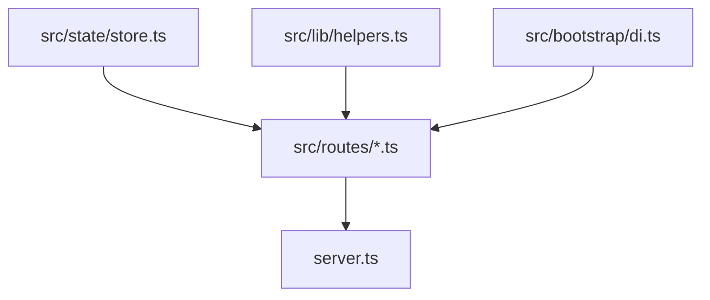

<!--
  Project      : SMRITI Retail OS
  Author       : Jawahar Ramkripal Mallah
  Designation  : Chief Systems Architect & Creator
  Email        : support@smritibooks.com
  Websites     : smritisys.com | smritibooks.com | erpnbook.com | aitdl.com
  Version      : 3.15.0
  Created      : 2026-07-12
  Modified     : 2026-07-12
  Copyright    : © SMRITIBooks.com. All Rights Reserved.
  License      : Proprietary Commercial Software
  Classification: Public
-->

# Foundation: Monolith Refactoring & Database Unification Plan — v3.15.0

## 1. Objective
Refactor the Express backend monolith (`server.ts`) by splitting route definitions into modular route files, moving global state arrays into a dedicated store, centralizing common utilities/helpers, integrating database-level operations through the DI container (eliminating the `db_store.json` file database), and resolving security gaps and setting up automated testing suites.

## 2. Business Motivation
SMRITI Retail OS currently uses a ~3500-line server entry point (`server.ts`) which complicates readability and maintainability. In addition, the flat-file JSON serialization fallback (`db_store.json`) is prone to file locks, database corruption under concurrent requests, and data desyncs with the live PostgreSQL instance. Unifying database operations through the DI container eliminates flat files, enforces multi-tenant schema isolation, and establishes a enterprise-grade clean architecture.

## 3. Scope
- **Phase 1 — Monolith Separation:** Extract shared mutable state arrays into `src/state/store.ts`. Extract helper/utility functions into `src/lib/helpers.ts`. Split route endpoints into 17 distinct module router files under `src/routes/`. Rewrite `server.ts` to under 150 lines.
- **Phase 2 — Database Unification:** Replace direct reads/writes to in-memory arrays in routes with calls to `container` database repositories. Remove `db_store.json` and in-memory arrays for entities that have database tables.
- **Phase 3 — Fix Security Gaps:** Increase PBKDF2 iterations to 600,000, remove sessions from disk serialization, replace string-based RBAC checks with permission-based checks, enforce authorization on Wiki routes, and remove demo session stubs.
- **Phase 4 — Automated Testing:** Set up Vitest testing suites for GST tax configurations, PBKDF2 Hashing, numbering allocations, and Express auth endpoints.
- **Phase 5 — CI Pipeline:** Configure GitHub actions workflow to run linters, tests, and build on push.
- **Phase 6 — Version Unification:** Bind all version outputs dynamically to `package.json`.

## 4. Current State
- `server.ts` is ~3500 lines containing API routing, helper functions, state declarations, and boot configurations.
- Mutation routes write concurrently to both memory arrays and `db_store.json` while some database tables exist in PostgreSQL.
- Sessions and demo tokens are serialized to disk.
- Role checks are hardcoded to strings like `"Store Manager"` or `"Cashier"`.

## 5. Gap Analysis
- **Monolithic Route Definitions:** Route logic, validation, and SQL queries are mixed with HTTP middleware, causing high technical debt.
- **Dual Persistence:** Storing data in both `db_store.json` and PostgreSQL creates duplicate read/write logic and potential database drifts.
- **Low Hashing Security:** 1,000 PBKDF2 iterations are below the recommended OWASP standard (600,000).

## 6. Architecture Impact
- **Decoupled Router Layout:** Express routes will be isolated by domain boundaries under `src/routes/`.
- **Single Source of Truth:** Direct array mutations are replaced by async queries via the SMRITI Platform Abstraction Layer (PAL) repositories.
- **Modular Bootloader:** `server.ts` acts exclusively as the HTTP application orchestrator and port binder.

## 7. Proposed Design

### Decoupled State & Helper Flow


### Database Access Unified Pattern
```typescript
// Old monothlic/in-memory query:
const existing = products.find(p => p.id === id);

// New unified database repository pattern:
const productRepo = container.products;
const existing = await productRepo.get(id);
```

## 8. Files Created
- `src/state/store.ts` — Centralized global store
- `src/lib/helpers.ts` — Common helper functions
- `src/routes/auth.ts` — Authentication routes
- `src/routes/users.ts` — User management routes
- `src/routes/products.ts` — Product management routes
- `src/routes/pos.ts` — POS terminal routes
- `src/routes/sales.ts` — Sales operations routes
- `src/routes/purchase.ts` — Procurement operations routes
- `src/routes/inventory.ts` — Stock ledger routes
- `src/routes/masters.ts` — Master entities routes
- `src/routes/numbering.ts` — Document series routes
- `src/routes/terms.ts` — Terms and conditions routes
- `src/routes/exchange.ts` — Data exchange routes
- `src/routes/attributes.ts` — Attribute and variant templates routes
- `src/routes/barcode.ts` — Barcode studio routes
- `src/routes/reports.ts` — Report configurations routes
- `src/routes/customers.ts` — CRM customer routes
- `src/routes/assistant.ts` — AI assistant Q&A routes
- `src/routes/system.ts` — Diagnostics and metadata routes
- `src/tests/helpers.test.ts` — Vitest tests for helpers
- `src/tests/numbering.test.ts` — Vitest tests for document numbering
- `src/tests/auth.test.ts` — Vitest tests for authentication endpoints
- `src/tests/gst.test.ts` — Vitest tests for tax and invoice reconciliation
- `.github/workflows/ci.yml` — GitHub actions workflow

## 9. Files Modified
- `server.ts` — Refactored to act as route orchestrator
- `package.json` — Add vitest packages, config and build tags

## 10. Dependencies
`vitest`, `@vitest/coverage-v8`, `supertest`, `@types/supertest`, `express`, `pg`.

## 11. Risks
- Route path mismatch or missing endpoints causing frontend API errors.
- *Mitigation:* The refactored Express routers will be mounted exactly at their original route roots.
- Concurrency issues during database operations.
- *Mitigation:* Leverage Postgres connection pooling and repository transactions.

## 12. Rollback Strategy
Revert files to the pre-refactoring commit using `git reset --hard HEAD` and clean up newly created routes directories.

## 13. Verification Plan
- Run `npm run lint` and `npm run test` to verify TypeScript compile status and routing health.
- Execute the Vitest integration suite.

## 14. Test Plan
- Run automated tests for all GST splits, token auths, HSN configurations, and password hashing utility functions.

## 15. Documentation Impact
Update Dev Tracker statuses, SMRITI Wiki endpoints catalog, and write Walkthrough document.

## 16. Deployment Plan
Scaffold plans, implement code locally, test in staging sandbox via git, and merge to main branch.

## 17. Status
Draft (Pending User Approval)

## 18. Related ADRs
None.

## 19. Related Walkthroughs
None.
