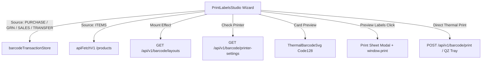

<!--
  Project      : SMRITI Retail OS
  Author       : Jawahar Ramkripal Mallah
  Designation  : Chief Systems Architect & Creator
  Email        : support@smritibooks.com
  Websites     : smritibooks.com | erpnbook.com | aitdl.com
  Version      : 6.46.0
  Created      : 2026-10-08
  Modified     : 2026-10-08
  Copyright    : © SMRITIBooks.com. All Rights Reserved.
  License      : Proprietary Commercial Software
  Classification: Internal -- SMRITI Implementation Plan Governance Policy (IPGP) v1.0
-->

# SMRITI Print Labels Studio Multi-Source Inward Intake, Dynamic Layouts & Accurate SVG Preview Plan (v6.46.0)

## 1. Objective
Remediate functional, architectural, and visual limitations identified during the Barcode Print Studio audit within `src/components/barcode/PrintLabelsStudio.tsx` (v6.45.0) and establish certified integration across inward document stores, backend layout registries, thermal printer discovery, symbology-accurate barcode rendering, and browser label sheet printing.

---

## 2. Business Motivation
High-velocity retail operations require instant barcode label printing immediately upon receiving purchase orders, GRN inward shipments, sales return parcels, or inter-branch stock transfers. If the Print Labels Studio is restricted to manual catalog item search or displays inaccurate placeholder bars, warehouse and store receiving staff face friction, delays, and mislabeled physical stock. Dynamic synchronization of custom thermal label dimensions and configured network/USB printers directly from FastAPI ensures seamless hardware interoperability without client-side hardcoding.

---

## 3. Scope

### In Scope
- Wiring domain transaction intake sources (`PURCHASE`, `GRN`, `SALES`, `STOCK_TRANSFER`) via `barcodeTransactionStore` with sensible default print quantities (`poQty`, `qty`).
- Dynamic layout synchronization querying `GET /api/v1/barcode/layouts` on mount, prepending custom user-designed layouts while retaining standard baseline presets.
- Dynamic thermal printer detection querying `GET /api/v1/barcode/printer-settings` to auto-populate configured hardware printer targets.
- Symbology-accurate barcode SVG preview using `<ThermalBarcodeSvg>` in place of static 40-rectangle illustrative graphics.
- Responsive WYSIWYG Browser Label Print Sheet Preview modal with formatted label cards and `window.print()` browser printing trigger.
- Unit verification test suite (`src/tests/printLabelsStudio.test.ts`).

### Out of Scope
- Native operating system raster driver development.
- Alterations to PostgreSQL schemas or Alembic migrations (existing `/api/v1/barcode/*` contracts are fully leveraged).
- Modifying `TagLabelPrintingTa.tsx`, `VisualLabelDesign.tsx`, or `BarcodeScriptGenVi.tsx` subtabs.
- Decommissioning legacy `LabelPrintingSec.tsx` (scheduled for a subsequent maintenance sprint).

---

## 4. Current State
`PrintLabelsStudio.tsx` (v6.45.0) functioned as a 3-step wizard (Select Source & Items -> Choose Layout & Quantities -> Review & Print), but suffered from 5 key limitations:
1. Non-functional source selector: Switching to `Purchase`, `GRN`, `Sales Return`, or `Stock Transfer` remained locked to catalog item lookup with no line items loaded.
2. Static layout dropdown: Limited to 5 hardcoded templates, failing to display user-designed layouts stored in the backend database.
3. Hardcoded printer state: Printer check always resolved to `"Zebra ZD420 (USB)"` or `"Generic ESC/POS"`.
4. Inaccurate visual barcode: Illustrated with an unvarying 40-rectangle SVG pattern regardless of product barcode length or symbology.
5. Inactive preview button: The `Preview Labels` button in Step 3 had an empty or stubbed click handler.

---

## 5. Gap Analysis

| Capability | Baseline State (v6.45.0) | Target State (v6.46.0) | Gap Classification |
|---|---|---|---|
| Inward Document Intake | Catalog `/products` only; zero inward document lines | Domain intake from `barcodeTransactionStore` (`PURCHASE`, `GRN`, `SALES`, `STOCK_TRANSFER`) with PO/GRN default counts | Functional / Operational |
| Layout Registry Sync | 5 static hardcoded presets | Dynamic fetch from `/api/v1/barcode/layouts` merged with presets | Architectural Contract |
| Hardware Detection | Mocked static string | Query `/api/v1/barcode/printer-settings` resolving active device | Hardware Integration |
| Symbology Preview | 40 uniform vertical bars | Deterministic Code128 bar widths via `ThermalBarcodeSvg` | Visual Fidelity |
| Label Sheet Preview | Inactive stub button | Responsive dialog with formatted grid cards and `window.print()` trigger | Usability / Output |

---

## 6. Architecture Impact
- **Component Layer:** `PrintLabelsStudio.tsx` transitions to an active orchestrator connecting `barcodeTransactionStore`, `ThermalBarcodeSvg`, and `apiFetchV1`.
- **Zero Backend Mutation:** Leverages existing FastAPI endpoints (`/api/v1/barcode/layouts`, `/api/v1/barcode/printer-settings`, `/api/v1/barcode/print`) without modifying backend contracts or database models.
- **Fault-Isolated Execution:** Print job dispatch failures write failure audit records to the database without corrupting transactions or aborting the user session.

---

## 7. Proposed Design

---

## 8. Files Created
- `docs/implementation/inventory/Barcode_PrintLabelsStudio_MultiSource_And_Preview_Plan_v6.46.0.md` (this plan)
- `src/tests/printLabelsStudio.test.ts` (unit verification suite)

---

## 9. Files Modified
- `src/components/barcode/PrintLabelsStudio.tsx`
- `docs/walkthrough/barcode/Barcode_PrintLabelsStudio_MultiSource_And_Preview_v6.46.0.md`
- `docs/walkthrough/README.md`
- `docs/implementation/README.md`
- `CHANGELOG.md`

---

## 10. Dependencies
- `src/lib/apiFetchV1.ts`: Governed API client for FastAPI backend communication.
- `src/store/barcodeTransactionStore.ts`: Inward transactional record cache for PO, GRN, and stock transfers.
- `src/components/barcode/ThermalBarcodeSvg.tsx`: Symbology-accurate deterministic Code128 barcode renderer.

---

## 11. Risks
- **Risk:** Empty transaction cache if user navigates to Print Studio without having opened PO/GRN screens.
  - **Mitigation:** Fallback cleanly displays an empty table state with clear instructions to load documents or switch to Items lookup.
- **Risk:** Backend unavailable for layout sync.
  - **Mitigation:** Fallback to baseline factory presets (`LABEL_TEMPLATES`) ensures zero UI crash or disruption.

---

## 12. Rollback Strategy
All changes are localized to `src/components/barcode/PrintLabelsStudio.tsx` and accompanying tests/docs. If unexpected issues arise, `git checkout HEAD~1 -- src/components/barcode/PrintLabelsStudio.tsx` restores v6.45.0 instantaneously with zero database or backend side effects.

---

## 13. Verification Plan
- Unit tests validating item intake from PO, GRN, Sales, Transfers, default quantity logic, and template merging.
- Full TypeScript compiler check (`tsc --noEmit --skipLibCheck`) to guarantee type safety.
- Vitest regression test run covering all barcode and print engine test suites.
- Pytest regression test run covering backend printer service and barcode API endpoints.

---

## 14. Test Plan
- `src/tests/printLabelsStudio.test.ts`:
  1. PO intake extracts lines with `poQty` as `printQty`.
  2. GRN intake extracts lines with inward `qty` as `printQty`.
  3. Stock Transfer intake extracts lines with transfer counts.
  4. Template merging prepends custom layouts from API before defaults.
  5. Barcode SVG renders valid Code128 paths.
- Barcode Subsystem Vitest Regression: 84/84 tests green.
- Backend Pytest Suite: 23/23 tests green against PostgreSQL.

---

## 15. Documentation Impact
- Update `CHANGELOG.md` with [6.70.25] entry.
- Create WGP v1.0 Walkthrough under `docs/walkthrough/barcode/Barcode_PrintLabelsStudio_MultiSource_And_Preview_v6.46.0.md`.
- Update `docs/walkthrough/README.md` master index.
- Update `docs/implementation/README.md` master index.

---

## 16. Deployment Plan
Commit and push changes to `smritiNX` branch. Changes are immediately available to test environments upon git pull. Zero migrations or deployment scripts required.

---

## 17. Status
**Completed** (v6.46.0 Initial Remediation -> v6.46.1 Advanced Filters & Hardware Dialog -> v6.46.2 Server-Side Inward Intake, Vector SVG Export & Legacy Retirement). Verified with 65/65 Vitest tests across 7 suites, 16/16 Pytest tests, and 0 `tsc --noEmit` errors.

---

## 18. Phase 3 Addendum (v6.46.2): Remote Inward Intake, Vector SVG Export & Legacy Prototype Retirement
- **Server-Side Inward Document Search:** Connected asynchronous backend API queries to `/api/v1/purchase/orders`, `/api/v1/purchase/receipts`, `/api/v1/sales/invoices`, and `/api/v1/wms/transfers` with seamless fallback to client `barcodeTransactionStore`.
- **Client-Side Deterministic Vector SVG Generator:** Added `generateThermalLabelSvgString` (scaled at 203 DPI / 8 dots/mm) and `generateThermalSheetSvgString` with instant browser `.svg` downloads via `downloadSvgFile`.
- **UI Export Controls:** Mounted `Export Vector SVG` button in `Labels Print Sheet Preview` modal and quick `SVG` export button in right sidebar single label preview card.
- **Legacy Prototype Decommissioning:** Safely deleted orphaned, unmounted `src/components/LabelPrintingSec.tsx` (1,009 lines) and modernized `src/tests/auxiliaryGridIntake.test.ts`.
- **Test Suite Expansion:** Expanded `src/tests/printLabelsStudio.test.ts` to 10/10 tests covering range filtering and SVG generation.

---

## 19. Related ADRs
- `ADR-008`: Strangler-Fig Migration (FastAPI Sole System of Record)
- `ADR-019`: Barcode Studio Component Architecture
- `ADR-0042`: Thermal Printer Hardware Integration & QZ Tray Gateway

---

## 20. Related Walkthroughs
- [`Barcode_PrintLabelsStudio_MultiSource_And_Preview_v6.46.0.md`](../walkthrough/barcode/Barcode_PrintLabelsStudio_MultiSource_And_Preview_v6.46.0.md)
- [`Barcode_PrintLabelsStudio_RemoteIntake_And_LegacyRetirement_v6.46.2.md`](../walkthrough/barcode/Barcode_PrintLabelsStudio_RemoteIntake_And_LegacyRetirement_v6.46.2.md)
