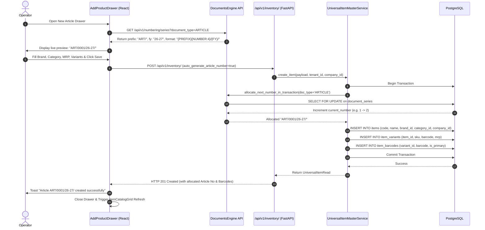

<!--
  Project      : SMRITI Retail OS
  Author       : Jawahar Ramkripal Mallah
  Designation  : Chief Systems Architect & Creator
  Email        : support@smritibooks.com
  Websites     : smritibooks.com | erpnbook.com | aitdl.com
  Version      : 6.47.3
  Created      : 2026-09-29
  Modified     : 2026-09-30
  Copyright    : © SMRITIBooks.com. All Rights Reserved.
  License      : Proprietary Commercial Software
  Classification: Internal Implementation Plan
  Policy ID    : UADHP-v1.0 / IPGP-v1.0
-->

# SMRITI Article / Design Master UX Refactor Plan

**Status:** Completed  
**Baseline Commit:** `bba276d1035a7b1968ec5f3f957e6ccea7b0db7b`  
**UI Terminology Commit:** `929093ca`  
**API Deprecation Commit:** `843f73ca` (`POST /api/v1/item-styles` -> HTTP 410 Gone)  
**Article Master Battery:** 14/14 PASS  
**Database Integrity:** 11/11 PASS (0 violations)  
**Visual Baseline Viewports:** Desktop (1920×1080), Laptop (1366×768), Tablet (768×1024), Mobile (390×844)  

---

## 1. Current Architecture

### 1.1 Shell & Routing Architecture
- **Route / Tab Mount:** The application shell (`src/App.tsx`) mounts workspaces conditionally based on URL query parameter `?tab=item-master`.
- **Launchpad Tile:** Configured in `src/components/launchpad/launchpadCatalog.ts` with ID `article-master`, titled `"Article / Design Master"`, category `catalog`, opening `activeTab = 'item-master'`.
- **Workspace Container:** Handled by `src/components/item_master/ItemMasterWs.tsx`.

### 1.2 The Active vs. Inactive Component Split
In `src/components/item_master/ItemMasterWs.tsx`:
```tsx
// Lines 250-264:
{activeSubTab === 'catalog' && (
  /* <ItemCatalogGrid onAddNew={() => setIsAddDrawerOpen(true)} /> */
  <ItemDetailsGrid
    key={companyId || 'no-company'}
    companyId={companyId}
    branchId={branchId}
  />
)}
```
- **Active Component:** `ItemDetailsGrid.tsx` (2,229 lines of code). It is a legacy 20+ column in-place editable spreadsheet with direct writes to `/api/v1/products/`. It bypasses the canonical Article Master creation flow and automatic document series allocation.
- **Dormant Component:** `ItemCatalogGrid.tsx` (489 LOC) combined with `AddProductDrawer.tsx` (910 LOC). It implements a modern card/row catalog view with search, filter chips, and a right-hand slide drawer using `/api/v1/inventory/`, but is currently commented out in the production JSX.
- **Variant / Matrix Component:** `VariantTemplateSec.tsx` mounted under `activeSubTab === 'variant-matrix'`. It operates as a detached tool using legacy endpoint `/api/v1/attributes/templates/{id}/generate-variants` rather than being integrated into the article creation lifecycle.

---

## 2. Verified Canonical APIs

Through verified terminal and AST inspection, the canonical backend APIs for Article / Design Master are established as follows:

| Endpoint | Method | Handling Service / File | Status | Notes |
| :--- | :--- | :--- | :--- | :--- |
| `/api/v1/inventory/` | `POST` | `UniversalItemMasterService.create_item()` in `backend/app/services/universal_item_master.py` | **CANONICAL** | Shared router with `/products/`. Handles `auto_generate_article_number`, tenant isolation, and document series allocation. |
| `/api/v1/universal/items` | `POST` | `UniversalItemMasterService.create_item()` | **CANONICAL** | Direct universal item master endpoint. Identical service delegation. |
| `/api/v1/inventory/{id}` | `PUT` | `backend/app/api/v1/inventory.py` lines 452–458 | **CANONICAL** | Strictly enforces immutability. Rejects updates containing `code`, `sku`, or `barcode` with HTTP 409 Conflict. |
| `/api/v1/inventory/` | `GET` | `UniversalItemMasterService.list_items()` | **CANONICAL** | Paginated, filtered search (`skip`, `limit`, `search`, `category`, `brand`). |
| `/api/v1/universal/items/{id}/variants/matrix` | `POST` | `backend/app/api/v1/universal_items.py` line 315 | **CANONICAL** | Generates Cartesian matrix variants directly linked to parent article in PostgreSQL. |
| `/api/v1/item-barcodes/` | `POST` | `backend/app/api/v1/item_barcodes.py` | **CANONICAL** | Manages 1:N barcode relationships for variants and articles in `item_barcodes` table. |
| `/api/v1/numbering/series` | `GET` | `DocumentsEngine` / `backend/app/api/v1/numbering.py` | **CANONICAL** | Exposes active document series configuration for `ARTICLE` type. |
| `/api/v1/item-styles` | `POST` | `backend/app/api/v1/item_styles.py` | **DEPRECATED (410)** | Retired in commit `843f73ca`. Returns HTTP 410 Gone. |
| `/api/v1/attributes/templates/{id}/generate-variants` | `POST` | `backend/app/api/v1/attributes.py` | **LEGACY SCALING** | Must be replaced by canonical matrix endpoint during P1. |

---

## 3. P0 Architecture Bridges

### 3.1 P0-1: Canonical Catalog Entry Activation
- **Problem:** Operators landing on "Article / Design Master" are served the legacy spreadsheet (`ItemDetailsGrid`) instead of the canonical catalog (`ItemCatalogGrid`).
- **Required Action:**
  1. Uncomment and activate `ItemCatalogGrid` as the primary view for `activeSubTab === 'catalog'`.
  2. Wire `onAddNew={() => setIsAddDrawerOpen(true)}` to launch `AddProductDrawer`.
  3. Ensure `ItemCatalogGrid` fetches from `/api/v1/inventory/` using `src/lib/apiFetchV1.ts`.

### 3.2 P0-2: Classic Spreadsheet Preservation & Adapter
- **Verdict:** **REQUIRES ADAPTER**
- **Evidence:**
  - `ItemDetailsGrid` writes to `/api/v1/products/`, which routes to `UniversalItemMasterService.create_item()` for POST.
  - However, for row updates (`PUT`), `ItemDetailsGrid` sends raw objects including `{ code: ..., barcode: ... }`.
  - Backend `backend/app/api/v1/inventory.py` lines 452–458 explicitly raises `HTTPException(status_code=409, detail="Field 'code' / 'barcode' is immutable and cannot be updated")`.
- **Bridge Strategy:**
  1. Relocate `ItemDetailsGrid` under a secondary sub-tab: `"Classic Spreadsheet View"` (`activeSubTab === 'spreadsheet'`).
  2. Implement `SpreadsheetPayloadAdapter` in frontend:
     - On create: Strip empty string fields, inject current `company_id` and `branch_id`.
     - On update: Strip immutable keys (`code`, `sku`, `barcode`, `id`, `created_at`, `tenant_id`) from the PUT payload.

### 3.3 P0-3: Add Article Entry Wire-Up
- **Entry Point:** `src/components/item_master/AddProductDrawer.tsx`.
- **Current Behavior:** Contains complete form fields (Article No, Name, Brand, Category, Gender, HSN, Tax Rate, Cost Price, MRP, Variants) and calls `POST /api/v1/inventory/`.
- **Bridge Verification:**
  - `auto_generate_article_number: boolean` is supported by backend `backend/app/schemas/universal_item.py`.
  - When `true`, backend triggers `DocumentsEngine.allocate_next_number_in_transaction(doc_type='ARTICLE')` returning format `ART/0001/26-27/`.
  - When `false`, backend accepts operator manual `code` and verifies uniqueness.
  - Multi-tenant isolation verified (`company_id: 'COMP-001'` / `comp-sal-359785`).

### 3.4 P0-4: Article Number Preview
- **Verification:**
  - Active document series verified in PostgreSQL:
    - Series ID: `SER-ART-COMP001`, Prefix: `ART/`, Format: `{PREFIX}{NUMBER:4}/{FY}/`, FY: `26-27`.
    - Series ID: `SER-ART-SAL359785`, Prefix: `ART/`, Format: `{PREFIX}{NUMBER:4}/{FY}/`, FY: `26-27`.
- **UI Requirement:**
  - Before save, when "Auto Generate" toggle is ON, the Article Number field must render a disabled badge:
    `[Auto Generated on Save: e.g. ART/0001/26-27/]`
  - Query `GET /api/v1/numbering/series?document_type=ARTICLE` on drawer mount to fetch prefix, format, and current number for live preview without consuming a sequence counter.

---

## 4. P1 Governance & UX Bridges

### 4.1 P1-1: Governed Master Lookups
- **Audit Finding:** `AddProductDrawer.tsx` lines 278 and 291 hardcode static arrays (`["Nike", "Adidas", "Puma"]`, `["Footwear", "Apparel"]`).
- **Required Bridge:**
  - Replace static arrays with live queries to `fetchGovernedLookupOptions()` from `src/services/itemMasterLookupGate.ts`.
  - Wire governed lookup options for:
    1. `brand` -> `master_types.type_name = 'brand'`
    2. `category` -> `master_types.type_name = 'category'`
    3. `gender` -> `master_types.type_name = 'gender'` (Men, Women, Boys, Girls, Unisex)
    4. `size` -> `master_types.type_name = 'size'`
    5. `color` -> `master_types.type_name = 'color'`
    6. `hsn` -> `hsn_sac_codes`
    7. `supplier` -> `parties` / `vendors` where `is_supplier = true`
  - If a lookup type is unseeded in tenant DB, gracefully render F2 Quick-Add shortcut or governed fallback.

### 4.2 P1-2: Field Immutability Presentation
- **Backend Rule:** Once persisted in PostgreSQL, `item_code`, `sku`, and `primary_barcode` are immutable.
- **UX Requirement:**
  - In Edit Mode (`ItemDetailsGrid` or `ItemEditModal`), `Article Number`, `SKU`, and `Primary Barcode` fields must render with a lock icon, disabled styling (`bg-slate-100 dark:bg-slate-800 text-slate-500 cursor-not-allowed`), and tooltip `"Canonical identifier is immutable after creation"`.

### 4.3 P1-3: Canonical Size × Color Matrix Convergence
- **Audit Finding:** `VariantTemplateSec.tsx` currently calls legacy `/api/v1/attributes/templates/{id}/generate-variants`.
- **Required Bridge:**
  - Integrate Size × Color Matrix generator directly inside `AddProductDrawer` (Variant Tab) and `ItemCatalogGrid` detail drawer.
  - Direct output to `POST /api/v1/universal/items/{item_id}/variants/matrix`.
  - Matrix table must display Size on horizontal header, Color on vertical header, with inline SKU/Barcode/MRP overrides per cell.

### 4.4 P1-4: Multi-Barcode UI & Table Parity
- **Backend Schema:** Table `item_barcodes` supports multiple barcodes per article/variant (`barcode`, `barcode_type`, `is_primary`, `notes`).
- **UX Requirement:**
  - Provide a compact "Additional Barcodes" chip list in drawer and edit modals.
  - Allow scanning or entering secondary barcodes (e.g. manufacturer UPC/EAN) without overwriting the system-generated internal barcode.

---

## 5. P2 Adaptive UX

### 5.1 SMRITI 3-Tier Adaptive Modes
The Article Master interface must adapt dynamically based on store operator configuration:
1. **SIMPLE (Express Retail / Kirana / Grocery):**
   - Single-screen quick entry.
   - Auto-generated article number.
   - Single barcode, default GST rate, standard units (PCS, KG).
   - Variant and matrix sections collapsed by default.
2. **HYBRID (Apparel / Footwear Specialty):**
   - Primary Article metadata (Brand, Category, Gender, Season).
   - Size × Color matrix generator enabled.
   - Batch inwarding and vendor style code linkage.
3. **ADVANCED (Enterprise / Departmental Store):**
   - Multi-barcode scanning and alias management.
   - Multi-vendor sourcing with purchase cost tiering.
   - Batch & expiry tracking toggles.
   - HSN tax slab overrides and franchise margin splits.

### 5.2 Strict Action Budget (Maximum 7 Primary Actions)
The current `ItemDetailsGrid` displays 12+ toolbar actions causing horizontal wrapping and visual noise. The refactored toolbar will enforce SMRITI 7-action budget:
1. `+ New Article` (Primary Highlight)
2. `Filter & Search` (Input + Popover)
3. `View: Catalog / Spreadsheet` (Segmented Toggle)
4. `Import / Export` (Dropdown Menu)
5. `Print Barcodes` (Secondary Button)
6. `Refresh` (Icon Button)
7. `More Options (...)` (Overflow Menu for Deactivate, Audit Log, Print Catalog)

---

## 6. Legacy Strangler-Fig Strategy

```
Phase 0 (Current Baseline):
[ItemMasterWs]
  ├── Default -> ItemDetailsGrid (Legacy Spreadsheet, direct writes)
  ├── Dormant -> ItemCatalogGrid + AddProductDrawer (Commented out)
  └── Detached -> VariantTemplateSec (Legacy attribute generator)

Phase 1 (P0 Bridge):
[ItemMasterWs]
  ├── Default View: ItemCatalogGrid + AddProductDrawer (Canonical /inventory/ API)
  ├── Fallback Tab: ItemDetailsGrid (Protected by SpreadsheetPayloadAdapter)
  └── Unified Numbering: Article Series live preview & auto-allocation

Phase 2 (P1 Bridges):
[ItemCatalogGrid & AddProductDrawer]
  ├── Live Governed Lookups (Brand, Cat, Gender, Size, Color, HSN, Supplier)
  ├── Integrated Matrix Generator -> POST /universal/items/{id}/variants/matrix
  ├── Multi-Barcode Editor -> POST /item-barcodes/
  └── Immutability Lock Badging on edit views

Phase 3 (Legacy Retirement):
[ItemDetailsGrid Retirement]
  ├── Decommission direct /api/v1/products/ writes
  ├── Turn spreadsheet view into Read-Only Quick-Audit Table
  └── Complete retirement once 100% of store operations transition to Catalog
```

---

## 7. Component Responsibility Map

| Component | File Path | Current Status | Target Architecture Responsibility |
| :--- | :--- | :--- | :--- |
| `ItemMasterWs` | `src/components/item_master/ItemMasterWs.tsx` | Main Router / Tab Shell | Master workspace container; controls active sub-tab (`catalog` vs `spreadsheet`), top KPI bar, and drawer visibility. |
| `ItemCatalogGrid` | `src/components/item_master/ItemCatalogGrid.tsx` | Commented Out | Primary canonical catalog view. Displays responsive card/row grid, status badges, search filter chips, and pagination. |
| `AddProductDrawer` | `src/components/item_master/AddProductDrawer.tsx` | Commented Out | Slide-over drawer for new article creation. Hosts Auto-numbering preview, governed lookups, variant matrix, and barcode inputs. |
| `ItemDetailsGrid` | `src/components/item_master/ItemDetailsGrid.tsx` | Active Primary View | Re-assigned as secondary `"Classic Spreadsheet View"`. Wrapped with `SpreadsheetPayloadAdapter` to sanitize payloads. |
| `VariantTemplateSec` | `src/components/item_master/VariantTemplateSec.tsx` | Detached Sub-Tab | Repurposed as standalone matrix template manager; matrix creation logic extracted into reusable drawer component. |
| `SpreadsheetPayloadAdapter` | `src/components/item_master/adapters/spreadsheetAdapter.ts` | To Be Created | Intercepts spreadsheet row updates; strips immutable fields (`code`, `sku`, `barcode`) to guarantee zero 409 errors. |
| `DocumentsEngine` | `backend/app/services/documents_engine.py` | Active Canonical Service | Sole atomic authority for generating sequence numbers for `ARTICLE` series. |

---

## 8. Data Flow



---

## 9. API Flow

### 9.1 Article Creation (`POST /api/v1/inventory/`)
- **Request Payload:**
```json
{
  "name": "Men's Slim Fit Polo",
  "code": "",
  "auto_generate_article_number": true,
  "brand": "Nike",
  "category": "Apparel",
  "gender": "Men",
  "hsn_code": "61091000",
  "tax_rate": 12.0,
  "cost_price": 450.0,
  "mrp": 999.0,
  "company_id": "COMP-001",
  "branch_id": "BR-MAIN",
  "variants": [
    {
      "color": "Navy Blue",
      "size": "L",
      "cost_price": 450.0,
      "mrp": 999.0,
      "barcodes": ["8901234567890"]
    }
  ]
}
```
- **Response (`HTTP 201 Created`):**
```json
{
  "id": "item_982341",
  "code": "ART/0001/26-27/",
  "name": "Men's Slim Fit Polo",
  "brand": "Nike",
  "category": "Apparel",
  "status": "ACTIVE",
  "created_at": "2026-09-29T23:15:00Z"
}
```

### 9.2 Article Update (`PUT /api/v1/inventory/{product_id}`)
- **Sanitized Payload (via Adapter):**
```json
{
  "name": "Men's Slim Fit Polo - Updated",
  "mrp": 1099.0,
  "tax_rate": 12.0,
  "is_active": true
}
```
*(Immutable fields `code`, `sku`, `barcode` stripped to prevent HTTP 409 Conflict)*.

---

## 10. UI State Flow

```
[IDLE_CATALOG]
       │
       ├─► Click "+ New Article" ────────► [DRAWER_OPEN]
       │                                         │
       │                                         ├─► Toggle Auto-Number ──► [FETCH_SERIES_PREVIEW]
       │                                         │
       │                                         ├─► Fill Master Metadata
       │                                         │
       │                                         ├─► Open Matrix Grid ────► [MATRIX_BUILDER]
       │                                         │
       │                                         ├─► Click "Save Article"
       │                                         │           │
       │                                         │           ▼
       │                                         │    [SUBMITTING_CANONICAL]
       │                                         │           │
       │                                         │           ├─► Success ──► [TOAST_SUCCESS] ──► [IDLE_CATALOG_REFRESH]
       │                                         │           │
       │                                         │           └─► Error ────► [ALERT_ERROR_MODAL]
       │                                         │
       ├─► Switch Sub-Tab "Spreadsheet" ──► [SPREADSHEET_VIEW]
       │                                         │
       │                                         ├─► In-Place Cell Edit
       │                                         │           │
       │                                         │           ▼
       │                                         │    [ADAPTER_SANITIZE] ──► [PUT_INVENTORY]
       │
       └─► Search / Filter Chips ─────────► [FILTERED_QUERY] ──► [PAGINATED_RENDER]
```

---

## 11. Rollback Strategy

1. **Zero Database Risk:**
   - No database schema migrations or column alters are required for this UX refactor. Backend models (`Item`, `ItemVariant`, `DocumentSeries`, `ItemBarcode`) already exist and are 100% unified in commit `bba276d1`.
2. **Instant Frontend Fallback Toggle:**
   - `ItemMasterWs.tsx` retains `activeSubTab` state.
   - If an unexpected regression occurs in `ItemCatalogGrid`, setting the default `activeSubTab = 'spreadsheet'` immediately restores 100% of legacy behavior.
3. **Payload Adapter Isolation:**
   - The `SpreadsheetPayloadAdapter` acts strictly as an outgoing data sanitizer. If bypassed, raw legacy calls continue to route to `/api/v1/products/`.

---

## 12. Regression Strategy

To guarantee continuous zero-regression across all operational workflows:
1. **Automated Playwright Suite:** Headless browser test verifying drawer open, auto-number allocation, matrix generation, and catalog grid rendering across Desktop, Laptop, Tablet, and Mobile.
2. **Unit Test Coverage:** Automated Jest suite testing `itemMasterLookupGate.ts`, `spreadsheetAdapter.ts`, and numbering series format derivation.
3. **Backend Battery Re-run:** Re-run the canonical 14/14 Article Master battery and 11/11 database integrity audit scripts after frontend integration.
4. **Tenant Isolation Verification:** Multi-company allocation verified across `COMP-001` and `comp-sal-359785`.

---

## 13. Visual Baseline Requirements & Audit Findings

From the live browser visual audit executed in Step 2 across Desktop (1920×1080), Laptop (1366×768), Tablet (768×1024), and Mobile (390×844):

| Finding ID | Viewport | Severity | Visual Observation & Technical Cause |
| :--- | :--- | :--- | :--- |
| **VIS-MOB-01** | Mobile (390×844) | **P0 (Critical)** | **Dual Sidebar Overlap Collision:** AppShell nav (180px fixed) + ItemMasterWs sub-nav (256px fixed) = 436px width, which exceeds mobile screen width (390px). Grid canvas pushed 100% off-screen to the right. |
| **VIS-TAB-02** | Tablet (768×1024) | **P1 (High)** | **Severe Grid Horizontal Squeeze:** Sidebars consume 476px (62% of viewport width), leaving only 292px for the 20-column grid. Extreme horizontal scrolling required. |
| **VIS-ACT-03** | All Viewports | **P1 (High)** | **Action Budget Violation:** Spreadsheet toolbar displays 12+ action buttons, violating SMRITI Rule (maximum 7 primary actions). |
| **VIS-NUM-04** | All Viewports | **P0 (Critical)** | **Auto Article Numbering Dormant:** In active spreadsheet view, Article Number is an unvalidated free-text cell. Auto-numbering series is completely unreachable. |
| **VIS-COL-05** | Laptop / Tablet | **P2 (Medium)** | **Column Header Clipping:** Several spreadsheet headers ("SHORT CODE / ALIAS", "PURCHASE ACCOUNT") truncate due to fixed pixel width allocations. |

---

## 14. Implementation Order

Execution must follow this strict sequence:

### Wave 0: Baseline Freeze & Evidence Audit (Current Task — COMPLETED)
- [x] Complete Step 1 Code & API verification.
- [x] Complete Step 2 Headless 4-Viewport Visual Baseline capture.
- [x] Freeze this Implementation Plan Document (`SMRITI_ARTICLE_DESIGN_MASTER_UX_REFACTOR_PLAN.md`).

### Wave 1: P0 Architecture Bridges
- [x] **Step 1.1:** Re-activate `ItemCatalogGrid` as default view in `ItemMasterWs.tsx`.
- [x] **Step 1.2:** Mount `ItemDetailsGrid` as secondary `"Classic Spreadsheet View"` sub-tab.
- [x] **Step 1.3:** Implement `SpreadsheetPayloadAdapter` to sanitize PUT payloads (strip `code`, `sku`, `barcode`).
- [x] **Step 1.4:** Connect `AddProductDrawer` to canonical `POST /api/v1/inventory/` with `auto_generate_article_number: true`.
- [x] **Step 1.5:** Implement Live Numbering Series Preview badge in `AddProductDrawer`.

### Wave 2: P1 Governance & Matrix Bridges
- [x] **Step 2.1:** Wire `fetchGovernedLookupOptions()` into `AddProductDrawer` (Brand, Category, Gender, Size, Color, HSN, Supplier).
- [x] **Step 2.2:** Add visual Immutability Locks to persisted `item_code`, `sku`, and `primary_barcode`.
- [x] **Step 2.3:** Integrate Size × Color Matrix generator in drawer, calling canonical `POST /api/v1/universal/items/{id}/variants/matrix`.
- [x] **Step 2.4:** Wire multi-barcode secondary chip list to `POST /api/v1/item-barcodes/`.

### Wave 3: P2 Adaptive UX & Responsive Polish
- [x] **Step 3.1:** Implement Mobile Drawer/Sidebar Collapse (collapsible drawer on `<1024px` viewports to fix VIS-MOB-01).
- [x] **Step 3.2:** Enforce 7-Action Budget on top toolbar (collapse secondary tools into `More Options` dropdown).
- [x] **Step 3.3:** SMRITI 3-Tier Adaptive Mode selector (SIMPLE, HYBRID, ADVANCED).
- [x] **Step 3.4:** Re-run 4-viewport Playwright visual audit for regression verification.

### Wave 4: Phase 3 Legacy Retirement (COMPLETED)
- [x] **Step 4.1:** Decommission direct spreadsheet writes (`POST` and `PUT` to `/api/v1/products/`) in `ItemDetailsGrid.tsx`.
- [x] **Step 4.2:** Remove mutating handlers (`handleCellChange`, `handleAddRow`, `handleDuplicateSelected`, `handleDeleteRecords`, `handleGlobalReplace`, `handleSaveGridToDatabase`).
- [x] **Step 4.3:** Convert all grid cells and classic inspector inputs to read-only presentation with native text selection (`select-text`).
- [x] **Step 4.4:** Update `ItemMasterWs.tsx` sidebar label to `"Quick-Audit Table (Read-Only)"` with tooltip.
- [x] **Step 4.5:** Wire top header and footer CTAs to open canonical Article / Design Catalog and Drawer.
- [x] **Step 4.6:** Verify zero regressions via Playwright visual audit, Vitest, and Python test battery.

---

## 15. Explicit Non-Goals

The following activities are strictly out of scope for this refactor:
1. **No Database Schema Changes:** No new Alembic migrations, no table creations, and no column modifications.
2. **No Backend Service Rewrites:** `UniversalItemMasterService`, `DocumentsEngine`, and `inventory.py` are certified and closed; they will not be modified.
3. **No Legacy Product Deletions:** Existing 570 legacy product records remain untouched and queryable.
4. **No Destructive Backfills:** Zero un-sandboxed data mutations on production data.
5. **No Visual Redesign Before P0/P1 Bridges:** Layout styling, color themes, and aesthetics refactoring will occur only after canonical bridges are certified green.
