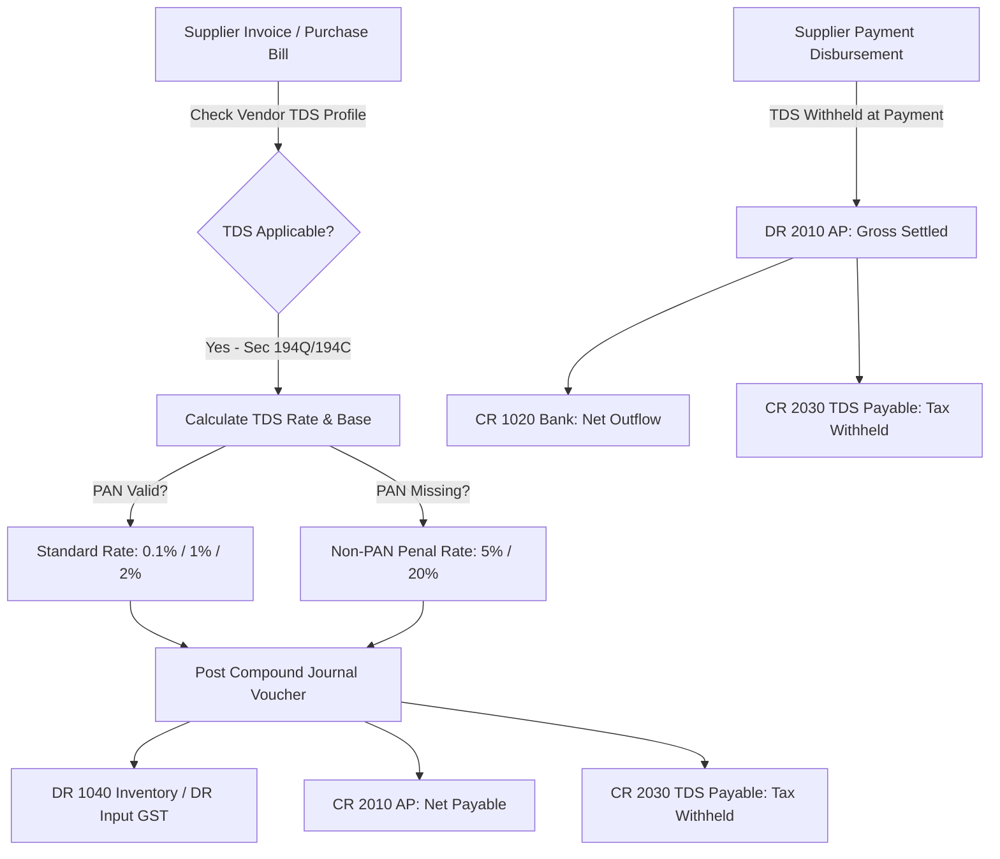

<!--
  Project      : SMRITI Retail OS
  Author       : Jawahar Ramkripal Mallah
  Designation  : Chief Systems Architect & Creator
  Email        : support@smritibooks.com
  Websites     : smritibooks.com | erpnbook.com | aitdl.com
  Version      : 6.50.0
  Created      : 2026-10-03
  Modified     : 2026-10-03
  Copyright    : © SMRITIBooks.com. All Rights Reserved.
  License      : Proprietary Commercial Software
  Classification: Internal
-->

# Implementation Plan: Procurement Phase 2.9 — Statutory Withholding Tax (TDS on Purchase & Payments — Section 194Q / 194C / 194J) & GL Account 2030 Integration

> **Document ID:** `IP-PROC-009`  
> **Version:** `1.0.0` (Target SSOT Release `v6.51.0`)  
> **Status:** `Approved / In Progress`  
> **Area:** Procurement / Accounts Payable / Statutory Withholding Tax (TDS)  
> **Author:** Jawahar Ramkripal Mallah, Chief Systems Architect  

---

## 1. Objective

To implement an authoritative, audit-compliant Indian Statutory Withholding Tax (Tax Deducted at Source — TDS) engine within SMRITI Retail OS. This covers statutory tax deduction under Sections 194Q (Purchase of Goods), 194C (Contractors), 194J (Professional & Technical Services), and 194H (Commission), integrated directly with the double-entry General Ledger (`Account 2030: TDS / Withholding Tax Payable`), Purchase Bill processing, Supplier Payment disbursements, and Vendor 360 compliance reporting.

---

## 2. Business Motivation

1. **Statutory Tax Compliance (Income Tax Act, 1961)**:
   - Indian retail enterprises with turnover exceeding ₹10 Crores are legally mandated under Section 194Q to deduct 0.1% TDS on aggregate purchases exceeding ₹50 Lakhs from a supplier in a financial year (or 5% if the supplier has not furnished a PAN).
   - Commercial contracts (transport, warehousing, packing) require 1%–2% TDS under Section 194C.
   - Professional and IT services require 2%–10% TDS under Section 194J.
2. **Double-Entry Financial Separation**:
   - Gross vendor bills must not be paid in full without withholding tax. Deducting TDS reduces the net cash liability to the supplier (`Account 2010 AP`) while establishing a statutory liability to the Central Government / Income Tax Department (`Account 2030 TDS Payable`).
3. **Audit & Filing Readiness**:
   - Businesses must file quarterly Form 26Q TDS returns and generate Form 16A certificates. Without ledger-backed TDS tracking, manual offline spreadsheets lead to non-compliance penalties, disallowances under Section 40(a)(ia), and statutory interest under Section 201(1A).

---

## 3. Scope

1. **Chart of Accounts Configuration**:
   - Register `Account 2030: TDS / Withholding Tax Payable` under `Liabilities (2000)` in `DEFAULT_CHART_OF_ACCOUNTS`.
2. **Statutory TDS Computation Engine (`TdsCalculationEngine`)**:
   - Rates and section rules:
     - `194Q` (Goods): Standard 0.10%; Non-PAN higher rate 5.00%.
     - `194C` (Contractors): Individual/HUF 1.00%; Corporate/Firm 2.00%; Non-PAN 20.00%.
     - `194J` (Technical/Professional): Technical 2.00%; Professional 10.00%; Non-PAN 20.00%.
     - `194H` (Commission): Standard 5.00%; Non-PAN 20.00%.
   - Validates supplier PAN 4th character (`C`=Company, `P`=Individual, `F`=Firm, `H`=HUF).
3. **Purchase Bill GL Integration**:
   - Enhanced `post_purchase_bill_to_gl()`: supports deducting TDS at the point of invoice booking:
     - `DR 1040 Inventory Asset` (Subtotal)
     - `DR 1051/1052/1053 Input GST` (Tax totals)
     - `CR 2010 Accounts Payable` (Net Amount = Total - TDS)
     - `CR 2030 TDS Payable` (TDS Amount)
     - Sub-cent rounding into `5030 Roundoff`.
   - Symmetrical reversal on cancellation (`reverse_purchase_bill_gl`).
4. **Supplier Payment Withholding Integration**:
   - Enhanced `record_payment()` and `post_supplier_payment_to_gl()`: supports withholding TDS upon cash/bank disbursement:
     - `DR 2010 Accounts Payable` (Gross Knock-off Amount)
     - `CR 1010/1020 Cash / Bank` (Net Cash Paid = Gross - TDS)
     - `CR 2030 TDS Payable` (TDS Amount Withheld)
   - Zero-cash variance balance invariant: $\sum \text{Debit} = \sum \text{Credit}$.
5. **REST API Endpoints**:
   - `GET /api/v1/purchase/vendors/{vendor_id}/tds-summary`: returns cumulative financial-year TDS deductions, threshold consumption, and pending deposits.
6. **Frontend UI Integration**:
   - Vendor 360 Payables & Profile: display active TDS section, applicable rate, and cumulative FY TDS withheld.
   - Payment Dialog: interactive TDS deduction toggle with rate preset and automatic net cash calculation.
7. **Automated Test Battery**:
   - Pytest suite `backend/app/tests/test_statutory_tds_engine.py` covering rate calculation, bill booking with TDS, payment disbursement with TDS, cancellation reversals, and tenant isolation.

---

## 4. Current State

- `supplier_profiles` table has `tds_section` (`194Q`, `194C`, `NONE`) and `tds_rate` (`Numeric(5,2)` default `0.10`).
- `DEFAULT_CHART_OF_ACCOUNTS` has Account `2010` (Accounts Payable), `2021-2023` (GST Output), `2050` (Advance Liability), `2060` (Wallet), `2070` (Loyalty).
- `PurchaseBill` and `SupplierPayment` post to GL without TDS split, requiring external manual calculation.

---

## 5. Gap Analysis

| Requirement | Current State | Target Phase 2.9 State |
|---|---|---|
| TDS Liability Account | Not in default COA | `Account 2030: TDS / Withholding Tax Payable` seeded |
| TDS on Bill Booking | Bills credit 100% to AP | Bill credits net to AP and TDS amount to Account 2030 |
| TDS on Payment | Payments credit 100% to Cash/Bank | Payment credits net to Cash/Bank and TDS amount to Account 2030 |
| Non-PAN Higher Rate | Not validated | Automatically escalates to 5% (194Q) or 20% (194C/J) if PAN missing |
| TDS Audit Summary | Not exposed in Vendor 360 | Detailed summary card with cumulative FY deductions and Form 26Q readiness |

---

## 6. Architecture Impact

---

## 7. Proposed Design

### A. Core TDS Calculation Engine
A stateless utility `TdsCalculationEngine`:
- `calculate_tds(gross_amount, section, pan, vendor_rate=None) -> TdsResult(rate, tds_amount, net_amount, section, is_penal)`

### B. Double-Entry Posting Matrix
#### 1. Purchase Bill with TDS
| Account | Code | DR (₹) | CR (₹) | Narration |
|---|---|---|---|---|
| Inventory Asset | 1040 | 1,00,000.00 | — | Taxable invoice amount |
| Input CGST | 1051 | 9,000.00 | — | Input CGST 9% |
| Input SGST | 1052 | 9,000.00 | — | Input SGST 9% |
| Accounts Payable | 2010 | — | 1,17,882.00 | Net payable to vendor |
| TDS Payable (194Q) | 2030 | — | 118.00 | 0.1% TDS on gross total |

#### 2. Supplier Payment with TDS
| Account | Code | DR (₹) | CR (₹) | Narration |
|---|---|---|---|---|
| Accounts Payable | 2010 | 50,000.00 | — | Knock-off against open bill |
| Bank Account | 1020 | — | 49,500.00 | Net electronic disbursement |
| TDS Payable (194C) | 2030 | — | 500.00 | 1% TDS on contractor settlement |

---

## 8. Files Created

1. `backend/app/schemas/tds.py` — Pydantic models for TDS calculation, summaries, and deduction records.
2. `backend/app/services/tds_engine.py` — Statutory calculation engine for 194Q, 194C, 194J, 194H.
3. `backend/app/tests/test_statutory_tds_engine.py` — Test suite for TDS calculations, GL postings, and reversals.
4. `docs/implementation/procurement/Procurement_Phase2_9_Statutory_TDS_Withholding_Tax_Plan_v1.0.md` — This plan.
5. `docs/walkthrough/procurement/Procurement_Phase2_9_Statutory_TDS_Withholding_Tax_v1.0.md` — Walkthrough.

---

## 9. Files Modified

1. `backend/app/services/unified_ledger.py` — Add Account `2030` to `DEFAULT_CHART_OF_ACCOUNTS`, update `post_purchase_bill_to_gl` and `post_supplier_payment_to_gl` to support TDS deduction and reversal.
2. `backend/app/services/supplier_payment.py` — Support `tds_amount` and `tds_section` in `SupplierPaymentCreate`.
3. `backend/app/api/v1/supplier_payment.py` — Expose TDS fields in payment creation endpoints.
4. `backend/app/api/v1/vendor.py` — Add TDS summary endpoint.
5. `src/components/vendor/tabs/VendorPayablesTab.tsx` — Display TDS summary and deduction status.
6. `src/config/version.ts` & `package.json` — Bump SSOT to `v6.51.0`.
7. `CHANGELOG.md` — Document Phase 2.9 changes.

---

## 10. Dependencies

- Python `decimal.Decimal` for exact sub-cent arithmetic.
- Existing `UnifiedAccountingLedgerService` and `SupplierPaymentService`.
- React 18 + Lucide React for UI components.

---

## 11. Risks

- **Sub-cent Rounding**: Rounding on small percentages (0.10%) must round to nearest rupee or 2 decimal places per statutory guidelines.
- **Cancellation Restitution**: Cancelling a bill or payment must completely extinguish the corresponding TDS liability.

---

## 12. Rollback Strategy

All changes are additive. Existing payments and purchase bills without TDS continue to post standard non-TDS entries with zero disruption.

---

## 13. Verification Plan

1. Run automated pytest test suite `test_statutory_tds_engine.py`.
2. Run TypeScript compiler check `npx tsc --noEmit`.
3. Verify double-entry balance invariant $\sum \text{Debit} = \sum \text{Credit}$ on all vouchers.
4. Capture headless Playwright visual evidence of TDS summary cards.

---

## 14. Test Plan

- Unit test 1: Section 194Q calculation with valid PAN (0.10%) vs without PAN (5.00%).
- Unit test 2: Section 194C calculation for Individual (1.00%) vs Company (2.00%).
- Unit test 3: Purchase bill booking with TDS (DR 1040, DR 1051/1052, CR 2010 Net, CR 2030 TDS).
- Unit test 4: Purchase bill cancellation with TDS reversal (DR 2010 Net, DR 2030 TDS, CR 1040, CR Input GST).
- Unit test 5: Supplier payment with TDS withholding (DR 2010 Gross, CR 1020 Net, CR 2030 TDS).
- Unit test 6: Multi-tenant isolation for TDS summaries and vouchers.

---

## 15. Documentation Impact

- Update `CHANGELOG.md` with version `6.51.0`.
- Update `docs/implementation/README.md`.
- Create `docs/walkthrough/procurement/Procurement_Phase2_9_Statutory_TDS_Withholding_Tax_v1.0.md` and append to `docs/walkthrough/README.md`.

---

## 16. Deployment Plan

- Commit code in branch `smritiNX` and push to remote.
- Ensure all tests pass green prior to merge.

---

## 17. Status

- `Approved / In Progress`

---

## 18. Related ADRs

- `ADR-ACC-004`: Chart of Accounts & Subledger Standards.
- `ADR-PROC-007`: Supplier Advance Liability & Knock-Off Compound Vouchers.
- `ADR-PROC-009`: Statutory Withholding Tax (TDS) Double-Entry Accounting.

---

## 19. Related Walkthroughs

- `WT-PROC-009`: Procurement Phase 2.9 — Statutory Withholding Tax (TDS) Engine (Upcoming).
- `WT-PROC-008`: Procurement Phase 2.8 — Vendor Statement of Account (SOA).
