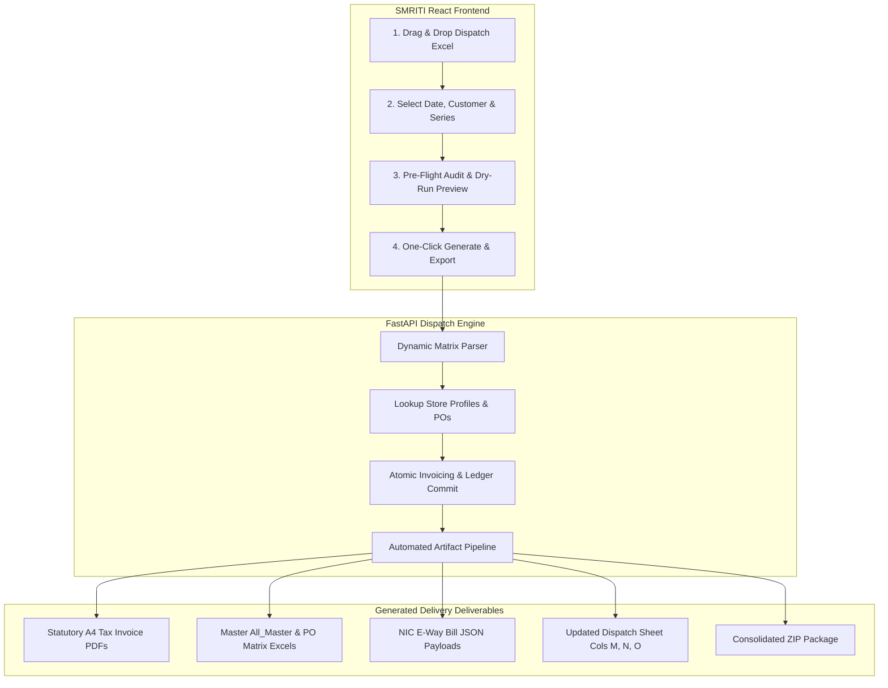

<!--
  Project      : SMRITI Retail OS
  Author       : Jawahar Ramkripal Mallah
  Designation  : Chief Systems Architect & Creator
  Email        : support@smritibooks.com
  Websites     : smritibooks.com | erpnbook.com | aitdl.com
  Version      : 1.0.0
  Created      : 2026-09-18
  Copyright    : © SMRITIBooks.com. All Rights Reserved.
  License      : Proprietary Commercial Software
  Classification: Internal
-->

# Implementation Plan: SMRITI B2B Dispatch & Tax Invoicing Studio (Automated Excel-to-Invoice Pipeline)

## 1. Objective
Design and construct an enterprise-grade, native **B2B Dispatch & Tax Invoicing Studio** (`B2BDispatchStudio`) in SMRITI Retail OS. The module eliminates manual Python scripting by enabling non-technical billing staff and logistics accountants to upload Excel matrix dispatch sheets, execute dry-run pre-flight audits, atomically generate statutory B2B Tax Invoices, create NIC E-Way Bill payloads, render PDF tax invoices via the Golden CSS template, update dispatch sheets with invoice stamps, and export master reconciliation workbooks in a single automated 1-click pipeline.

---

## 2. Business Motivation
Currently, whenever a client dispatch occurs (such as Reliance Retail batches on `08-09-2026`, `11-09-2026`, `15-09-2026`, `16-09-2026`), developers and agents are manually required to write custom scripts to parse Excel files, resolve stores, perform tax calculations, insert database rows, render PDFs, and bundle ZIP packages. 

This manual workflow causes operational friction:
- Requires software engineers for routine commercial dispatch billing.
- High risk of script divergence, typos, or missed store metadata.
- Slow turnaround time for warehouse dispatches awaiting E-Way bills and printable PDF invoices.

Automating this into a native SMRITI React Studio and FastAPI service empowers operations teams to process 50+ stores and 10,000+ pairs in under 60 seconds with zero engineering intervention.

---

## 3. Scope
- **In-Scope:**
  - Dynamic Excel Matrix Dispatch Parser supporting numeric/text shoe sizes (`36` through `42`, or extensible size headers).
  - Pre-flight validation engine detecting unmapped stores, invalid GSTINs, negative quantities, or pending PO shortfalls.
  - Concurrency-hardened sequence allocator (`TT2026-2027/{seq}`) using PostgreSQL `SELECT ... FOR UPDATE`.
  - Automated statutory GST partitioning (IGST vs CGST/SGST) and rounding adjustments.
  - Full transactional database posting (`sales_invoices`, `sales_invoice_items`, `sales_order_invoice_allocations`, and `stock_movements`).
  - Automated statutory artifact generation:
    1. Individual `<Store>_<PO>_<Invoice>.pdf` via Playwright and SMRITI Golden CSS Template.
    2. Consolidated 11-page master statement PDF (`Tax_Invoice_Statement_*.pdf`).
    3. Source dispatch Excel write-back (populating Columns M, N, O with green highlighting).
    4. Master Reconciliation workbooks (`All_Master.xlsx` and `PO_Fulfillment_And_Movements_Matrix.xlsx`).
    5. E-Way Bill JSON payloads (individual + NIC bulk upload format).
    6. Complete ZIP delivery bundle.
  - React 18 + Vite Frontend Studio (`src/components/sales/DispatchInvoicingStudioTab.tsx`) with drag-and-drop upload, parameter selection, pre-flight audit preview, live progress modal, and delivery download center.

- **Out-of-Scope:**
  - Automated government NIC API live transmission (payloads generated for portal upload; direct GSP live upload handled by dedicated NIC gateway).
  - Retail POS consumer billing (handled by `BillingTerm.tsx`).

---

## 4. Current State
- Dispatch sheets arrive as Excel workbooks (`STORE NAME`, `ARTICLE`, `COLOR`, `MRP`, `36`..`42`, `TOTAL`).
- Backend has fragmented scripts in `backend/scripts/` (`generate_ril_dispatch_16092026_invoices.py`, `generate_ril_dispatch_16092026_2nd_invoices.py`, `tattly_dispatch_import_service.py`).
- Store metadata (PO numbers, GSTIN, addresses, distances) is often hardcoded in Python dictionaries instead of being fully driven by `customer_delivery_locations` and `sales_orders`.

---

## 5. Gap Analysis
1. **Missing Unified Parser:** No generic parser exists that auto-detects size matrix columns and store groups dynamically.
2. **Missing UI Studio:** No React interface exists for dispatch uploads; operations staff must rely on terminal scripts.
3. **Missing Automated Artifact Packaging:** PDF rendering, Excel reconciliation generation, and ZIP packaging are executed via manual ad-hoc scripts.
4. **Metadata Centralization Gap:** Some store distances and PO mappings remain in scripts rather than being fully managed in database models.

---

## 6. Architecture Impact
- **Backend Architecture:**
  - New service module: `backend/app/services/dispatch_invoicing_engine.py`.
  - New API router: `backend/app/api/v1/dispatch_invoicing.py` mounted on `/api/v1/dispatch-invoicing`.
  - Background async worker integration for heavy PDF rendering tasks.
- **Frontend Architecture:**
  - New studio tab: `src/components/sales/DispatchInvoicingStudioTab.tsx`.
  - Registered in `src/components/shell/NavRail.tsx` under the Sales & Logistics domain.
  - Integrated with `src/services/f2LookupRegistry.ts` for quick store and PO search.
- **Database Layer:**
  - Additive migration for `dispatch_import_batches` tracking upload history, checksums, and generated invoice ranges.
  - Additive fields in `customer_delivery_locations` (`distance_km`, `eway_pin_code`).

---

## 7. Proposed Design

---

## 8. Files Created
- `docs/implementation/sales/Sales_B2B_Dispatch_Invoicing_Studio_Plan_v1.0.0.md` (this plan)
- `backend/app/services/dispatch_matrix_parser.py`
- `backend/app/services/dispatch_invoicing_engine.py`
- `backend/app/services/dispatch_artifact_pipeline.py`
- `backend/app/schemas/dispatch_invoicing.py`
- `backend/app/api/v1/dispatch_invoicing.py`
- `src/components/sales/DispatchInvoicingStudioTab.tsx`
- `backend/app/tests/test_dispatch_invoicing_engine.py`

---

## 9. Files Modified
- `docs/implementation/README.md` (appended master index entry)
- `CHANGELOG.md` (added to Upcoming Features roadmap)
- `backend/app/main.py` (mounted `/api/v1/dispatch-invoicing` router)
- `src/components/shell/NavRail.tsx` (added Dispatch Studio navigation item)
- `src/App.tsx` (registered studio tab route)

---

## 10. Dependencies
- `openpyxl` (Excel parsing and styled workbook generation)
- `playwright` (headless A4 PDF rendering with SMRITI Golden CSS)
- `psycopg2` / `asyncpg` (PostgreSQL transactional commit)
- `pypdf` (PDF validation and header verification)

---

## 11. Risks & Mitigations
| Risk | Severity | Mitigation |
|---|---|---|
| Concurrent sequence allocation collisions during simultaneous billing | High | Enforce PostgreSQL `SELECT ... FOR UPDATE` on numbering series table within caller transaction. |
| Incomplete or unmapped store metadata in uploaded sheets | Medium | Pre-flight audit blocks execution and highlights unmapped stores with an interactive inline mapper drawer. |
| Browser rendering timeouts on large 50+ invoice PDF batches | Medium | Process PDF generation via chunked `asyncio.gather(..., return_exceptions=False)` with a dedicated headless context pool. |

---

## 12. Rollback Strategy
- Non-destructive additive module: Can be enabled/disabled via feature toggle in `company_policy_settings`.
- Database rollback: Invoices generated in a batch are tagged with `batch_id`; a dedicated void/rollback endpoint can soft-delete a faulty batch before statutory sign-off.

---

## 13. Verification Plan
1. **Automated Parser Test:** Unit tests validating correct size-column detection across 3 different sample dispatch sheets.
2. **Pre-flight Audit Test:** Assert that unmapped stores trigger HTTP 422 with granular validation errors.
3. **End-to-End Batch Test:** Upload a test dispatch sheet with 5 stores; assert that 5 invoices, 5 PDFs, E-Way JSONs, master Excel workbooks, and a valid ZIP file are generated.
4. **GST Parity Test:** Verify that line-item tax sums equal header tax sums with zero rounding drift.

---

## 14. Test Plan
- Run `pytest backend/app/tests/test_dispatch_invoicing_engine.py`
- Verify 100% test pass rate with terminal output logged.
- Verify that `scripts/architecture_duplication_gate.py` passes with 0 debt.

---

## 15. Documentation Impact
- Update `CHANGELOG.md`
- Update `RELEASE_NOTES.md`
- Update `docs/walkthrough/sales/` upon completion
- Add user guide section in SMRITI User Manual for Dispatch Studio

---

## 16. Deployment Plan
1. Merge backend services and API router.
2. Run database migration for batch tracking tables.
3. Deploy frontend React studio tab.
4. Seed verified store profiles and PO mappings into PostgreSQL master tables.

---

## 17. Status
**Approved — Scheduled for Implementation**

---

## 18. Related ADRs
- `ADR-0012`: FastAPI + PostgreSQL Sole Backend System-of-Record
- `ADR-0045`: Golden CSS Print Engine Architecture for Statutory A4 Invoices
- `ADR-0062`: Unified Numbering & Atomic Series Allocation Contract

---

## 19. Related Walkthroughs
- `docs/walkthrough/sales/Sales_Dispatch_5_Stores_Invoices_Allof2nd_v6.26.0.md`
- `docs/walkthrough/billing/Dispatch_Invoices_Update_And_Synchronization_v5.4.0.md`
