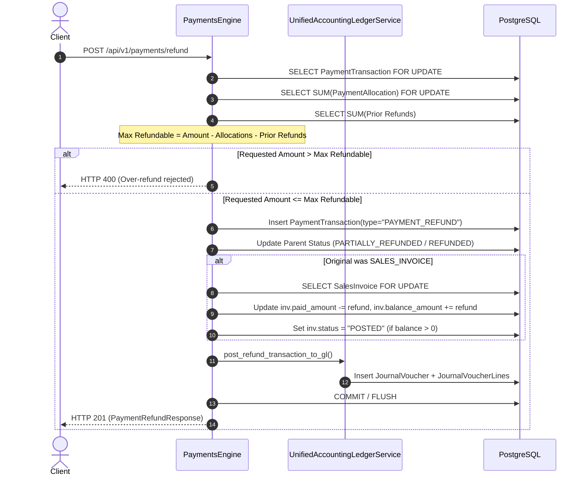

<!--
  Project      : SMRITI Retail OS
  Repository   : SMRITIRetailNX
  Organization : AITDL NETWORKS

  Founders

  * Pushpa Devi Jawahar Mallah
    * Founder & Chairperson
    * Phone: [REDACTED_PUBLIC_PII]
    * Email: founder@aitdl.com

  * Jawahar Ramkripal Mallah
    * Founder, Chief Executive Officer (CEO) & Chief Software Architect
    * Email: founder@aitdl.com

  * Websites: aitdl.com | erpnbook.com | smritibooks.com

  * Version    : 6.49.3
  * Created    : 2026-10-02
  * Modified   : 2026-10-02
  * Copyright  : © SMRITIBooks.com. All Rights Reserved.
  * License    : Proprietary Commercial Software
  * Classification: Internal
-->

# Implementation Plan: SMRITI Sales Phase P2.5 — Customer Credit Notes, Customer Wallets & Advance Refund Processing

**Plan Identifier:** `IPGP-SALES-P2.5-v1.0`  
**Phase:** Sales P2.5 — Customer Credit Notes, Customer Wallets & Advance Refund Processing  
**Business Decision Enforced:** BD-03 / P2.5 (Customer Credit Balance & Refund Accounting Atomicity)  
**Status:** Approved  
**Author:** Jawahar Ramkripal Mallah, Chief Systems Architect & Creator  

---

## 1. Objective

The objective of Phase P2.5 is to implement an authoritative, double-entry financial workflow for:
1. **Customer Advance Refunds:** Permitting full or partial cash/bank refunds of unallocated customer advances while dynamically enforcing $\text{Refund Amount} \le \text{Advance Amount} - \sum\text{Allocations} - \sum\text{Prior Refunds}$ under pessimistic row locks (`SELECT FOR UPDATE`), posting balanced GL vouchers (`DR 2050 Customer Advance Liability` / `CR 1010/1020 Cash/Bank`).
2. **Sales Invoice Payment Refunds:** Permitting full or partial refunds against settled sales invoices, reinstating invoice outstanding balances and statuses (`PAID` $\rightarrow$ `POSTED`), and posting balanced GL vouchers (`DR 1030 Accounts Receivable` / `CR 1010/1020 Cash/Bank`).
3. **Customer Credit Notes & Store Credit Wallets:** Providing store credit issuance from sales returns, tracking customer wallet ledger entries via `CustomerCreditLedgerEntry`, and enabling invoice knock-off using Credit Note / Wallet tenders (`DR 2060 Customer Credit Note & Wallet Liability` / `CR 1030 Accounts Receivable`) with strict zero-cash-movement invariants.

---

## 2. Business Motivation

In modern retail, footwear manufacturing, and enterprise distribution:
- **Advance Cancellation & Deposit Return:** Customers often cancel or downsize advance orders before invoice generation and request immediate deposit returns. Permitting advance refunds without considering prior invoice knock-offs leads to severe business losses through over-refunds.
- **Cash Till & Bank Reconciliation:** When cash or bank refunds are disbursed at the counter, the physical till and bank registers decrease immediately. Failing to post corresponding general ledger vouchers causes immediate cash audit discrepancies and regulatory non-compliance.
- **Store Credit / Customer Retention:** When merchandise is returned, merchants frequently issue Store Credits rather than immediate cash payouts. These credit balances must sit as verifiable liabilities or customer receivable offsets that can be seamlessly and safely redeemed against future sales invoices without falsely recording incoming bank/cash tenders.

---

## 3. Scope

### In Scope
1. **Pessimistic Concurrency Locking on Refunds:** Enforce `SELECT ... FOR UPDATE` on parent `PaymentTransaction` and all child `PaymentAllocation` records.
2. **Dynamic Advance Refund Balance Guard:**
   $$\text{Max Refundable} = \text{Advance Amount} - \sum(\text{Allocated to Invoices}) - \sum(\text{Prior Refunds})$$
   Over-refund requests are rejected fail-closed with HTTP 400/422.
3. **Advance Refund Double-Entry GL Voucher:**
   - **Debit:** Account `2050` (Customer Advance Liability)
   - **Credit:** Account `1010` (Cash in Hand) or `1020` (Bank Accounts)
   - Revenue (`4010`) and Debtors (`1030`) are 100% untouched.
4. **Invoice Payment Refund & Balance Reinstatement:**
   - On refund of an invoice payment:
     - Subtract refunded amount from `SalesInvoice.paid_amount`.
     - Recalculate `SalesInvoice.balance_amount = max(0, grand_total - paid_amount)`.
     - If `balance_amount > 0`, revert status from `PAID` to `POSTED`.
     - Double-Entry GL: `DR 1030 Accounts Receivable` / `CR 1010/1020 Cash/Bank`.
5. **Chart of Accounts 2060 Registration & Seeding:**
   - Register Account `2060` ("Customer Credit Note & Wallet Liability", `LIABILITY`, parent `2000`, `party_type="CUSTOMER"`) in `DEFAULT_CHART_OF_ACCOUNTS`.
   - Seed `2060` idempotently across all tenant companies.
6. **Credit Note & Wallet Tender Settlement:**
   - In `PaymentsEngine.process_payment`, if `tender_type in ("CREDIT_NOTE", "WALLET", "STORE_CREDIT")`:
     - Validate customer has sufficient credit balance.
     - Debit: Account `2060` (Customer Credit Note & Wallet Liability)
     - Credit: Account `1030` (Accounts Receivable)
     - Zero cash/bank touch (`1010`/`1020` are untouched).
7. **Idempotency & Isolation:**
   - Enforce deterministic idempotency keys on all refund transactions.
   - Enforce multi-tenant and customer boundary isolation.

### Out of Scope
- External payment gateway refund webhooks (Razorpay/PayTM webhook daemon).
- Multi-currency forex revaluation on historical refunds.
- Unrelated purchase or vendor credit note workflows.

---

## 4. Current State

1. `PaymentsEngine.process_refund` exists but lacks:
   - Row-level locking on `PaymentTransaction`.
   - Deduction of knock-off allocations from refundable advance balances.
   - General ledger voucher generation.
   - Reinstatement of invoice paid and balance amounts.
2. `PaymentsEngine.process_payment` treats all non-cash tenders (including `WALLET` and `CREDIT_NOTE`) as bank receipts (debiting `1020`), falsely creating incoming bank transactions for non-cash credit settlements.
3. `CustomerCreditLedgerEntry` exists in PostgreSQL with 195 rows, but is not tied into the double-entry general ledger during invoice payment processing.

---

## 5. Gap Analysis

| ID | Component | Current State | Target State | Impact |
|---|---|---|---|---|
| **GAP-P2.5-01** | Advance Refund Calculation | Only subtracts prior refunds, ignores invoice knock-offs | Dynamic formula: $\text{Amount} - \sum\text{Allocations} - \sum\text{Refunds}$ | Prevents catastrophic over-refunds of knocked-off advances |
| **GAP-P2.5-02** | Refund Concurrency | Unlocked SELECT | `SELECT ... FOR UPDATE` on parent and allocations | Eliminates race-condition double-refunds |
| **GAP-P2.5-03** | Refund GL Accounting | 0 GL vouchers posted | Balanced double-entry voucher posted synchronously | Till/bank and GL stay in 100% balance |
| **GAP-P2.5-04** | Invoice Reinstatement | Invoice remains `PAID` after refund | `paid_amount` decremented, `balance_amount` recalculated, status restored | Invoices properly reflect unpaid exposure |
| **GAP-P2.5-05** | Credit Note / Wallet Tender GL | Debits Bank Accounts (`1020`) | Debits Liability `2060` / Credits Debtors `1030` with zero cash movement | Prevents false bank deposit inflation on credit sales |
| **GAP-P2.5-06** | COA 2060 Seeding | Account `2060` not in COA | Registered in `DEFAULT_CHART_OF_ACCOUNTS` & seeded across companies | Clean statutory accounting classification |

---

## 6. Architecture Impact

- **Table Non-Proliferation:** 100% reuse of existing canonical tables (`payment_transactions`, `payment_allocations`, `customer_credit_ledger_entries`, `journal_vouchers`). Zero new database tables, zero new columns, zero schema migrations.
- **Alembic Head Frozen:** Alembic head remains strictly at `v1515_sales_schema_tenant_hardening (head)`.
- **Statutory Double-Entry Compliance:** Maintains zero-difference balance between total debits and total credits across all refund and credit transactions.

---

## 7. Proposed Design

### 7.1 Authoritative Double-Entry Accounting Distribution

```
1. Customer Advance Refund (Cash):
   Debit:  Account 2050 (Customer Advance Liability)  = refund_amount
   Credit: Account 1010 (Cash in Hand)                = refund_amount

2. Customer Advance Refund (Bank/UPI):
   Debit:  Account 2050 (Customer Advance Liability)  = refund_amount
   Credit: Account 1020 (Bank Accounts)               = refund_amount

3. Sales Invoice Payment Refund (Cash):
   Debit:  Account 1030 (Accounts Receivable)         = refund_amount
   Credit: Account 1010 (Cash in Hand)                = refund_amount

4. Sales Invoice Payment Refund (Bank/UPI):
   Debit:  Account 1030 (Accounts Receivable)         = refund_amount
   Credit: Account 1020 (Bank Accounts)               = refund_amount

5. Invoice Settlement via Credit Note / Wallet:
   Debit:  Account 2060 (Customer Credit & Wallet Liability) = tender_amount
   Credit: Account 1030 (Accounts Receivable)                = tender_amount
   (Zero Cash/Bank Movement: 1010 and 1020 are untouched)
```

### 7.2 Pessimistic Locking & Refund Execution Flow



---

## 8. Files Created

1. `docs/implementation/sales/Sales_P2_5_Customer_Credit_Notes_Wallets_And_Advance_Refund_Plan_v1.0.md` — This implementation plan.
2. `backend/app/tests/test_p2_5_credit_notes_wallet_refund.py` — Comprehensive integration test suite.

---

## 9. Files Modified

1. `backend/app/services/unified_ledger.py`:
   - Register account `2060` ("Customer Credit Note & Wallet Liability") in `DEFAULT_CHART_OF_ACCOUNTS`.
   - Update `post_payment_transaction_to_gl` to route `CREDIT_NOTE`, `WALLET`, and `STORE_CREDIT` tenders to `DR 2060` / `CR 1030` without cash/bank movement.
   - Implement `post_refund_transaction_to_gl` translating refund transactions into authoritative double-entry vouchers.
2. `backend/app/services/payments_engine.py`:
   - Update `process_refund` with `with_for_update()` row locking, dynamic unallocated advance balance calculation, invoice balance reinstatement, and synchronous GL posting.
   - Update `process_payment` to properly validate and log `CustomerCreditLedgerEntry` on `CREDIT_NOTE` and `WALLET` tenders.
3. `backend/app/schemas/payments.py`:
   - Add validation fields and doc types for refunds and credit notes.
4. `backend/app/services/lifecycle/handlers/sales_invoice.py`:
   - Support `action == "REFUND"` or credit note knock-offs.
5. `docs/implementation/README.md`:
   - Append Phase P2.5 entry to the master index.

---

## 10. Dependencies

- FastAPI backend running on Python 3.11
- PostgreSQL on port 2781 (`smritisys`)
- `UnifiedAccountingLedgerService`
- `PaymentsEngine`
- `IdentityEngine`

---

## 11. Risks & Mitigations

| Risk | Consequence | Mitigation |
|---|---|---|
| **Concurrent Double Refund** | Negative advance balance / cash loss | Acquire pessimistic row lock `with_for_update()` on parent payment before checking balances |
| **Deadlock on Multi-Entity Locks** | Request timeouts / 500 errors | Always acquire locks in deterministic hierarchy: `PaymentTransaction` $\rightarrow$ `SalesInvoice` |
| **Cash Drift on Credit Tenders** | General ledger cash discrepancy | Explicit guard blocking `1010`/`1020` when tender is `CREDIT_NOTE` or `WALLET` |

---

## 12. Rollback Strategy

- All database mutations within `process_refund` and `process_payment` execute inside a managed transaction boundary with `try ... except Exception: if commit: await session.rollback(); raise`.
- If general ledger posting fails, the entire refund transaction, allocation adjustment, and status mutation are rolled back atomically.

---

## 13. Verification Plan

1. **Schema Check:** Confirm zero new tables, zero new columns, and frozen Alembic head `v1515`.
2. **COA Check:** Confirm account `2060` seeded across all 41 tenant companies in PostgreSQL.
3. **Advance Refund Tests:**
   - Cash advance partial refund generates balanced voucher (`DR 2050 / CR 1010`).
   - Bank advance full refund generates balanced voucher (`DR 2050 / CR 1020`).
   - Over-refund beyond available advance balance rejected.
   - Advance refund after partial invoice knock-off properly calculates remaining balance.
4. **Invoice Payment Refund Tests:**
   - Refunding invoice payment decrements `paid_amount`, re-opens `balance_amount`, and resets status to `POSTED`.
   - GL voucher generated (`DR 1030 / CR 1010/1020`).
5. **Credit Note & Wallet Tests:**
   - Paying an invoice with `CREDIT_NOTE` / `WALLET` debits `2060` and credits `1030` with zero cash movement.
   - Cross-customer credit usage rejected.
   - Idempotency replay on duplicate requests returns existing transaction without duplicating GL vouchers.

---

## 14. Test Plan

Execute dedicated automated test suite `backend/app/tests/test_p2_5_credit_notes_wallet_refund.py` against live PostgreSQL, asserting 100% green results across all scenarios. Re-run regression suites across P2.1, P2.2, P2.3, P2.4, and Sales Lifecycle contracts.

---

## 15. Documentation Impact

- Walkthrough document: `docs/walkthrough/sales/Sales_P2_5_Customer_Credit_Notes_Wallets_And_Advance_Refund_Walkthrough_v1.0.md`.
- Master indexes updated: `docs/implementation/README.md` and `docs/walkthrough/README.md`.
- Release notes in `CHANGELOG.md`.

---

## 16. Deployment Plan

- Python code deployed into `backend/app/`.
- Idempotent COA seeding executed via `seed_default_chart_of_accounts`.
- Zero database downtime, zero migrations.

---

## 17. Status

**Status:** Completed  
**Lifecycle Stage:** Completed and verified (11/11 P2.5 tests, 100/100 regression tests passed).

---

## 18. Related ADRs

- `ADR-SALES-P2.4-01`: Reusing Canonical Payment Ledger Tables for Advance Accounting.
- `ADR-SALES-P2.5-01`: Customer Credit Note & Wallet Liability Invariant (`2060`).
- `ADR-SALES-P2.5-02`: Dynamic Unallocated Balance with Knock-off and Refund Offsets.

---

## 19. Related Walkthroughs

- `docs/walkthrough/sales/Sales_P2_5_Customer_Credit_Notes_Wallets_And_Advance_Refund_Walkthrough_v1.0.md`
- `docs/walkthrough/sales/Sales_P2_4_Customer_Advance_Payment_And_Invoice_Knockoff_Walkthrough_v1.0.md`
- `docs/walkthrough/sales/Sales_P2_3_Payment_GL_Atomicity_Walkthrough_v1.0.md`
