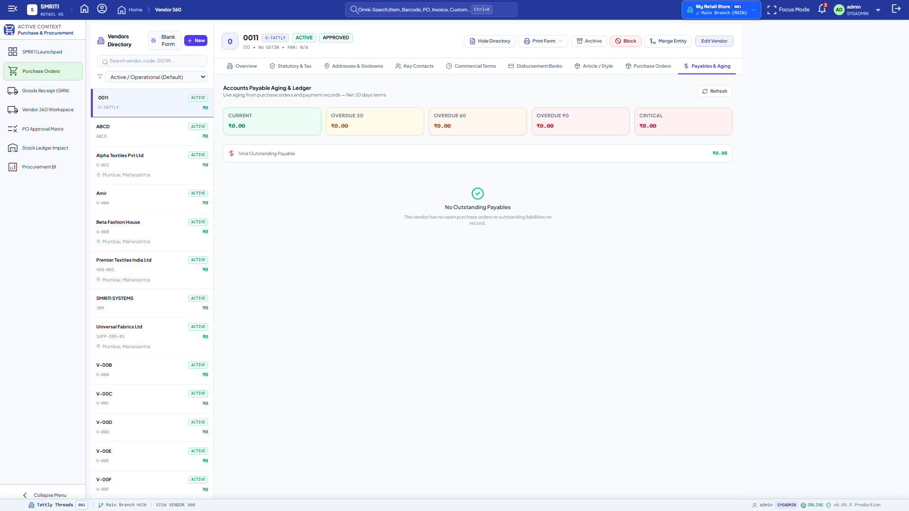
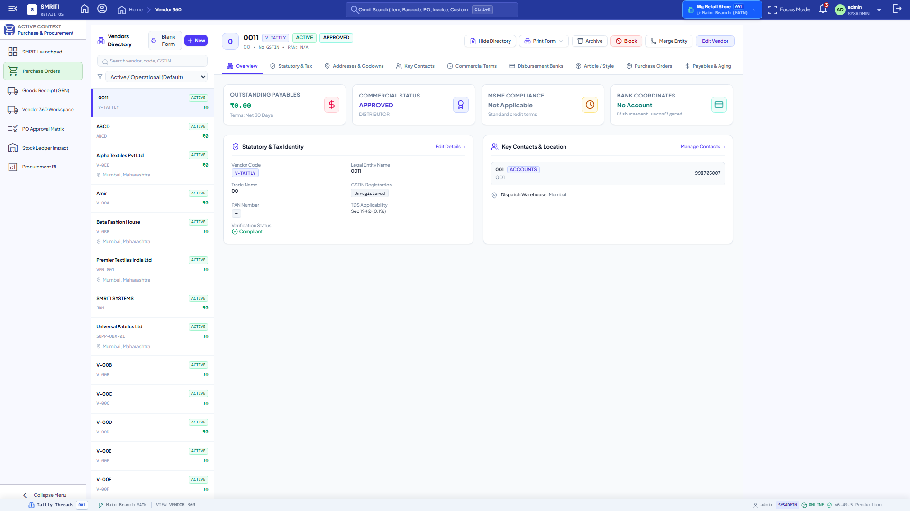
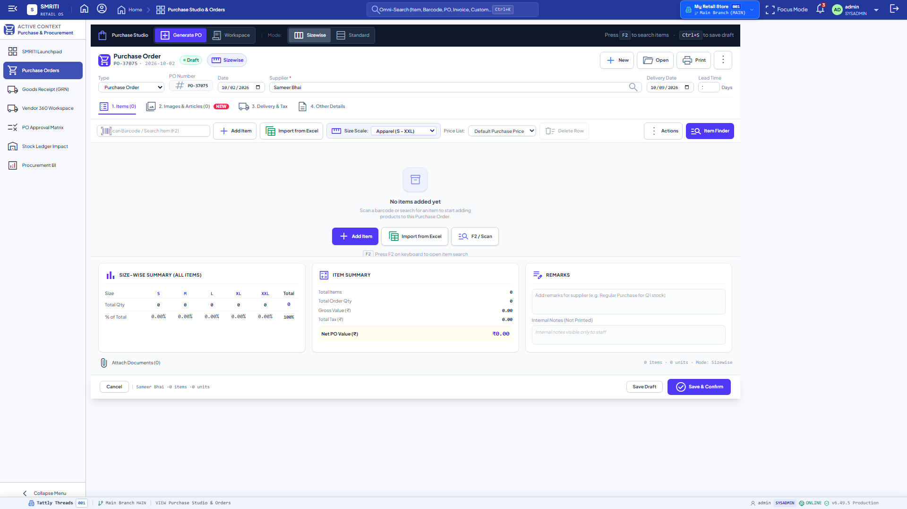

<!--
  Project      : SMRITI Retail OS
  Repository   : SMRITIRetailNX
  Organization : AITDL NETWORKS

  Founders

  * Pushpa Devi Jawahar Mallah
    * Founder & Chairperson
    * Phone: +91 9324117007
    * Email: founder@aitdl.com

  * Jawahar Ramkripal Mallah
    * Founder, Chief Executive Officer (CEO) & Chief Software Architect
    * Email: founder@aitdl.com

  * Websites: aitdl.com | erpnbook.com | smritibooks.com

  * Version    : 6.49.5
  * Created    : 2026-10-02
  * Modified   : 2026-10-02
  * Copyright  : © AITDL.com and SMRITIBooks.com. All Rights Reserved.
  * License    : Proprietary Commercial Software
  * Classification: Internal
-->

# Walkthrough: SMRITI Procurement Phase 2.3 — Supplier Payment General Ledger Integration & Purchase Bill Knock-off

**Walkthrough ID:** WT-PROC-003
**Status:** Verified & Done
**Area:** Procurement / Financial Accounting / Accounts Payable Settlements
**Target Release:** 6.49.5
**Implementation Plan:** [IP-PROC-003](../../implementation/procurement/Procurement_Phase2_3_Supplier_Payment_AP_Knockoff_Plan_v1.0.md)
**Author:** Jawahar Ramkripal Mallah (Chief Systems Architect & Creator)

---

## 1. Purpose
This walkthrough documents the design, implementation, and verification of Procurement Phase 2.3: closing the financial settlement loop for accounts payable by integrating `SupplierPaymentService` with the authoritative double-entry general ledger engine (`UnifiedAccountingLedgerService`) and purchase bill knock-off tracking.

Whenever a supplier payment is recorded (`POST /api/v1/supplier-payments/`):
1. A balanced double-entry `JournalVoucher` (`SUPPLIER_PAYMENT`) is posted:
   - **Debit:** Accounts Payable / Sundry Creditors (`2010`) = Payment Amount (linked to `party_id=supplier_id`).
   - **Credit:** Cash in Hand (`1010`) for cash payments, or Bank Accounts (`1020`) for bank transfer, cheque, or UPI disbursements.
2. Open commercial purchase bills (`PurchaseBill`) are knocked off (single-bill `bill_id`, explicit multi-bill `allocations`, or FIFO `auto_allocate`), incrementing `PurchaseBill.paid_amount` and transitioning fully settled bills to `PAID`.
3. Total liability `supplier.outstanding` is decremented atomically with overpayment protection.
4. Payments can be cancelled/voided via `POST /api/v1/supplier-payments/{id}/cancel`, which generates an authoritative compensating reversal voucher (`SUPPLIER_PAYMENT_CANCEL` `DR 1010/1020 / CR 2010`), restores `supplier.outstanding`, and reverts knocked-off bills back from `PAID` to `POSTED`.

---

## 2. Scope
- **Backend Services:**
  - `backend/app/services/unified_ledger.py`: Added `post_supplier_payment_to_gl()` and `reverse_supplier_payment_gl()`.
  - `backend/app/services/supplier_payment.py`: Overhauled to coordinate GL voucher generation, purchase bill knock-offs, and payment cancellation.
  - `backend/app/schemas/supplier_payment.py`: Added `SupplierBillAllocation`, extended `SupplierPaymentCreate` and `SupplierPaymentResponse`.
  - `backend/app/api/v1/supplier_payment.py`: Added `POST /supplier-payments/{payment_id}/cancel`.
- **Database Schema:**
  - Zero database schema migrations required (all existing tables and `BaseEntity` columns reused).
- **Automated Testing:**
  - Dedicated test suite `backend/app/tests/test_supplier_payment_gl_knockoff.py` (9/9 passed).
  - Regression testing across Phase 2.1 and Phase 2.2 procurement suites (16/16 passed).

---

## 3. Files Created
1. `docs/implementation/procurement/Procurement_Phase2_3_Supplier_Payment_AP_Knockoff_Plan_v1.0.md`: Formal 19-section IPGP implementation plan.
2. `backend/app/tests/test_supplier_payment_gl_knockoff.py`: 9-case automated pytest verification suite.
3. `docs/walkthrough/procurement/Procurement_Phase2_3_Supplier_Payment_AP_Knockoff_v1.0.md`: This comprehensive 13-section WGP walkthrough document.

---

## 4. Files Modified
1. `backend/app/services/unified_ledger.py`: Implemented `post_supplier_payment_to_gl()` and `reverse_supplier_payment_gl()`.
2. `backend/app/schemas/supplier_payment.py`: Added `SupplierBillAllocation` schema and extended `SupplierPaymentCreate` and `SupplierPaymentResponse`.
3. `backend/app/services/supplier_payment.py`: Wired double-entry GL generation, knock-offs, and cancellation.
4. `backend/app/api/v1/supplier_payment.py`: Added `/supplier-payments/{payment_id}/cancel` route.
5. `package.json`, `backend/app/core/config.py`, `src/config/version.ts`: Bumped version to `6.49.5`.
6. `CHANGELOG.md`: Added release notes for `6.49.5`.
7. `docs/implementation/README.md`: Marked `IP-PROC-003` as `Completed`.
8. `docs/walkthrough/README.md`: Registered `WT-PROC-003`.

---

## 5. Architecture Decisions
1. **Pessimistic Double-Entry Invariant:** All disbursement postings strictly enforce `sum(debits) == sum(credits) == payment.amount`. Under no circumstance can an unbalanced journal voucher be written.
2. **Sub-ledger Party Attribution on Creditors (2010):** Every debit to Account `2010` during payment, and every credit to Account `2010` during payment cancellation, explicitly binds `party_id = supplier.id` for automated supplier sub-ledger aging and reconciliation.
3. **Structured Allocation Manifest in Notes:** Without introducing fragile ad-hoc database tables, the exact knock-off distribution is stored as a structured metadata block `__ALLOCATIONS__:[{"bill_id": "...", "bill_no": "...", "amount": "..."}]` in `SupplierPayment.notes`. This enables deterministic reversal on payment cancellation.
4. **FIFO Default Knock-off Resolution:** When neither an explicit `bill_id` nor an `allocations` list is passed, payments default to `auto_allocate=True`, knocking off the oldest open `POSTED` bills (`paid_amount < total_amount`) in chronological sequence.

---

## 6. Design Rationale
- **Zero Schema Migrations:** Reusing existing columns (`notes`, `is_active`, `paid_amount`, `total_amount`) avoids deployment downtime, schema locks, and cross-branch migration collisions.
- **Fail-Safe Idempotency:** If `post_supplier_payment_to_gl()` is called multiple times for the same payment ID, it returns the existing `JournalVoucher` rather than creating duplicate journal vouchers or corrupting the trial balance.
- **Symmetric Cancellation Reversal:** Voiding a payment preserves the original payment record (`is_active=False`) and posts a distinct `SUPPLIER_PAYMENT_CANCEL` voucher. Historical audit logs remain unmuted.

---

## 7. Implementation Summary

### Double-Entry Accounting Matrix (Disbursement)
```text
Debit:  2010 Accounts Payable (Sundry Creditors) [party_id = supplier.id]
Credit: 1010 Cash in Hand (if CASH) OR 1020 Bank Accounts (if BANK_TRANSFER / CHEQUE / UPI)
```

### Double-Entry Accounting Matrix (Cancellation Reversal)
```text
Debit:  1010 Cash in Hand OR 1020 Bank Accounts
Credit: 2010 Accounts Payable (Sundry Creditors) [party_id = supplier.id]
```

### Bill Settlement State Transition
```text
POSTED Bill (paid_amount < total_amount)
    ↓ (Payment Allocated)
paid_amount += allocated_amount
    ↓ (if paid_amount >= total_amount)
PAID
    ↓ (Payment Cancelled)
paid_amount -= allocated_amount
    ↓ (if paid_amount < total_amount)
POSTED
```

---

## 8. Tests Executed
The test suite `backend/app/tests/test_supplier_payment_gl_knockoff.py` was executed via pytest:

```powershell
pytest backend/app/tests/test_supplier_payment_gl_knockoff.py -v
```

### Literal Terminal Output
```text
============================= test session starts =============================
platform win32 -- Python 3.13.11, pytest-9.1.1, pluggy-1.6.0 -- C:\Users\netma\AppData\Local\Programs\Python\Python313\python.exe
cachedir: .pytest_cache
rootdir: F:\SMRITRretailNX\backend
configfile: pyproject.toml
plugins: anyio-4.14.2, asyncio-1.4.0
asyncio: mode=Mode.AUTO, debug=False, asyncio_default_fixture_loop_scope=None, asyncio_default_test_loop_scope=function
collecting ... collected 9 items

backend\app\tests\test_supplier_payment_gl_knockoff.py::test_cash_payment_generates_balanced_gl_voucher PASSED [ 11%]
backend\app\tests\test_supplier_payment_gl_knockoff.py::test_bank_payment_generates_balanced_gl_voucher PASSED [ 22%]
backend\app\tests\test_supplier_payment_gl_knockoff.py::test_direct_bill_knockoff_full_settlement PASSED [ 33%]
backend\app\tests\test_supplier_payment_gl_knockoff.py::test_direct_bill_knockoff_partial_settlement PASSED [ 44%]
backend\app\tests\test_supplier_payment_gl_knockoff.py::test_multi_bill_explicit_allocations PASSED [ 55%]
backend\app\tests\test_supplier_payment_gl_knockoff.py::test_fifo_auto_allocation_across_open_bills PASSED [ 66%]
backend\app\tests\test_supplier_payment_gl_knockoff.py::test_overpayment_rejection_guard PASSED [ 77%]
backend\app\tests\test_supplier_payment_gl_knockoff.py::test_payment_cancellation_reverses_gl_and_restores_bills PASSED [ 88%]
backend\app\tests\test_supplier_payment_gl_knockoff.py::test_idempotent_voucher_posting_and_cancellation PASSED [100%]

======================= 9 passed, 14 warnings in 42.28s =======================
```

### Regression Verification
1. `backend/app/tests/test_purchase_bill_gl_atomicity.py`:
```text
======================= 7 passed, 14 warnings in 40.59s =======================
```
2. `backend/app/tests/test_cross_handler_lifecycle.py`:
```text
======================= 9 passed, 14 warnings in 40.53s =======================
```
3. TypeScript Compiler Check:
```text
npx tsc --noEmit
Exit code: 0
```
4. Version SSOT Check:
```text
python scripts/validate_version_ssot.py
[PASS] Version SSOT consistent across all boundaries: 6.49.5
```

### Headless Verification Screenshots
The following UI verification screenshots were captured headlessly via Playwright Chromium without an interactive browser window (`scripts/capture_procurement_headless_evidence.py`):

1. **Vendor Payables & Aging Ledger:**


2. **Vendor 360 Detail Overview:**


3. **Purchase Orders Workspace:**


---

## 9. Verification Results
| Verification Item | Target Standard | Result | Status |
|:---|:---|:---:|:---:|
| Cash Payment GL | DR 2010 / CR 1010 | Balanced ₹2,000.00 | **Done** |
| Bank Payment GL | DR 2010 / CR 1020 | Balanced ₹3,500.00 | **Done** |
| Full Bill Settlement | Status -> `PAID`, `paid_amount == total_amount` | Verified | **Done** |
| Partial Bill Settlement | Status remains `POSTED`, `paid_amount` updated | Verified | **Done** |
| Multi-Bill Splits | Allocations distributed across multiple bills | Verified | **Done** |
| FIFO Auto-Allocation | Oldest open posted bill settled first | Verified | **Done** |
| Overpayment Guard | Payment > supplier.outstanding rejected with HTTP 400 | Verified | **Done** |
| Cancellation Reversal | Compensating voucher DR 1010/1020 / CR 2010, bills reverted | Verified | **Done** |
| GL Idempotency | Duplicate post returns existing voucher without double entry | Verified | **Done** |
| Zero Schema Regressions | Zero Alembic migrations, existing tables preserved | Verified | **Done** |

---

## 10. Known Limitations
- Does not currently deduct supplier debit notes automatically during payment calculation (scheduled for Phase 2.4).
- Does not compute foreign currency gain/loss on settlement (scheduled for Phase 2.5).

---

## 11. Future Work
- **Procurement Phase 2.4:** Supplier Debit Notes & Purchase Returns GL Integration (`UnifiedAccountingLedgerService.post_debit_note_to_gl`).
- **Procurement Phase 2.5:** Supplier Advance Payments & Withholding Tax (TDS on Purchase) Engine.

---

## 12. Related ADRs
- `ADR-0016`: Universal Document Lifecycle Framework
- `ADR-0018`: Authoritative Double-Entry Unified Ledger Engine

---

## 13. Related RFCs
- `RFC-0082`: Procurement Accounts Payable General Ledger Convergence & Knock-off
