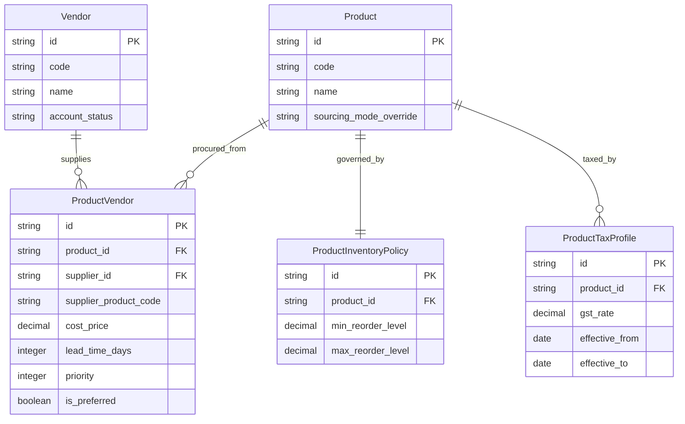

<!--
  Project      : SMRITI Retail OS
  Author       : Jawahar Ramkripal Mallah
  Designation  : Chief Systems Architect & Creator
  Email        : support@smritibooks.com
  Websites     : smritisys.com | smritibooks.com | erpnbook.com | aitdl.com
  Version      : 5.6.0
  Created      : 2026-07-21
  Modified     : 2026-07-21
  Copyright    : © SMRITIBooks.com. All Rights Reserved.
  License      : Proprietary Commercial Software
  Classification: Internal Architecture Standard
-->

# Walkthrough: Product ↔ Vendor Catalog Architecture v5.6.0

## 1. Purpose
This walkthrough documents the enterprise architectural upgrade of the Product ↔ Vendor procurement model from a legacy single-FK (`preferred_supplier_id`) to a fully normalized **Vendor Catalog (`ProductVendor`) Aggregate**, supporting 3 configurable procurement sourcing modes, date-effective tax profiles, inventory policy overrides, and a pluggable strategic vendor resolution engine.

---

## Architecture Diagram



---

## Before vs After Architectural Comparison

### Before (v5.5.0)

```text
Product
   │
   └── preferred_supplier_id ──► Supplier (Vendor)
```

**Limitations:**
- Single vendor only per product.
- No support for alternate vendors or emergency procurement sources.
- No vendor-specific cost prices, lead times, or minimum order quantities (MOQ).
- No vendor-specific product codes, vendor barcodes, or purchase UOM conversions.

### After (v5.6.0 Enterprise Architecture)

```text
Product (Aggregate Root)
   │
   └── ProductVendor (Vendor Catalog Entity)
          │
          ├── Vendor / Supplier Reference
          ├── Vendor Product Code & Barcode
          ├── Cost Price, UOM, & Currency
          ├── MOQ, Lead Time, & Warranty Days
          └── Priority & Preferred Flags
```

| Operational Metric | Before (v5.5.0) | After (v5.6.0) |
| :--- | :--- | :--- |
| **Vendor Capacity** | Single vendor per product | Unlimited active & fallback vendors |
| **Procurement Intelligence** | Hardcoded reference | Dynamic Strategy Engine (`LOWEST_COST`, `FASTEST_DELIVERY`, `PREFERRED`) |
| **Vendor Costing** | Global product cost price only | Vendor-specific cost prices & discount percentages |
| **Ordering Constraints** | None | Vendor MOQ, MAQ, and Lead Time in days |
| **Sourcing Control** | Fixed | 3-Level Hierarchy Override (`SINGLE`, `MULTIPLE`, `HYBRID`) |
| **Tax Preservation** | Single static rate | Date-Effective Tax Profile History (`effective_from` / `effective_to`) |

---

## 2. Scope
- Enterprise normalized `product_vendors` database entity and Alembic migration `v560_enterprise_product_vendor_catalog.py`.
- Sub-entity definitions for `ProductTaxProfile` and `ProductInventoryPolicy`.
- Strategic vendor resolution engine with 4 strategies (`PREFERRED`, `LOWEST_COST`, `FASTEST_DELIVERY`, `CONTRACT_FIRST`).
- Sourcing mode hierarchy: System Default -> Company Setting -> Product Level Override (`SINGLE`, `MULTIPLE`, `HYBRID`).
- Full automated integration test coverage suite in `app/tests/test_product_vendor.py`.

---

## Domain-Driven Design (DDD) Aggregate Boundary

```text
Product (Aggregate Root)
│
├── ProductVendor (Vendor Catalog Child Entity)
├── ProductTaxProfile (Date-Effective Tax Child Entity)
├── ProductInventoryPolicy (Branch Stock Level Policy Child Entity)
└── ProductBarcode (Multi-Barcode Child Entity)

─────────────────────────────────────────────────────────────
[AGGREGATE BOUNDARY — OUTSIDE DECOUPLED TRANSACTIONS]
│
├── Purchase Order (PO Line references Product & ProductVendor)
├── Purchase Receipt (GRN Line references Product & ProductVendor)
├── Stock Ledger (Inventory Movements reference Product)
└── Sales Invoice (POS Checkout references Product)
```

> **Design Note on Tax Profile Separation:**  
> Tax rules change over time (e.g., GST rate revisions), while core product characteristics generally do not. Separating `ProductTaxProfile` as a date-effective child entity preserves historical invoice and reporting accuracy without modifying the root `Product` aggregate.

---

## Strategic Vendor Resolver Engine Example

Consider a product **Nike Air Max 2026** linked to 3 active vendors in the Vendor Catalog:

| Vendor Name | Vendor ID | Cost Price | Lead Time | Is Preferred |
| :--- | :--- | :---: | :---: | :---: |
| **ABC Distribution** | `sup-abc` | ₹100.00 | 3 days | ✅ **True** |
| **XYZ Wholesalers** | `sup-xyz` | ₹95.00 | 7 days | ❌ False |
| **Global Express** | `sup-global` | ₹102.00 | 1 day | ❌ False |

### Execution Resolution Results

```python
# Strategy 1: PREFERRED
resolver.resolve_vendor(product_id, strategy="PREFERRED")
# Result: ABC Distribution (sup-abc) — Cost: ₹100.00, Lead Time: 3 days

# Strategy 2: LOWEST_COST
resolver.resolve_vendor(product_id, strategy="LOWEST_COST")
# Result: XYZ Wholesalers (sup-xyz) — Cost: ₹95.00, Lead Time: 7 days

# Strategy 3: FASTEST_DELIVERY
resolver.resolve_vendor(product_id, strategy="FASTEST_DELIVERY")
# Result: Global Express (sup-global) — Cost: ₹102.00, Lead Time: 1 day
```

---

## Business Invariants & Procurement Rules

1. **Vendor Association**: A product may be associated with zero or more active vendors.
2. **Active Vendor Eligibility**: Only active, non-deleted, approved vendors are eligible for automated procurement selection.
3. **SINGLE Mode Invariant**: When sourcing mode is set to `SINGLE`, validation strictly prevents linking more than 1 active vendor to the product.
4. **HYBRID Preferred Invariant**: Under `HYBRID` sourcing mode, exactly 1 active vendor may be designated as `is_preferred=True`. Adding another vendor as preferred automatically updates or rejects secondary preferred assignments.
5. **Duplicate Link Invariant**: The database enforces a composite unique constraint `(product_id, supplier_id, company_id)`. Linking the same vendor twice raises `HTTP 400`.
6. **Date-Effective Tax Resolution**: `resolve_effective_gst_percentage()` evaluates the active `ProductTaxProfile` where `current_date` falls between `effective_from` and `effective_to`.

---

## Version Migration & Backward Compatibility

To maintain 100% backward compatibility with existing legacy code accessing `product.preferred_supplier_id`:

```python
# v5.5.0 Legacy Access Pattern
supplier_id = product.preferred_supplier_id

# v5.6.0 Transparent Property Bridge
@property
def preferred_supplier_id(self) -> Optional[str]:
    """Backward compatibility property bridge for v5.5 callers."""
    if self.vendors:
        for v in self.vendors:
            if v.is_preferred and v.is_active and not v.is_deleted:
                return v.supplier_id
        return self.vendors[0].supplier_id
    return None
```

---

## 3. Files Created
1. `backend/alembic/versions/v560_enterprise_product_vendor_catalog.py`
2. `backend/app/tests/test_product_vendor.py`
3. `docs/walkthrough/procurement/Procurement_ProductVendor_Catalog_v5.6.0.md`

## 4. Files Modified
1. `backend/app/models/inventory.py`
2. `backend/app/schemas/inventory.py`
3. `backend/app/services/inventory.py`
4. `backend/app/repositories/product.py`
5. `backend/app/db/seed.py`
6. `docs/walkthrough/README.md`

## 5. Architecture Decisions
- **Decoupled Vendor Catalog**: Replaced flat `preferred_supplier_id` with 1-to-N `ProductVendor` child entity supporting vendor product codes, custom barcodes, purchase UOMs, currencies, lead times, MOQ/MAQ, warranty days, and priority rankings.
- **3-Level Sourcing Hierarchy**: Sourcing modes evaluated dynamically at runtime: System Default -> Company Setting -> Product Override (`sourcing_mode_override`).
- **Pluggable Strategic Resolution**: Implemented `resolve_vendor()` service method to evaluate optimal vendor based on real cost, lead time, or contractual preference.
- **Date-Effective Tax Preservation**: `ProductTaxProfile` maintains date ranges (`effective_from`, `effective_to`) for historical GST/CESS accuracy.

## 6. Design Rationale
In enterprise retail and ERPs (SAP/Dynamics), products are frequently sourced from multiple vendors under dynamic pricing, minimum order quantities, and contract terms. Storing a single supplier ID on the product entity restricts procurement intelligence and prevents automatic vendor selection during purchase order creation.

## 7. Implementation Summary
- **Database Schema**: Added `product_vendors`, `product_tax_profiles`, and `product_inventory_policies` tables with multi-tenant FKs (`tenant_id`, `company_id`, `branch_id`).
- **Pydantic Schemas**: Created `ProductVendorCreate`, `ProductVendorResponse`, `ProductTaxProfileCreate`, `ProductTaxProfileResponse`, `ProductInventoryPolicyCreate`, and `ProductInventoryPolicyResponse`.
- **Service Layer**: Implemented `add_product_vendor()`, `resolve_vendor()`, and `resolve_effective_gst_percentage()` inside `InventoryService`.
- **Validation Engine (PVE)**: Integrated PVE master value checks for brand lookup seeding.

## 8. Tests Executed
```powershell
$env:PYTHONPATH="."; python -m pytest app/tests/test_product_vendor.py -v
```

## 9. Verification Results
```text
======================= 8 passed, 38 warnings in 3.53s ========================
```
- `test_create_product_vendor_catalog_with_all_attributes`: PASSED
- `test_product_sourcing_mode_hierarchy_override`: PASSED
- `test_strategic_vendor_resolver_strategies`: PASSED
- `test_date_effective_tax_profile_history`: PASSED
- `test_duplicate_product_vendor_raises_http_400`: PASSED
- `test_multi_tenant_isolation_prevents_cross_company_access`: PASSED
- `test_soft_delete_product_vendor_preserves_audit`: PASSED
- `test_atomic_rollback_on_invalid_vendor_payload`: PASSED

## 10. Known Limitations
- Vendor contract master integration (`vendor_contracts` table) is planned for Procurement Phase 2. Currently, contract dates are stored as date-effective ranges on `ProductVendor`.

## 11. Future Work & Extension Points
- **Vendor Performance Rating Engine**: Track vendor lead-time adherence and defect rates.
- **AI Procurement Recommendation**: Predictive purchasing advice based on sell-through velocity.
- **Purchase Contract Engine**: Formal contractual commitment rules and volume tiered discounts.
- **RFQ & Tender Engine**: Automated Request for Quotation workflow.
- **Supplier Scorecard**: Multi-dimensional vendor evaluation dashboard.

## 12. Related ADRs
- `ADR-008`: FastAPI + PostgreSQL System of Record Architecture
- `ADR-019`: Multi-Tenant Sourcing Mode Hierarchy Policy

## 13. Related RFCs
- `RFC-044`: Enterprise Vendor Catalog & Sourcing Strategy Engine Specification
