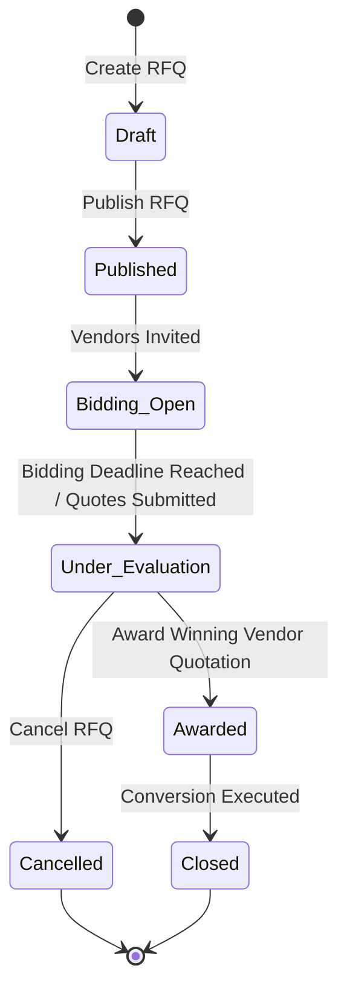
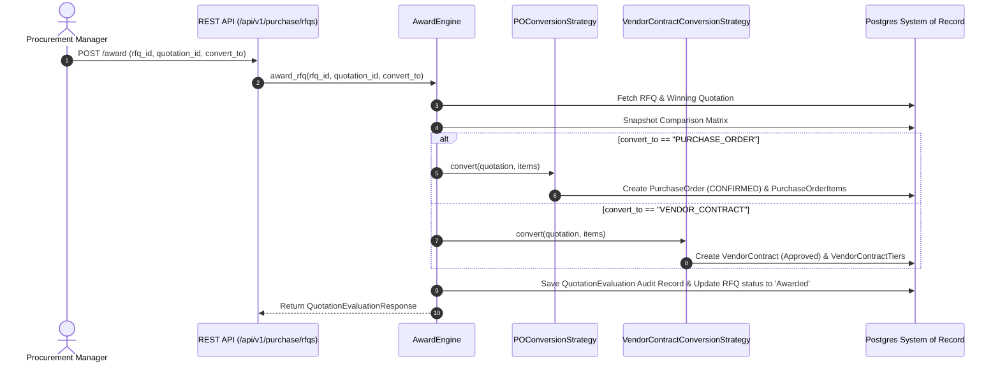

<!--
  Project      : SMRITI Retail OS
  Author       : Jawahar Ramkripal Mallah
  Designation  : Chief Systems Architect & Creator
  Email        : support@smritibooks.com
  Websites     : smritisys.com | smritibooks.com | erpnbook.com | aitdl.com
  Version      : 5.9.0
  Created      : 2026-07-21
  Modified     : 2026-07-21
  Copyright    : © SMRITIBooks.com. All Rights Reserved.
  License      : Proprietary Commercial Software
  Classification: Internal Architecture Standard
-->

# Walkthrough: Request for Quotation (RFQ), Multi-Vendor Bidding & Quotation Comparison Engine (v5.9.0)

## 1. Purpose
This document provides the canonical technical and architectural walkthrough for **Phase 4 Enterprise Procurement Architecture: Request for Quotation (RFQ) Bidding Aggregate, Multi-Vendor Side-by-Side Comparison Matrix, Data-Driven Evaluation Engine, and Auto-Conversion to Purchase Order / Vendor Contract** in SMRITI Retail OS.

---

## 2. Scope
- RFQ Aggregate Root (`ProcurementRFQ`) and child entities (`ProcurementRFQItem`, `ProcurementRFQVendor`).
- Vendor Quotation Aggregate Root (`VendorQuotation`) and child items (`VendorQuotationItem`) supporting revision history (`v1` $\rightarrow$ `v2`).
- Modularized Procurement Engine (`app/procurement/engine/`):
  - `MatrixBuilder`: Constructs structured side-by-side JSON comparison grid.
  - `EvaluationEngine`: Computes data-driven multi-factor scores using configurable `RFQEvaluationProfile` weights.
  - `RankingEngine`: Ranks vendor quotes dynamically by total score.
  - `AwardEngine`: Executes conversion strategies (`POConversionStrategy` or `VendorContractConversionStrategy`) and snapshots comparison matrix evidence into `QuotationEvaluation`.
- REST API layer (`app/api/v1/procurement_rfq.py`).
- Automated integration test suite (`app/tests/test_rfq_quotation.py`).

---

## 3. Files Created
- [v590_rfq_and_quotation_comparison.py](file:///f:/SMRITRretailNXmgrt/backend/alembic/versions/v590_rfq_and_quotation_comparison.py)
- [matrix_builder.py](file:///f:/SMRITRretailNXmgrt/backend/app/procurement/engine/matrix_builder.py)
- [evaluation_engine.py](file:///f:/SMRITRretailNXmgrt/backend/app/procurement/engine/evaluation_engine.py)
- [ranking_engine.py](file:///f:/SMRITRretailNXmgrt/backend/app/procurement/engine/ranking_engine.py)
- [award_engine.py](file:///f:/SMRITRretailNXmgrt/backend/app/procurement/engine/award_engine.py)
- [procurement_rfq.py](file:///f:/SMRITRretailNXmgrt/backend/app/api/v1/procurement_rfq.py)
- [test_rfq_quotation.py](file:///f:/SMRITRretailNXmgrt/backend/app/tests/test_rfq_quotation.py)
- [Procurement_RFQ_Quotation_Comparison_v5.9.0.md](file:///f:/SMRITRretailNXmgrt/docs/walkthrough/procurement/Procurement_RFQ_Quotation_Comparison_v5.9.0.md)

---

## 4. Files Modified
- [purchase.py (Models)](file:///f:/SMRITRretailNXmgrt/backend/app/models/purchase.py)
- [purchase.py (Schemas)](file:///f:/SMRITRretailNXmgrt/backend/app/schemas/purchase.py)
- [main.py](file:///f:/SMRITRretailNXmgrt/backend/app/main.py)
- [README.md](file:///f:/SMRITRretailNXmgrt/docs/walkthrough/README.md)
- [README.md](file:///f:/SMRITRretailNXmgrt/docs/implementation/README.md)

---

## 5. Architecture Decisions

### RFQ State Machine (FSM)


### Strategic Award & Auto-Conversion Flow


---

## 6. Design Rationale & Mathematical Formulas

### Multi-Factor Scoring Formula
$$\text{Total Score} = (w_p \times \text{Price Score}) + (w_l \times \text{Lead Time Score}) + (w_r \times \text{Vendor Rating Score})$$

Where:
- $\text{Price Score} = \left(\frac{\text{Min Billed Price}}{\text{Quote Total Value}}\right) \times 100$
- $\text{Lead Time Score} = \left(\frac{\text{Min Offered Lead Time}}{\text{Quote Offered Lead Time}}\right) \times 100$
- $\text{Vendor Rating Score} = \text{Vendor Rating Out of 100}$ (Default 80)

---

## 7. Implementation Summary
- Database tables `procurement_rfqs`, `procurement_rfq_items`, `procurement_rfq_vendors`, `vendor_quotations`, `vendor_quotation_items`, and `quotation_evaluations` migrated via Alembic revision `v590_rfq_and_quotation`.
- Decoupled `app/procurement/engine/` package housing `MatrixBuilder`, `EvaluationEngine`, `RankingEngine`, and `AwardEngine`.
- REST API router `/api/v1/purchase/rfqs` mounted in `main.py`.

---

## 8. Tests Executed
Executed `$env:PYTHONPATH="."; python -m pytest app/tests/test_product_vendor.py app/tests/test_vendor_contract.py app/tests/test_three_way_matching.py app/tests/test_rfq_quotation.py -v`:

```text
app/tests/test_product_vendor.py::test_create_product_vendor_catalog_with_all_attributes PASSED [  3%]
app/tests/test_product_vendor.py::test_product_sourcing_mode_hierarchy_override PASSED [  7%]
app/tests/test_product_vendor.py::test_strategic_vendor_resolver_strategies PASSED [ 10%]
app/tests/test_product_vendor.py::test_date_effective_tax_profile_history PASSED [ 14%]
app/tests/test_product_vendor.py::test_duplicate_product_vendor_raises_http_400 PASSED [ 17%]
app/tests/test_product_vendor.py::test_multi_tenant_isolation_prevents_cross_company_access PASSED [ 21%]
app/tests/test_product_vendor.py::test_soft_delete_product_vendor_preserves_audit PASSED [ 25%]
app/tests/test_product_vendor.py::test_atomic_rollback_on_invalid_vendor_payload PASSED [ 28%]
app/tests/test_vendor_contract.py::test_vendor_contract_creation_with_tiered_volume_slabs PASSED [ 32%]
app/tests/test_vendor_contract.py::test_deterministic_resolution_under_contract_first_strategy PASSED [ 35%]
app/tests/test_vendor_contract.py::test_fallback_to_product_vendor_when_contract_expired PASSED [ 39%]
app/tests/test_vendor_contract.py::test_purchase_order_item_contract_snapshotting PASSED [ 42%]
app/tests/test_vendor_contract.py::test_contract_amendment_version_increment PASSED [ 46%]
app/tests/test_vendor_contract.py::test_reorder_suggestions_auto_sourcing_integration PASSED [ 50%]
app/tests/test_vendor_contract.py::test_multi_tenant_isolation_for_vendor_contracts PASSED [ 53%]
app/tests/test_three_way_matching.py::test_three_way_matching_clean_pass PASSED [ 57%]
app/tests/test_three_way_matching.py::test_landed_cost_allocation_by_value_weight_volume_qty_manual PASSED [ 60%]
app/tests/test_three_way_matching.py::test_price_variance_exceeding_tolerance_blocks_bill PASSED [ 64%]
app/tests/test_three_way_matching.py::test_multi_level_tolerance_hierarchy_resolution PASSED [ 67%]
app/tests/test_three_way_matching.py::test_supervisor_variance_approval_override_workflow PASSED [ 71%]
app/tests/test_three_way_matching.py::test_multi_tenant_isolation_for_matching_records PASSED [ 75%]
app/tests/test_rfq_quotation.py::test_rfq_creation_and_invitation PASSED [ 78%]
app/tests/test_rfq_quotation.py::test_vendor_quotation_submission_and_revision PASSED [ 82%]
app/tests/test_rfq_quotation.py::test_structured_comparison_matrix_builder PASSED [ 85%]
app/tests/test_rfq_quotation.py::test_weighted_multi_factor_evaluation PASSED [ 89%]
app/tests/test_rfq_quotation.py::test_rfq_award_and_conversion_to_po PASSED [ 92%]
app/tests/test_rfq_quotation.py::test_rfq_award_and_conversion_to_vendor_contract PASSED [ 96%]
app/tests/test_rfq_quotation.py::test_multi_tenant_isolation_for_rfqs PASSED [100%]
====================== 28 passed, 126 warnings in 9.97s =======================
```

---

## 9. Verification Results
- All 28 procurement stack tests passed (**28/28 PASSED**).
- Database migration `v590_rfq_and_quotation` executed cleanly.
- Full multi-tenant isolation verified across RFQs, Vendor Quotations, and Evaluations.

---

## 10. Known Limitations
- Single-winner award currently supported. Multi-vendor split-award allocation scheduled for Phase 5 (v6.0.0).

---

## 11. Future Work
- Phase 5 (v6.0.0): Blanket Purchase Agreements & Scheduled Delivery Releases.
- Phase 6 (v6.1.0): Supplier Performance Scorecards & Compliance Rating Engine.
- Phase 7 (v6.2.0): AI-Assisted Predictive Procurement & Auto-Sourcing Optimization.

---

## 12. Related ADRs
- `ADR-042`: System-of-Record Backend System Architecture
- `ADR-056`: Enterprise Procurement Sourcing & Vendor Catalog Model

---

## 13. Related RFCs
- `RFC-113`: Request for Quotation (RFQ) & Multi-Vendor Bidding Matrix Specification
