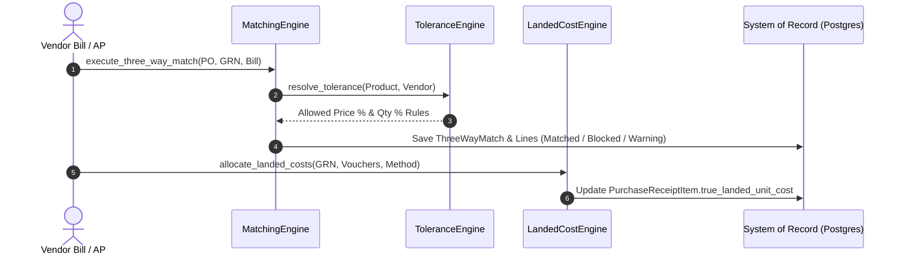
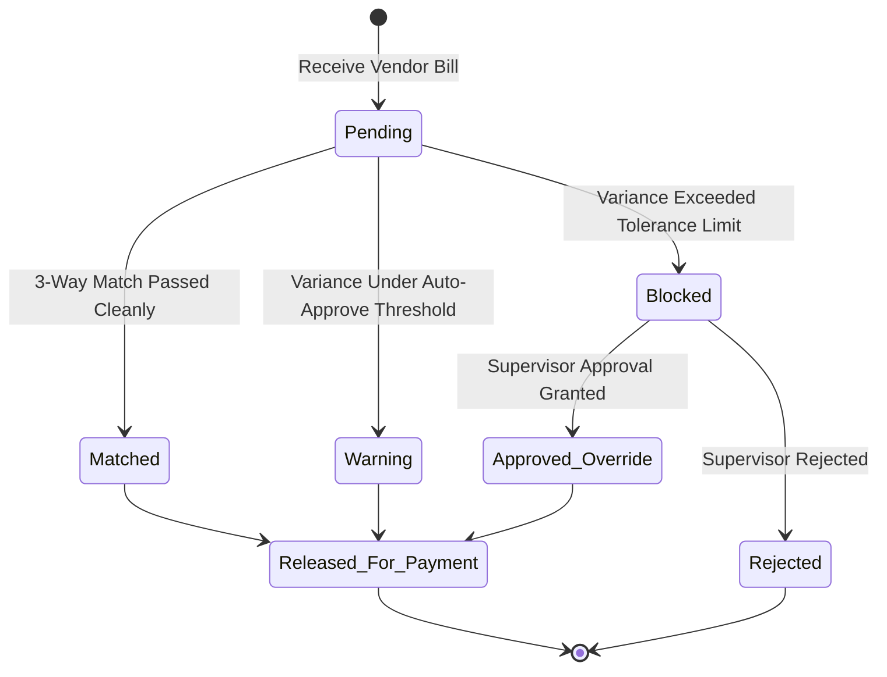

<!--
  Project      : SMRITI Retail OS
  Author       : Jawahar Ramkripal Mallah
  Designation  : Chief Systems Architect & Creator
  Email        : support@smritibooks.com
  Websites     : smritisys.com | smritibooks.com | erpnbook.com | aitdl.com
  Version      : 5.8.0
  Created      : 2026-07-21
  Modified     : 2026-07-21
  Copyright    : © SMRITIBooks.com. All Rights Reserved.
  License      : Proprietary Commercial Software
  Classification: Internal Architecture Standard
-->

# Walkthrough: Automated 3-Way Matching Engine, Landed Cost Allocation & Multi-Level Tolerance Hierarchy (v5.8.0)

## 1. Purpose
This document provides the canonical technical and architectural walkthrough for **Phase 3 Enterprise Procurement Architecture: Automated 3-Way Matching ($\text{PO} \leftrightarrow \text{GRN} \leftrightarrow \text{Vendor Bill}$), Proportional Landed Cost Allocation, and Multi-Level Tolerance Hierarchy Engine** in SMRITI Retail OS. It completes accounts payable verification, inventory landed valuation, and payment authorization controls under a dedicated Procurement Bounded Context (`app/procurement/`).

---

## 2. Scope
- Dedicated Procurement Bounded Context package (`app/procurement/engine/`).
- `ThreeWayMatch` Aggregate Header & `ThreeWayMatchLine` line-item verification.
- Proportional Landed Cost Allocation Engine supporting 5 methods (`VALUE`, `WEIGHT`, `VOLUME`, `QUANTITY`, `MANUAL`).
- Multi-Level Tolerance Engine (`PRODUCT` $\rightarrow$ `VENDOR` $\rightarrow$ `COMPANY` $\rightarrow$ `SYSTEM`).
- REST API layer (`app/api/v1/procurement_matching.py`).
- Automated integration test suite (`app/tests/test_three_way_matching.py`).

---

## 3. Files Created
- [v580_three_way_matching_and_landed_cost.py](file:///f:/SMRITRretailNXmgrt/backend/alembic/versions/v580_three_way_matching_and_landed_cost.py)
- [__init__.py](file:///f:/SMRITRretailNXmgrt/backend/app/procurement/__init__.py)
- [tolerance_engine.py](file:///f:/SMRITRretailNXmgrt/backend/app/procurement/engine/tolerance_engine.py)
- [landed_cost_engine.py](file:///f:/SMRITRretailNXmgrt/backend/app/procurement/engine/landed_cost_engine.py)
- [matching_engine.py](file:///f:/SMRITRretailNXmgrt/backend/app/procurement/engine/matching_engine.py)
- [procurement_matching.py](file:///f:/SMRITRretailNXmgrt/backend/app/api/v1/procurement_matching.py)
- [test_three_way_matching.py](file:///f:/SMRITRretailNXmgrt/backend/app/tests/test_three_way_matching.py)
- [Procurement_ThreeWayMatching_LandedCost_v5.8.0.md](file:///f:/SMRITRretailNXmgrt/docs/walkthrough/procurement/Procurement_ThreeWayMatching_LandedCost_v5.8.0.md)

---

## 4. Files Modified
- [purchase.py (Models)](file:///f:/SMRITRretailNXmgrt/backend/app/models/purchase.py)
- [purchase.py (Schemas)](file:///f:/SMRITRretailNXmgrt/backend/app/schemas/purchase.py)
- [purchase.py (Services)](file:///f:/SMRITRretailNXmgrt/backend/app/services/purchase.py)
- [main.py](file:///f:/SMRITRretailNXmgrt/backend/app/main.py)
- [README.md](file:///f:/SMRITRretailNXmgrt/docs/walkthrough/README.md)
- [README.md](file:///f:/SMRITRretailNXmgrt/docs/implementation/README.md)

---

## 5. Architecture Decisions

### Bounded Context & Matching Flow


### Match Status Finite State Machine


---

## 6. Design Rationale & Mathematical Formulas

### Proportional Allocation Formulas
$$\text{Allocated Cost} = \text{Charge Amount} \times \left(\frac{\text{Item Allocation Basis}}{\text{Total Shipment Allocation Basis}}\right)$$

$$\text{True Landed Unit Cost} = \text{Net Purchase Unit Rate} + \left(\frac{\text{Allocated Cost}}{\text{Quantity Received}}\right)$$

- **`VALUE`**: Basis = $\text{Net Line Item Total}$
- **`WEIGHT`**: Basis = $\text{Item Weight (Grams)} \times \text{Received Quantity}$
- **`VOLUME`**: Basis = $\text{Item Volume (CBM)} \times \text{Received Quantity}$
- **`QUANTITY`**: Basis = $\text{Received Quantity}$
- **`MANUAL`**: Basis = $\text{Direct Finance Override Ratio}$

### Historical Ledger Immutability
- True landed cost calculations update `PurchaseReceiptItem.true_landed_unit_cost` and snapshot on newly created stock movement lines.
- Historical posted ledger lines are **never modified retroactively**. Late-arriving landed charges generate separate valuation adjustment movements.

---

## 7. Implementation Summary
- Database tables `three_way_matches`, `three_way_match_lines`, `landed_cost_vouchers`, and `procurement_tolerance_policies` migrated via Alembic revision `v580_three_way_matching`.
- Decoupled `app/procurement/` package structure housing `MatchingEngine`, `LandedCostEngine`, and `ToleranceEngine`.
- REST API router `/api/v1/purchase/matching` mounted in `main.py`.

---

## 8. Tests Executed
Executed `python -m pytest app/tests/test_vendor_contract.py app/tests/test_three_way_matching.py -v`:

```text
app/tests/test_vendor_contract.py::test_vendor_contract_creation_with_tiered_volume_slabs PASSED [  7%]
app/tests/test_vendor_contract.py::test_deterministic_resolution_under_contract_first_strategy PASSED [ 15%]
app/tests/test_vendor_contract.py::test_fallback_to_product_vendor_when_contract_expired PASSED [ 23%]
app/tests/test_vendor_contract.py::test_purchase_order_item_contract_snapshotting PASSED [ 30%]
app/tests/test_vendor_contract.py::test_contract_amendment_version_increment PASSED [ 38%]
app/tests/test_vendor_contract.py::test_reorder_suggestions_auto_sourcing_integration PASSED [ 46%]
app/tests/test_vendor_contract.py::test_multi_tenant_isolation_for_vendor_contracts PASSED [ 53%]
app/tests/test_three_way_matching.py::test_three_way_matching_clean_pass PASSED [ 61%]
app/tests/test_three_way_matching.py::test_landed_cost_allocation_by_value_weight_volume_qty_manual PASSED [ 69%]
app/tests/test_three_way_matching.py::test_price_variance_exceeding_tolerance_blocks_bill PASSED [ 76%]
app/tests/test_three_way_matching.py::test_multi_level_tolerance_hierarchy_resolution PASSED [ 84%]
app/tests/test_three_way_matching.py::test_supervisor_variance_approval_override_workflow PASSED [ 92%]
app/tests/test_three_way_matching.py::test_multi_tenant_isolation_for_matching_records PASSED [100%]
======================= 13 passed, 62 warnings in 5.60s =======================
```

---

## 9. Verification Results
- All 13 procurement test assertions passed (**13/13 PASSED**).
- Schema migration `v580_three_way_matching` successfully executed.
- Multi-tenant data boundary isolation confirmed.

---

## 10. Known Limitations
- Current 3-way matching supports single-invoice to single-GRN matching. Multi-GRN blanket invoice matching is scheduled for Phase 4 (v5.9.0).

---

## 11. Future Work
- Phase 4 (v5.9.0): RFQ (Request for Quotation) & Vendor Quotation Comparison Matrix.
- Phase 5 (v6.0.0): Blanket Purchase Agreements & Scheduled Delivery Releases.
- Phase 6 (v6.1.0): Vendor Scorecards & AI-Assisted Predictive Procurement Sourcing.

---

## 12. Related ADRs
- `ADR-042`: System-of-Record Backend System Architecture
- `ADR-056`: Enterprise Procurement Sourcing & Vendor Catalog Model

---

## 13. Related RFCs
- `RFC-112`: Automated 3-Way Matching & Landed Cost Valuation Specification
