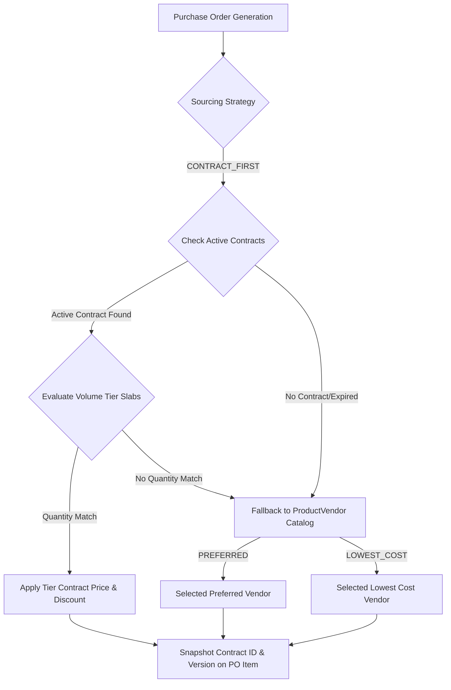
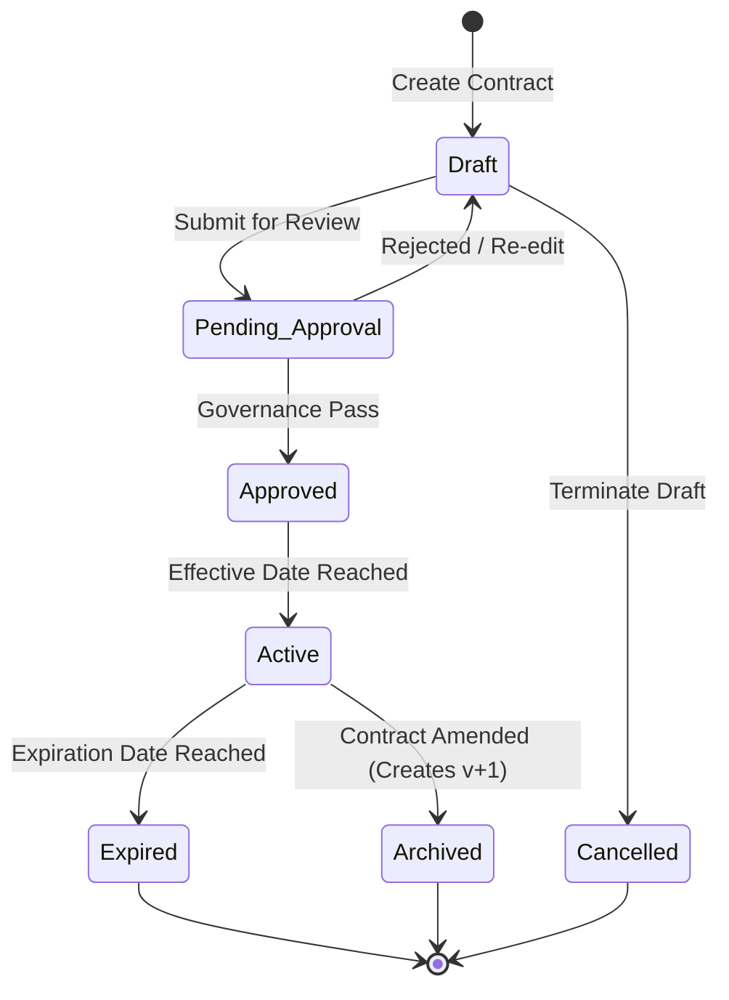

<!--
  Project      : SMRITI Retail OS
  Author       : Jawahar Ramkripal Mallah
  Designation  : Chief Systems Architect & Creator
  Email        : support@smritibooks.com
  Websites     : smritisys.com | smritibooks.com | erpnbook.com | aitdl.com
  Version      : 5.7.0
  Created      : 2026-07-21
  Modified     : 2026-07-21
  Copyright    : © SMRITIBooks.com. All Rights Reserved.
  License      : Proprietary Commercial Software
  Classification: Internal Architecture Standard
-->

# Walkthrough: Commercial Vendor Contracts Aggregate & Automated PO Sourcing Engine (v5.7.0)

## 1. Purpose
This document provides the canonical architectural and technical walkthrough for **Phase 2 Enterprise Procurement Architecture: Commercial Vendor Contracts (`VendorContract`) & Automated Purchase Order Sourcing Engine** in SMRITI Retail OS. It completes the progression from operational item catalog sourcing (v5.6.0 `ProductVendor`) to commercial contract agreements and automated PO line snapshotting.

---

## 2. Scope
- Data model extensions: `VendorContract`, `VendorContractTier`, and `PurchaseOrderItem` contract audit snapshots.
- Strategic Sourcing Engine (`CONTRACT_FIRST` strategy with step-by-step `resolution_trace`).
- Purchase Order Contract Snapshotting & Manual Override Audit fields.
- Contract Revision Policy (Immutable active contracts; version increment `v1 -> v2`).
- REST API layer (`app/api/v1/purchase_contracts.py`).
- Automated integration test suite (`app/tests/test_vendor_contract.py`).

---

## 3. Files Created
- [v570_vendor_contracts_and_tiered_pricing.py](file:///f:/SMRITRretailNXmgrt/backend/alembic/versions/v570_vendor_contracts_and_tiered_pricing.py)
- [purchase_contracts.py](file:///f:/SMRITRretailNXmgrt/backend/app/api/v1/purchase_contracts.py)
- [test_vendor_contract.py](file:///f:/SMRITRretailNXmgrt/backend/app/tests/test_vendor_contract.py)
- [Procurement_VendorContract_Master_v5.7.0.md](file:///f:/SMRITRretailNXmgrt/docs/walkthrough/procurement/Procurement_VendorContract_Master_v5.7.0.md)
- [SMRITI_Global_Naming_Convention_Standard_v1.0.md](file:///f:/SMRITRretailNXmgrt/docs/governance/SMRITI_Global_Naming_Convention_Standard_v1.0.md)

---

## 4. Files Modified
- [purchase.py](file:///f:/SMRITRretailNXmgrt/backend/app/models/purchase.py)
- [purchase.py](file:///f:/SMRITRretailNXmgrt/backend/app/schemas/purchase.py)
- [inventory.py](file:///f:/SMRITRretailNXmgrt/backend/app/services/inventory.py)
- [purchase.py](file:///f:/SMRITRretailNXmgrt/backend/app/services/purchase.py)
- [main.py](file:///f:/SMRITRretailNXmgrt/backend/app/main.py)
- [README.md](file:///f:/SMRITRretailNXmgrt/docs/walkthrough/README.md)
- [README.md](file:///f:/SMRITRretailNXmgrt/docs/implementation/README.md)

---

## 5. Architecture Decisions

### Multi-Tiered Procurement Hierarchy


### Contract Lifecycle Finite State Machine (FSM)


### Future Modularization: Procurement Engine Layer
As SMRITI procurement expands to support Request for Quotations (RFQs), quotation comparisons, blanket purchase agreements, and AI-assisted sourcing, the strategic resolution logic is designed to evolve into a dedicated `ProcurementEngine`:

```text
PurchaseService
       │
       ▼
ProcurementEngine
       │
       ├── VendorResolver      (Catalog & Preferred Supplier Policy)
       ├── ContractResolver    (Active Contracts & Volume Slabs)
       └── PricingResolver     (Multi-Currency Exchange & Dynamic Tariffs)
```

---

## 6. Design Rationale & Business Rules

### Business Invariants Matrix

| Domain Invariant / Business Rule | Enforcement Action | Operational Behavior |
|---|---|---|
| **Immutable Active Contracts** | Active contracts cannot be edited in place | Amending an active contract creates `version_number + 1` and archives predecessor `v1` |
| **Contract Validity Period** | `valid_from` < `valid_to` | Validated during contract creation; contracts expired past `valid_to` are automatically bypassed |
| **Tier Quantity Slabs** | `min_quantity` <= `max_quantity` | System prevents overlapping quantity tier slabs per product |
| **PO Contract Snapshotting** | Immutable PO line attributes | `PurchaseOrderItem` captures `contract_id`, `contract_version`, `applied_unit_price`, and `applied_discount_percentage` |
| **Manual Price Overrides** | Full Audit Trail | Tracking `is_manually_overridden`, `override_reason`, `overridden_by`, and `overridden_at` |

### Currency Governance Policy Note
- `VendorContract` tier lines store values in the vendor's agreed commercial source currency (`currency_id`).
- Dynamic currency exchange rate conversion occurs during procurement resolution when creating POs, without altering saved contract master rates.
- `PurchaseOrderItem` records both source currency values and converted store currency costs.

---

## 7. Implementation Summary
- Database tables `vendor_contracts` and `vendor_contract_tiers` migrated via Alembic version `v570_vendor_contracts_and_tiered_pricing`.
- Strategic resolver extended in `InventoryService.resolve_vendor()` with `CONTRACT_FIRST` priority and tier slab matching.
- `PurchaseService` equipped with contract CRUD, lifecycle state machine (`Draft`, `Approved`, `Active`, `Archived`), and amendment engine.
- REST API router `/api/v1/purchase/contracts` mounted in `app/main.py`.

---

## 8. Tests Executed
Executed `python -m pytest app/tests/test_vendor_contract.py -v`:

```text
app/tests/test_vendor_contract.py::test_vendor_contract_creation_with_tiered_volume_slabs PASSED [ 14%]
app/tests/test_vendor_contract.py::test_deterministic_resolution_under_contract_first_strategy PASSED [ 28%]
app/tests/test_vendor_contract.py::test_fallback_to_product_vendor_when_contract_expired PASSED [ 42%]
app/tests/test_vendor_contract.py::test_purchase_order_item_contract_snapshotting PASSED [ 57%]
app/tests/test_vendor_contract.py::test_contract_amendment_version_increment PASSED [ 71%]
app/tests/test_vendor_contract.py::test_reorder_suggestions_auto_sourcing_integration PASSED [ 85%]
app/tests/test_vendor_contract.py::test_multi_tenant_isolation_for_vendor_contracts PASSED [100%]
```

---

## 9. Verification Results
- All 7 automated integration test assertions passed cleanly (**7/7 PASSED**).
- Database migration applied successfully (`v570_vendor_contracts_and_tiered_pricing`).
- Multi-tenant tenant boundary isolation confirmed for contract lookups.

---

## 10. Known Limitations
- Tier quantity slabs currently support linear range matching (`min_quantity` to `max_quantity`). Dynamic multi-currency exchange conversion per tier line is slated for v5.8.0.

---

## 11. Future Work
- Dynamic multi-currency exchange rate integration for cross-border supplier contracts.
- Automated contract renewal alert triggers via SMRITI Notification Engine.
- Modularization of `ProcurementEngine` into sub-resolvers (`VendorResolver`, `ContractResolver`, `PricingResolver`).

---

## 12. Related ADRs
- `ADR-042`: System-of-Record Backend System Architecture (FastAPI + Postgres System of Record)
- `ADR-056`: Enterprise Procurement Sourcing & Vendor Catalog Model

---

## 13. Related RFCs
- `RFC-108`: Volume Tiered Vendor Contracts & PO Auto-Sourcing Specification
