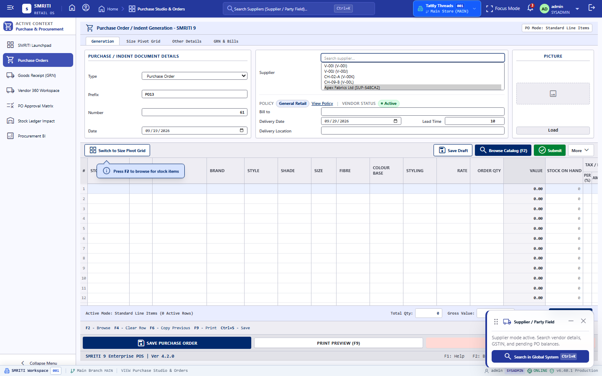
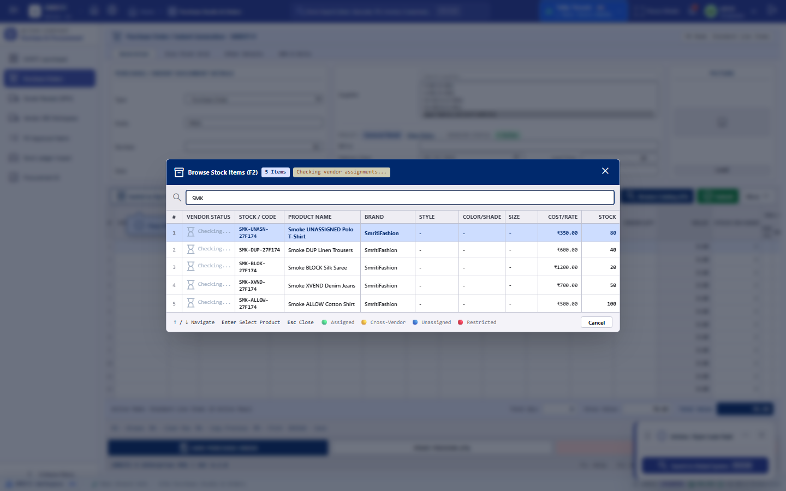
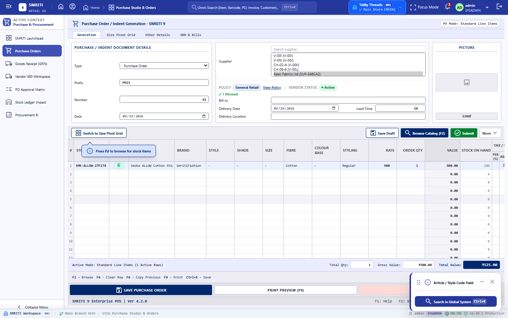
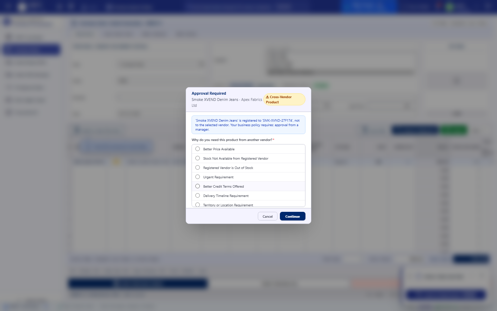
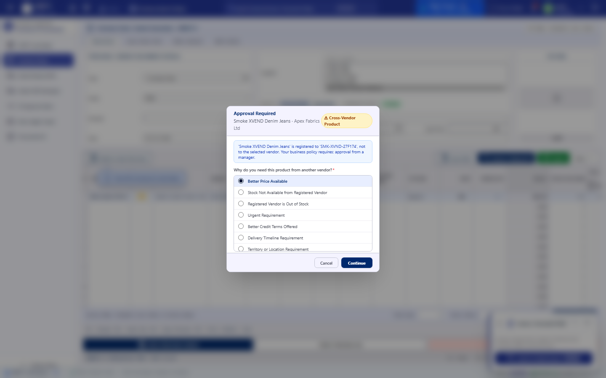
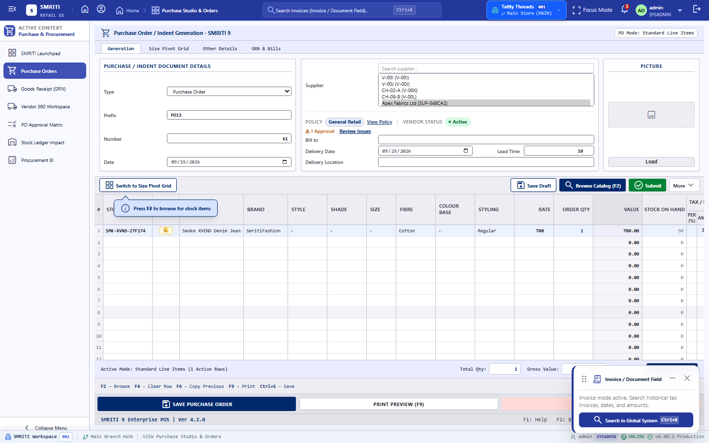
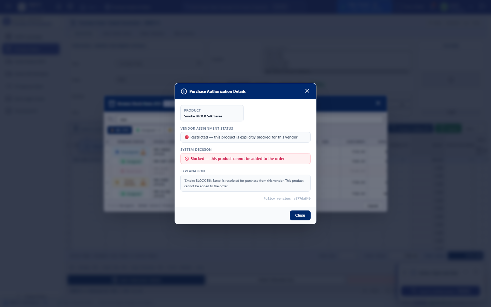
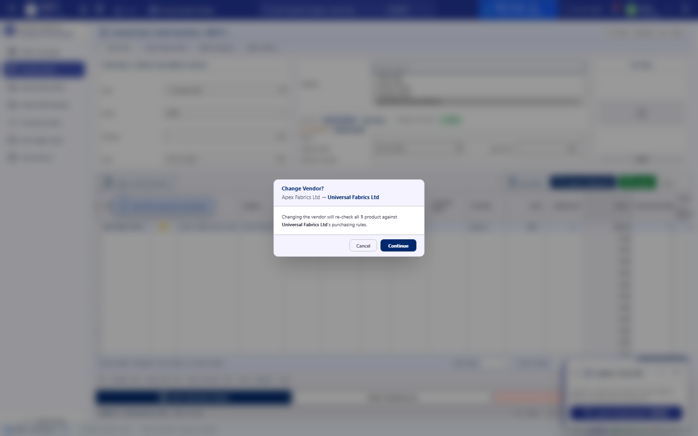
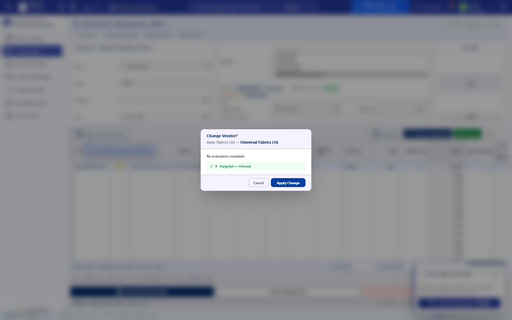
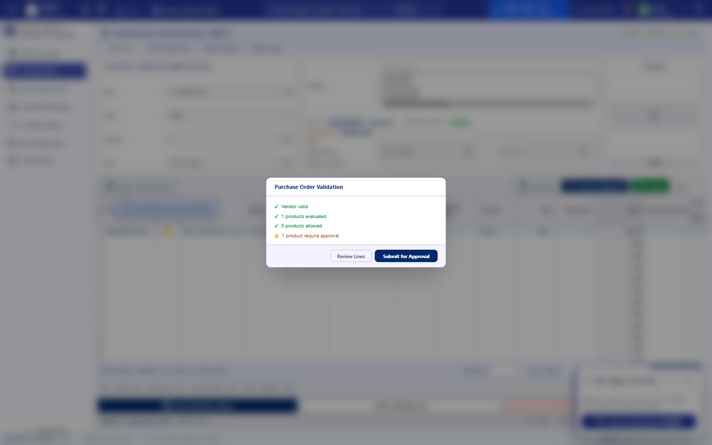

<!--
  Project      : SMRITI Retail OS
  Repository   : SMRITIRetailNX
  Organization : AITDL NETWORKS

  * Version    : 1.0.0
  * Created    : 2026-09-21
  * Modified   : 2026-09-21
  * Classification: Procurement Demo
-->

# Purchase Order Cycle Demo

This demo summarizes the complete purchase order lifecycle in SMRITI Retail OS, from PO creation and approval to goods receipt, discrepancy reconciliation, and final statutory document export.

## 1. Demo Objective

The business flow shown here demonstrates:

- Vendor selection and item validation
- Cross-vendor policy checks during PO creation
- Approval workflow and validation summary
- Goods receipt and inward audit matrix
- Damage, shortage, and acceptance reconciliation
- Final PDF export and reconciliation summary

## Live Verification Status

Verified in the currently shared browser session at http://localhost:3000/ on 2026-09-21. The live purchase order form is in Draft state for a purchase order numbered PO-10 for supplier V-00A, with a 30-day payment term, GSTIN details, and a valid item line ready for review. This is the current live evidence used for the procurement demo and supersedes older static screenshots.

The approval step was then exercised live: the system reached the Purchase Order Validation modal and the "Submit for Approval" action produced a real blocker: "PO Save Error — A database operations conflict occurred or referential integrity check failed." This is the actual current status of the live procurement flow in this environment.

---

## 2. Step 1 — Purchase order workspace and vendor policy guardrails

**Comment:** The purchase order workspace is initialized with the selected vendor and item catalog. The operator can validate product eligibility before adding lines.

**Comment:** Products are classified with clear policy badges such as ALLOW, CROSS-VENDOR, and BLOCKED. This prevents unauthorized procurement and keeps policy enforcement visible to the buyer.

**Comment:** An approved item is added to the PO grid with a valid status. This confirms the line is commercially accepted and ready for review.

---

## 3. Step 2 — Approval workflow and exception handling

**Comment:** For cross-vendor items, the approval modal requires a reason before the line can be accepted. This ensures every exception is documented and auditable.

**Comment:** The selected reason is clearly captured in the approval flow, which supports governance and future audit review.

**Comment:** Once approved, the line is reflected in the PO with a status that shows the exception has been resolved transparently.

**Comment:** A blocked item is not silently added. The system opens a policy explanation modal, which protects the business from non-compliant procurement.

---

## 4. Step 3 — Vendor change and validation summary

**Comment:** If the vendor changes, the system prompts the user to confirm the impact before continuing. This avoids accidental procurement under a non-compliant vendor regime.

**Comment:** The system re-evaluates all lines and surfaces the resulting policy impact. This step makes the decision traceable and explains why the PO changed.

**Comment:** Before submission, the system validates the PO and displays a final summary. This is the last business gate before PO approval is finalized.

---

## 5. Step 4 — PO approved state

**Comment:** The purchase order is approved and ready for dispatch to the vendor. At this point, the procurement intent is confirmed and the order is active in the system.

---

## 6. Step 5 — Goods receipt and inward audit

**Comment:** Goods are received against the approved PO. The inward matrix shows ordered quantity, received quantity, damage, shortage, net accepted quantity, and mismatch tracking in a single view.

**Business notes**
- Ordered quantity is compared with actual inward quantity.
- Damage and shortage are segregated for investigation.
- Accepted quantity is calculated after reconciliation.
- The audit matrix helps warehouse teams resolve commercial exceptions before payment.

---

## 7. Step 6 — Statutory PDF preview and export

**Comment:** The system generates a statutory A4 inward and reconciliation document for business and compliance review. This gives stakeholders a clean proof of the transaction and the valuation logic.

---

## 8. Step 7 — Final cycle reconciliation summary

**Comment:** This final view closes the procurement loop: approved PO, received GRN, discrepancy reconciliation, and documented financial impact. It confirms that the purchase order cycle is complete, traceable, and audit-ready.

---

## 9. End-to-end business summary

The purchase order cycle is complete when all of the following are true:

1. The vendor and item policy are validated.
2. Approval exceptions are resolved with reason codes.
3. The PO is approved and dispatched.
4. Goods are received and checked against the order.
5. Shortage and damage are investigated and reconciled.
6. The statutory document is exported and archived.
7. The final summary confirms financial and operational closure.

This is a full, auditable procurement lifecycle inside SMRITI Retail OS and is suitable for demo, stakeholder review, and training.
